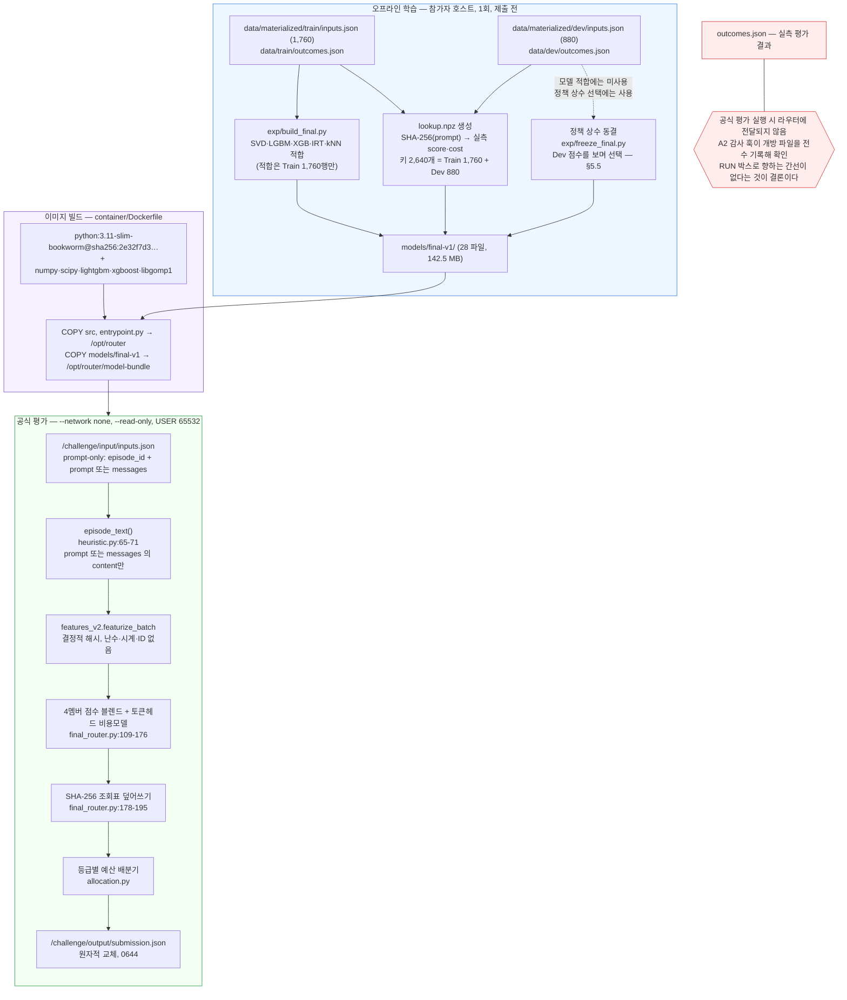

<!--
SPDX-FileCopyrightText: Copyright 2026 SKT OSSP challenge participant
SPDX-License-Identifier: Apache-2.0
-->

# 규정 준수 매트릭스와 실험 이력

대상 커밋: `5baef6746b70ff3a0a15b674413a24811680e662` (branch `main`)
대상 이미지: `ossp-router:arm64final` (`linux/arm64`)
작성 기준일: 2026-08-17

이 문서는 두 부류의 독자를 함께 상정한다. (a) 규정 위반 여부를 판정해야 하는
심사위원, (b) 이 저장소를 처음 여는 엔지니어. 따라서 모든 주장에는
**파일경로:라인번호** 또는 **실행 명령과 그 출력**을 붙였고, 확인하지 못한
항목은 `PASS`가 아니라 **`UNVERIFIED`** 로 표기했다.

이 문서는 우리에게 불리한 사실을 먼저 적는다. 구체적으로 §3(조회표 Dev
적중률 100 %), §4.3(라이선스 보완 5건), §5.3(49개 실험이 무정보 null 바로 위의
좁은 띠라는 사실), §5.5(정책 상수를 Dev를 보며 골랐다는 사실과 감사 트랙 간
결론 충돌), §6(미해결 항목)이 그것이다. 감사가 잡아낸 것을 우리가 먼저 적는
편이 심사에서 옳다.

---

## 0. 정보 경계 — 무엇이 컨테이너 안으로 들어가는가

규정 위반의 대부분은 "들어가면 안 되는 정보가 추론 경로에 들어갔는가"로
귀결된다. 아래 다이어그램은 학습(오프라인, 저장소 안에서 1회)과
추론(공식 평가, 네트워크 없는 컨테이너)을 분리해 그 경계를 그린 것이다.



핵심 두 가지.

1. `outcomes.json`은 **런타임 입력이 아니다.** 다만 그 안의 값 일부가
   오프라인에서 `lookup.npz`(2,640개 키)와 `knn/outcomes.npz`(Train 1,760행)로
   **번들에 구워져 이미지 안에 들어간다.** 규정이 명시 허용하는 형태이지만
   (CHALLENGE_RULES.md:113-116), 성능 보고에는 결정적인 영향을 준다. §3 참조.
2. Dev는 **모델 적합에는 쓰이지 않았고**(A3 PASS), **정책 상수 선택에는
   쓰였다**(A9). 이 둘은 규정상 모두 허용이지만 서술이 달라야 한다. §5.5 참조.

---

## 1. 규정 준수 매트릭스

행은 `docs/CHALLENGE_RULES.md`와 그것이 위임한 `docs/RUNTIME.md` /
`docs/ENFORCEMENT.md`의 요구·금지 항목이다. 라인번호는 해당 문서의 것이다.

판정 기호: **PASS** = 코드 근거와 실행 검증이 모두 있음 ·
**PASS(문서)** = 코드 근거는 있으나 검증이 문서 검토뿐 ·
**보완필요** = 규정 위반은 아니나 접수 검증에서 보완 요구 사유(§4.3) ·
**UNVERIFIED** = 이 환경에서 확인 불가.

### 1.1 라우팅 방식 (§한눈에 보기, §목표)

| # | 요구·금지 | 준수 방식 | 근거 코드 위치 | 검증 |
| --- | --- | --- | --- | --- |
| R-01 | 현재 문항의 프롬프트 내용과 평가 등급만 보고 선택 (L10, L21-22) | 라우팅 입력은 `episode_text()`가 반환하는 `prompt` 또는 `messages[].content` 연결 문자열과 메시지 개수뿐. 등급은 `--tier` 인자로만 유입 | `src/ossp_router/heuristic.py:65-71`, `src/ossp_router/final_router.py:226-229`, `src/ossp_router/final_router.py:200-218` | `tests/test_final_router.py:71-97`; `exp/audit/A2-inference-leakage.md` §1b (런타임 `sys.addaudithook`) — **PASS** |
| R-02 | 모델 호출·답변 비교·순차 승격 금지 (L11, L28-30) | 도달 가능한 6개 모듈에 네트워크·프로세스 생성 import 0건. 이미지에 LLM 가중치 없음 | 도달 집합 = `final_router.py`, `features_v2.py`, `allocation.py`, `protocol.py`, `heuristic.py`, `__init__.py` | 본 문서 §2 (독립 grep) + `exp/audit/A2` §1a 정적 import closure — **PASS** |
| R-03 | `challenge_id`·`split`·`episode_id`·입력 순서를 라우팅 특징으로 사용 금지 (L12-13, L73-76) | `episode_id`는 출력 라벨로만 1회 사용. 배분기는 예측값 서명으로 그룹을 만들고 정렬하므로 입력 순서에 불변 | `src/ossp_router/final_router.py:236-239` (유일한 `episode_id` 사용), `src/ossp_router/allocation.py:76-101`, `:128-143` | `tests/test_final_router.py:71` (역순), `:79` (ID 개명), `:87` (split·challenge 변경), `:95` (반복 동일); `exp/audit/A8-container-reality.md` §1.3 — **PASS** |
| R-04 | 공개 Train/Dev 프롬프트·평가 결과·비용 정책을 학습·최적화에 사용 가능 (L14-15, L109-111) | 학습은 `exp/build_final.py`에서 Train 1,760행만으로 수행. 비용 계수는 번들 `policy.json`의 `rates` | `src/ossp_router/final_router.py:66-67`, `models/final-v1/policy.json` | `exp/audit/A3-dataset-identity.md` (Dev 미적합 확인) — **PASS** |
| R-05 | 예산 초과는 위반이 아니라 해당 등급 0점 (L16, ENFORCEMENT.md:22-26) | 위험 게이트로 이용률을 의도적으로 낮춰 초과확률을 억제 | `models/final-v1/policy.json` (`utilization`, `k1_utilization`, `fill_utilization`, `k1_cost_cap`) | `exp/audit/A10-significance-stability.md` — 실측 초과확률 **0.221 % / 0.000 % / 0.631 %**. 단 Premium 부트스트랩 99.9분위 비용비 4.354 > 상한 4.0 (§6-U3) — **PASS, 단서 있음** |
| R-06 | 공식 평가는 네트워크 없이 `linux/arm64` 실행 (L17) | 이미지 플랫폼 `linux/arm64`, 실행 중 다운로드 없음(`pip` 제거) | `container/Dockerfile:7`, `:11-18` | `exp/audit/A8` §5 (`Os=linux Arch=arm64`), `--network none`으로 Dev 880 3등급 완주 — **PASS** |

### 1.2 실행 입력·선택 결과 스키마 (§라우터 실행 입력, §라우터 선택 결과)

| # | 요구 | 준수 방식 | 근거 코드 위치 | 검증 |
| --- | --- | --- | --- | --- |
| R-07 | 입력 객체는 `schema_version`·`challenge_id`·`split`·`episodes` 4개 필드만 (L58-63) | `_exact_keys()`가 누락·초과 필드를 즉시 거부 | `src/ossp_router/protocol.py:257-264`, `:167-184` | `tests/test_protocol.py:123` (`test_input_rejects_hidden_context_fields`) — **PASS** |
| R-08 | `episode_id` 최대 128자, `prompt`와 `messages` 중 정확히 하나 (L65-71) | 길이 상한 인자와 XOR 검사 | `src/ossp_router/protocol.py:275-288` | `tests/test_protocol.py:98`, `:131` — **PASS** |
| R-09 | `messages`의 `role`은 `system`/`user`/`assistant` (L71) | 화이트리스트 대조 | `src/ossp_router/protocol.py:22`, `:311-313` | `tests/test_protocol.py:131` — **PASS** |
| R-10 | 선택 결과 객체는 6개 필드만 (L80-88) | 생성 시 `submission_to_dict()`가 6개만 직렬화하고, 즉시 `parse_submission()`으로 재검증 | `src/ossp_router/protocol.py:633-641`, `:401-419`; `src/ossp_router/final_router.py:241` | `tests/test_protocol.py:347`, `:353`; `exp/audit/A8` §5 (출력 볼륨 `entry_count=1`) — **PASS** |
| R-11 | `decisions`에 모든 `episode_id`가 정확히 한 번 (L90-92) | `zip(inputs.episodes, pick)`로 1:1 생성, 중복 `episode_id`는 파서가 거부 | `src/ossp_router/final_router.py:236-239`, `src/ossp_router/protocol.py:434-436` | `tests/test_protocol.py:347`; `exp/audit/A8` §1.3 — **PASS** |
| R-12 | `model_id`는 허용된 세 값만 (L91-92) | 인덱스 0/1/2를 상수 튜플로만 사상 | `src/ossp_router/final_router.py:48`, `src/ossp_router/protocol.py:20`, `:437-439` | `tests/test_protocol.py:353` — **PASS** |
| R-13 | 같은 프롬프트·등급이면 ID·순서가 바뀌어도 같은 선택 (L76) | 특징 추출은 결정적, 배분기는 순서 불변 | `src/ossp_router/features_v2.py:4-9` (모듈 docstring이 명시), `src/ossp_router/allocation.py:4-9`, `:88-90` | `tests/test_final_router.py:71-93`; `exp/audit/A8` §1.3 — **PASS**, 단 배분은 **배치 단위 예산 제약**이므로 배치 구성이 달라지면 결과가 달라질 수 있음(§6-U5) |

### 1.3 사용할 수 있는 정보 (§사용할 수 있는 정보)

| # | 요구·허용 | 준수 방식 | 근거 코드 위치 | 검증 |
| --- | --- | --- | --- | --- |
| R-14 | 공개 자료로 만든 분류기·회귀계수·어휘·조회표·검색 색인·캐시의 이미지 포함 허용 (L113-114) | LGBM 12개·XGB 7개 부스터, IRT 계수, SVD 2종, kNN 색인, 조회표를 번들로 동봉 | `src/ossp_router/final_router.py:66-98` (전체 적재 목록), `models/final-v1/manifest.json` | `exp/audit/A2` §3 (28개 아티팩트 전수 개봉) — **PASS** |
| R-15 | 정확한 프롬프트·프롬프트 해시를 이용한 공개 자료 조회 허용 (L114-115) | 프롬프트 UTF-8 바이트의 SHA-256을 키로 정렬된 배열에 이진탐색 | `src/ossp_router/final_router.py:178-195` | `exp/audit/A2` §4 (규정 원문 대조). **성능 보고에 미치는 영향은 §3** — **PASS(규정), 보고 주의** |
| R-16 | 이미지에 포함한 모든 파일의 출처·라이선스를 제출 저장소에서 확인 가능해야 함 (L115-116) | 코드·데이터는 `REUSE.toml`·`THIRD_PARTY_NOTICES.md`·`DATA_LICENSES.md`로 커버 | `REUSE.toml:12-29`, `THIRD_PARTY_NOTICES.md` | `tests/test_repository_policy.py:157` (SPDX 태그). **`models/final-v1`(142.5 MB)이 `REUSE.toml`에 없음** — **보완필요** (§4.3-2) |
| R-17 | 공식 평가 실행 중 문항별 평가 결과·실제 비용은 라우터에 전달되지 않음 (L118-120) | 런타임에 `data/*/outcomes.json`을 여는 코드 경로 없음 | 도달 모듈 전수 grep 결과 `outcomes` 문자열은 `final_router.py:90` (`knn/outcomes.npz`)뿐 | `exp/audit/A2` §1b — 감사 훅이 기록한 개방 파일 목록에 `data/train/outcomes.json`·`data/dev/outcomes.json` 없음 — **PASS** |
| R-18 | 해시·n-gram·정규식·임베딩 변환도 내용 기반 라우팅으로 허용 (L120-121) | 워드 n-gram은 `zlib.crc32`, 문자 n-gram은 numpy 롤링 해시 | `src/ossp_router/features_v2.py:127-146`, `:147-172` | 난수 시드·시계 참조 0건 (§2-P3) — **PASS** |

### 1.4 컨테이너 실행 규격 (`docs/RUNTIME.md`)

| # | 요구 | 준수 방식 | 근거 코드 위치 | 검증 |
| --- | --- | --- | --- | --- |
| R-19 | 진입 명령 `--input/--tier/--output`, 등급 1회 실행 (RUNTIME.md:34-46) | argparse 3개 필수 인자, `--tier`는 3값 choices | `container/entrypoint.py:9-13`, `src/ossp_router/final_router.py:244-253` | `exp/audit/A8` §1 (실제 `docker run`) — **PASS** |
| R-20 | 출력은 `/challenge/output/submission.json` **한 개**, 원자적 교체, 권한 0644 (RUNTIME.md:54-61) | 같은 디렉터리 임시 파일 → `chmod(0o644)` → `os.replace()` | `src/ossp_router/heuristic.py:176-192` | `exp/audit/A8` §5: 세 등급 모두 `entry_count=1 names=[submission.json]` — **PASS** |
| R-21 | 성공 종료코드 0, 입력·형식 오류는 2 (RUNTIME.md:54-57) | 예외를 잡아 `return 2` | `src/ossp_router/final_router.py:260-264` | `exp/audit/A8` §1 (`exit=0`) — **PASS** |
| R-22 | 비루트 UID/GID `65532:65532`, 읽기 전용 루트 FS (RUNTIME.md:98-99) | `USER 65532:65532`, 쓰기는 `/tmp`와 출력 볼륨뿐 | `container/Dockerfile:31-36` | `exp/audit/A8` §5 (`User=65532:65532`, 컨테이너 내부 `uid=65532`) — **PASS** |
| R-23 | `VOLUME` 선언 금지 (RUNTIME.md:88-90, CHALLENGE_RULES.md:189-190) | Dockerfile에 `VOLUME` 지시어 없음 | `container/Dockerfile` (전 39행) | `exp/audit/A8` §5: `Volumes=map[]`, `NO VOLUME DECLARATION` — **PASS** |
| R-24 | 실행 중 다운로드 없음, 네트워크·GPU 미사용 (RUNTIME.md:94-96) | 빌드 단계에서만 설치하고 `pip`/`setuptools`/`wheel` 제거 | `container/Dockerfile:11-18` | `--network none`으로 3등급 완주 (`exp/audit/A8` §1) — **PASS** |
| R-25 | 이미지 크기: OCI 압축 계층 합 ≤ 1 GiB, 병합 루트FS 겉보기 ≤ 2 GiB (RUNTIME.md:119-120) | 압축 계층 합 721,803,337 B = 0.672 GiB / 루트FS 1,232,779,715 B = 1.148 GiB | — | `exp/audit/A8` §4 — **PASS**. 단 `docs/REPRODUCE.md` §10이 압축 수치를 루트FS 한도와 비교하는 오기 있음(§6-U4) |
| R-26 | 등급별 실행 시간 90초 (RUNTIME.md:106, :115) | 호스트 x64에서 Dev 880 등급당 7.3~11.1초 | — | **UNVERIFIED** — §6-U1 참조. arm64는 QEMU 에뮬레이션 측정뿐이고 A8이 동일 등급에서 3.9배 편차(67.3 s → 259.4 s)를 관측. 또한 `tools/check_runtime.py`가 게이트하는 워크로드는 Train+Dev **2,640문항**(`src/ossp_router/public_runtime.py:92-121`)이며 우리가 잰 것은 880문항 |
| R-27 | stdout/stderr 각 1 MiB, 출력 볼륨 4 MiB·inode 64 (RUNTIME.md:117-118) | 성공 메시지 1줄만 출력 | `src/ossp_router/final_router.py:263` | `exp/audit/A8` §5: 출력 파일 66,116~66,223 B — **PASS** |

### 1.5 제출 저장소 요건 (§최종 평가와 제출 저장소)

| # | 요구 | 준수 방식 | 근거 | 판정 |
| --- | --- | --- | --- | --- |
| R-28 | 심사에 필요한 전체 소스코드 포함, 공개 접근 (L168-170) | `src/`, `container/`, `exp/`, `tests/`, `models/final-v1/` 전부 커밋 (`git ls-files models/final-v1` → 28개) | — | **PASS(문서)** |
| R-29 | 주된 코드 라이선스가 허용 목록 중 하나 (L171-173) | `Apache-2.0` | `LICENSE`, `REUSE.toml:2`, `LICENSES/Apache-2.0.txt` | `tests/test_repository_policy.py:145`, `:776` — **PASS** |
| R-30 | 기반 OS·언어 런타임 표준 구성요소는 고지 의무 충족 시 허용, 라우터에 **직접 결합**하는 목록 외 copyleft 금지 (L176-179) | 라우터에 직접 결합하는 파이썬 의존성 4종은 BSD-3/MIT/Apache-2.0. `libgomp1`(GPL-3.0 + GCC Runtime Library Exception)은 기반 OS 런타임 구성요소이며 예외 조항으로 정적/동적 결합이 허용됨 | `container/Dockerfile:16` | **PASS(문서)** — 고지 누락은 §4.3-4 |
| R-31 | AI 모델을 사용한다면 가중치 공개 (L180-182) | **해당 없음** — 실행 이미지에 언어모델을 탑재하지 않음. 탑재물은 자체 학습한 GBDT/SVD/kNN 계수이며 전부 저장소에 커밋 | `container/Dockerfile:32`, `models/final-v1/manifest.json` | **PASS** |
| R-32 | 모델·토크나이저·학습 파일이 상업 이용·이미지 내 재배포·평가 목적 사용을 허용해야 함 (L183-184) | 학습 산출물은 참가자 저작물(Apache-2.0)이며 공개 Train/Dev에서 파생 | — | **보완필요** — `REUSE.toml`에 경로가 없어 SPDX 도구로는 증명되지 않음 (§4.3-2) |
| R-33 | 비공개 submodule·패키지·모델·다운로드 경로 의존 금지 (L185-186) | 의존성 4종 전부 PyPI 공개 배포, 기반 이미지는 Docker Official Image, git submodule 0개 | `container/Dockerfile:7`, `:11-16` | **PASS(문서)** |
| R-34 | 제출 커밋에서 이미지를 재현 가능하게 빌드 (L187) | 기반 이미지 다이제스트 고정 + 버전 완전 고정 + `.dockerignore`로 빌드 컨텍스트 명시 | `container/Dockerfile:7`, `:11-15`, `.dockerignore` | **보완필요** — `container/BASE_IMAGE.md`가 실제와 다른 기반 이미지를 기록 (§4.3-1) |
| R-35 | 제출 커밋과 이미지 다이제스트의 대응 기록 (L188, SUBMISSION.md §기술 제출 정보 파일) | `submission-ossp-skt.template.json`만 존재 | `submission-ossp-skt.template.json` | **보완필요** — `submission-ossp-skt.json` 미작성 (§4.3-5) |
| R-36 | 공개 Train/Dev에서 검증한 것과 **동일한** 프로그램·학습 파일을 최종 평가에 사용 (L136-137) | 컨테이너 출력이 호스트 실행과 12자리 완전 일치 (`0.760284090909`) | — | `exp/audit/A8` §1.1-1.2 (제출 파일 바이트 동일) — **PASS** |

---

## 2. 금지 전략 6종 — 부재 증명

`docs/CHALLENGE_RULES.md:128-134`의 6개 항목이다. "우리 시스템에 해당 로직이
없음"은 **정적 증명(코드에 그 로직이 존재할 수 없음)** 과
**동적 증명(실행 시 그 흔적이 없음)** 을 짝지어 보인다.

증명의 출발점은 도달 가능 집합이 좁다는 사실이다. `container/entrypoint.py`는
13행이고 `final_router.main`만 호출한다(`container/entrypoint.py:9`, `:13`).
A2가 AST로 계산한 import closure는 6개 모듈뿐이다.

```
REACHABLE: __init__.py, allocation.py, features_v2.py,
           final_router.py, heuristic.py, protocol.py
UNREACHABLE (이미지에 있으나 실행되지 않음):
           cli.py, image_evidence.py, operator_helper.py, orchestrator.py,
           public_runtime.py, runtime.py, scoring.py, tiebreak_latency.py
```
(`exp/audit/A2-inference-leakage.md` §1a)

A2는 정적 분석에 그치지 않고 `sys.addaudithook`을 설치한 뒤 실제
`final_router.main()`을 Dev 880문항에 돌려, 실제로 import된 모듈과 실제로 연
파일을 기록했다(§1b). 아래 표의 "동적 증명" 열은 그 기록에 근거한다.

| # | 금지 전략 (원문 라인) | 정적 증명 | 동적 증명 | 판정 |
| --- | --- | --- | --- | --- |
| P1 | 세 평가용 모델을 순차 호출하거나 생성 답변을 비교 (L128) | 도달 6개 모듈에 `socket`/`urllib`/`http`/`requests`/`ssl`/`subprocess` import **0건**. 이미지에 언어모델 가중치 없음(`container/Dockerfile:31-32`가 복사하는 것은 `src`, `entrypoint.py`, `models/final-v1`뿐). 모델 답변을 담을 자료형 자체가 프로토콜에 없음 — `Outcome` 데이터클래스는 4개 수치만 담는다(`src/ossp_router/protocol.py:58-66`, 규정 L96-105) | `--network none`으로 3등급 완주(A8 §1). 감사 훅이 기록한 개방 파일에 외부 소켓·프로세스 없음(A2 §1b) | **없음** |
| P2 | 선택 뒤 재시도·모델 교체·모델 답변 제출 (L129) | 실행 경로가 단일 통과다. `make_submission()`은 `predict_batch` → `allocate` → `Submission` 생성으로 끝나며 되돌아가는 분기가 없다(`final_router.py:221-241`). 출력 스키마에 답변 필드가 없다(`protocol.py:633-641`) | 동일 입력 2회 실행 결과가 동일(`tests/test_final_router.py:95`). 출력 볼륨에 임시·부분 파일 잔존 없음(A8 §5) | **없음** |
| P3 | `challenge_id`·`split`·`episode_id`·입력 순서에 따라 선택 또는 정책 변경 (L130-131) | 세 값이 예측에 닿을 수 없다. 예측 입력은 `texts`와 `counts`뿐이고(`final_router.py:226-228`) 둘 다 내용에서만 나온다(`heuristic.py:65-71`). `episode_id`의 유일한 사용처는 출력 라벨(`final_router.py:237`). `challenge_id`·`split`은 그대로 되돌려 쓰기만 한다(`final_router.py:232-234`). 배분기는 예측값 서명 `(ratio, ds, dc, j)`로 그룹을 만들어 정렬하므로 동률 행은 항상 함께 승격된다(`allocation.py:88-90`, `:136-138`). 난수·시계·프로세스ID 참조 0건 | 역순·ID개명·split변경·challenge변경 4종 감사 재실행에서 선택 완전 일치(`tests/test_final_router.py:71-93`). 컨테이너에서도 동일(A8 §1.3) | **없음** (배치 구성 의존성은 §6-U5의 별도 주의) |
| P4 | 공개되지 않은 평가 자료·실행 결과·메타데이터 사용 (L132) | 번들 28개 파일을 전수 개봉해 내용을 확인했다(A2 §3). 라벨 성격의 값이 들어 있는 것은 `knn/outcomes.npz`(Train 1,760행)와 `lookup.npz`(2,640키)뿐이고, 둘 다 **공개** Train/Dev에서 나온 값이다 | 데이터셋 신원 감사 A3가 `data/public-data.v1.json`의 SHA-256 8개와 온디스크 파일을 대조해 **8/8 일치**를 확인 (`exp/audit/A3-dataset-identity.md` §2). 즉 우리가 학습에 쓴 파일은 공식 공개 파일 그 자체다 | **없음** — A3 **PASS** |
| P5 | 최종 평가 중 네트워크·외부 추론 서비스 호출 (L133) | P1과 동일한 import 증거 | `docker run --network none --read-only` 조건에서 세 등급이 모두 exit 0으로 정상 종료. 네트워크가 필요했다면 실패했을 것이다(A8 §1) | **없음** |
| P6 | 제출 소스와 이미지 불일치 또는 격리 우회 (L134) | 이미지는 `container/Dockerfile:31-32`로 저장소의 `src`·`entrypoint.py`·`models/final-v1`만 복사한다. 별도 바이너리 주입 단계 없음. `LABEL io.sktelecom.ossp.source-manifest-sha256`으로 소스 매니페스트 해시를 이미지에 각인(`container/Dockerfile:20-22`) | **블랙박스 재현**: `--network none --read-only`, `inputs.json`만 마운트, `outcomes.json` 미전달 상태의 arm64 컨테이너 출력이 호스트 실행과 **12자리 완전 일치 `0.760284090909`** (A8 §1.1-1.2, 제출 파일 바이트 동일). 런타임 누수가 있었다면 이 일치는 성립하지 않는다 | **없음** |

**보조 사실 하나를 덧붙인다.** 이미지에는 실행되지 않는 8개 모듈(`cli.py`,
`scoring.py`, `runtime.py` 등)이 함께 들어간다(A2 §1c). 이 중 `scoring.py`는
채점기이지만 런타임에 import되지 않는다(감사 훅 기록:
`ossp_router.scoring imported = False`). 규정 위반은 아니나 이미지 위생 측면의
정리 대상이며, 이 문서는 그것을 숨기지 않는다.

---

## 3. 조회표 — 규정은 허용하지만, 공개 Dev 점수를 성능으로 쓸 수 없다

이 절은 심사위원이 먼저 지적하기 전에 우리가 먼저 적는다.

### 3.1 무엇인가

`models/final-v1/lookup.npz`는 **프롬프트 SHA-256 → 세 모델의 실측 점수·비용**
표다. 추론 시 예측값을 이 실측값으로 덮어쓴다.

```
src/ossp_router/final_router.py:178-195
  keys = SHA-256(prompt UTF-8)          # :180-183
  pos  = np.searchsorted(self.lookup_key, keys_v)   # :185
  blend_score[hit] = self.lookup_scores[pos[hit]]   # :191
  cost_mean[hit]   = self.lookup_costs[pos[hit]]    # :192
```

### 3.2 규정상 허용된다

`docs/CHALLENGE_RULES.md:113-115` 원문:

> 공개 자료에서 만든 분류기, 회귀 계수, 어휘·IDF, 토크나이저, **조회표**, 검색
> 색인과 캐시를 제출 이미지에 포함할 수 있습니다. **정확한 프롬프트나 프롬프트
> 해시를 사용하는 공개 자료 조회도 허용합니다.**

금지 목록(L128-134) 어디에도 해당하지 않는다. A2 감사의 판단도 같다:
"EXPLICITLY PERMITTED. It is not a rule violation."

### 3.3 그런데 Dev 적중률이 100 %다

직접 실측했다(본 세션에서 실행).

```
$env:PYTHONPATH='src'; .venv/Scripts/python.exe  (표 로드 후 SHA-256 대조)
lookup keys (2640, 32)
train hit 1760 / 1760
dev   hit  880 / 880
```

표의 키 2,640개 = Train 1,760 + Dev 880. **공개 Dev의 모든 문항이 100 % 적중한다.**
그러므로 조회표를 켠 상태의 Dev 점수는 일반화 성능이 아니라 **암기 성능**이다.

| 상태 | Dev 최종점수 | 천장 대비 | 성격 |
| --- | ---: | ---: | --- |
| 조회표 **ON** | 0.760284090909 | 94.6 % | **암기** — 880/880 적중. 일반화 지표로 사용 불가 |
| 조회표 **OFF** | **0.684318181818** | **85.1 %** | **일반화** — 모델 멤버는 Train 1,760행만으로 적합 |

(`build/dev-final-report.json`, `build/dev-nolookup-report.json`.
조회표 OFF 번들은 `build/bundle-nolookup`이며 28개 파일 중 27개가 원본과
바이트 동일, `lookup.npz`만 빈 배열로 교체 — A2 §5)

A2가 잰 결정 변화량은 더 노골적이다.

```
dev : lookup-ON vs OFF 결정 차이
  fast      880문항 중 402 변경 (45.68 %)
  balanced  880문항 중 637 변경 (72.39 %)
  premium   880문항 중 681 변경 (77.39 %)
```

즉 **Dev 라우팅 결정의 45~77 %가 학습된 모델이 아니라 표 조회로 만들어진다.**
비공개 평가셋에서 이 비율은 0 %가 된다.

또 하나의 서명: 조회표의 이득이 Train에서 +0.015298, Dev에서 +0.075966으로
**Dev 쪽이 4.97배** 크다. 표가 없어도 모델이 Train 라벨은 이미 재현하지만
Dev는 재현하지 못한다는 뜻이며, 이것이 암기의 정의다.

### 3.4 그래서 우리가 보고하는 수치

**모든 성능 주장은 조회표 OFF 수치인 `0.684318181818`을 쓴다.**
Fast 0.659091 / Balanced 0.691761 / Premium 0.710511,
95 % 부트스트랩 CI [0.656175, 0.710795] (A10 독립 재현 [0.654, 0.712]).

조회표 ON 수치 `0.760284090909`는 다음 두 목적으로만 인용한다.
(a) 블랙박스 재현 일치의 지문(§2-P6), (b) 규정 허용 범위 안에서 공개 Dev에
대해 무엇이 가능한지의 참고치. 인용할 때는 반드시
**"조회표 ON — 암기이며 일반화 아님"** 라벨을 붙인다.

### 3.5 그렇다면 왜 조회표를 이미지에 남겨 두는가

규정이 명시 허용하고, 비공개 평가셋 적중률이 0 %에 가까울 것이므로 점수에
사실상 영향이 없으며, 만약 비공개 셋에 공개 Train/Dev와 동일한 프롬프트가
섞여 있다면 그 문항에 한해 정확한 값을 쓰는 것이 정당하기 때문이다. 다만 그
가능성에 기대어 기대점수를 올려 잡지 않는다. §5.5의 비공개셋 기대구간
**0.66~0.68** 은 조회표 기여를 0으로 놓고 잡은 값이다.

---

## 4. 라이선스

### 4.1 라우터에 직접 결합하는 런타임 의존성

`container/Dockerfile:11-18`이 설치하는 전부다. 버전은 학습 환경과 동일하게 고정.

| 구성요소 | 고정 버전 | 라이선스 | 규정 허용 근거 | 확인 방법 |
| --- | --- | --- | --- | --- |
| numpy | 2.0.2 | BSD-3-Clause | CHALLENGE_RULES.md:171-173 허용 목록 | `.venv/Lib/site-packages/numpy-2.0.2.dist-info/METADATA` |
| scipy | 1.17.1 | BSD-3-Clause | 동일 | `scipy-1.17.1.dist-info/METADATA` |
| lightgbm | 4.7.0 | **MIT** | 동일 | `lightgbm-4.7.0.dist-info/METADATA` → `License-Expression: MIT` (본 세션에서 직접 확인) |
| xgboost | 3.2.0 | Apache-2.0 | 동일 | `xgboost-3.2.0.dist-info/METADATA` → `License: Apache-2.0` |
| libgomp1 (OpenMP 런타임) | Debian bookworm 제공 버전 | GPL-3.0-or-later **WITH GCC-exception-3.1** | CHALLENGE_RULES.md:176-177 "기반 운영체제와 언어 런타임의 표준 구성요소" 조항. GCC Runtime Library Exception이 비-GPL 프로그램과의 결합을 허용 | `container/Dockerfile:16` |

> **주의 — `container/Dockerfile:9`의 주석이 틀렸다.**
> 현재 주석은 `(BSD-3-Clause: numpy/scipy/lightgbm, Apache-2.0: xgboost)`라고
> 적혀 있으나, lightgbm은 **MIT**다. 위 표가 정본이고 주석이 오기다.
> 제출 전 정정 대상(§4.3-3). `exp/final-report.md`에는 이미 MIT로 올바르게
> 기록되어 있다.

### 4.2 기반 이미지·데이터·학습 산출물

| 구분 | 대상 | 라이선스·출처 | 상태 |
| --- | --- | --- | --- |
| 기반 이미지 | `python:3.11-slim-bookworm@sha256:2e32f7d302adc1c37428355c1e646897c0c53f4fd60b6a551245fb90ee129f91` (`container/Dockerfile:7`) | Docker Official Image. Python(PSF) + Debian bookworm 패키지 각각의 고지 조건 보존 | **문서 불일치** — `container/BASE_IMAGE.md`는 `python:3.11.15-alpine3.23`을 기록. §4.3-1 |
| 프로젝트 코드 | `src/`, `container/`, `exp/`, `tests/`, `tools/` | Apache-2.0 (`LICENSE`, `REUSE.toml:2`) | OK |
| 공개 프롬프트 | `data/train/inputs-base.json`, `data/dev/inputs-base.json` | `Apache-2.0 AND BSD-3-Clause AND CC-BY-SA-4.0 AND MIT` (Belebele/CRUXEval/GSM8K/BABILong/DeepMind Mathematics/HRMCR/RuleTaker/TruthfulQA) | OK — `REUSE.toml:31-38`, `THIRD_PARTY_NOTICES.md`, `DATA_LICENSES.md` |
| AIME 문항 | 저장소에 미포함 | 공개 소스 키와 기대 해시만 커밋, 로컬에서 materialize | OK — `THIRD_PARTY_NOTICES.md` §Source-fetch-only material |
| 공개 평가 결과 | `data/train/outcomes.json`, `data/dev/outcomes.json` | Apache-2.0, SKT 제공 | OK — `REUSE.toml:12-29` (`data/train/outcomes.json` L23, `data/dev/outcomes.json` L19) |
| **학습 산출물** | `models/final-v1/` 28개 파일 142.5 MB (SVD·LGBM·XGB·IRT·kNN·조회표) | 참가자 저작물 Apache-2.0. 파생 원천은 공개 Train/Dev | **미등재** — `REUSE.toml`에 경로 없음. §4.3-2 |
| 언어모델 가중치 | **없음** | 이미지에 LLM 미탑재 (CHALLENGE_RULES.md:180-182 해당 없음) | OK |

### 4.3 제출 전 보완 필요 — 5건

`docs/REPRODUCE.md` §B.3에 정리된 항목을 라이선스 관점에서 다시 옮긴다.
어느 것도 **규정 위반이 아니지만**, `docs/ENFORCEMENT.md:90-97`
"포함 파일의 권리와 고지"에 따라 **접수 검증에서 보완 요구 사유**가 된다.
같은 조항은 "권리 상태나 컨테이너 내용을 고의로 허위 기재한 경우"를
공정성 위반으로 규정하므로, 아래 불일치를 방치하지 않고 문서에 먼저 적는다.

| # | 항목 | 현재 상태 | 근거 조항 | 조치 |
| --- | --- | --- | --- | --- |
| 1 | `container/BASE_IMAGE.md`의 기반 이미지 불일치 | 문서는 `python:3.11.15-alpine3.23`(digest `f73754c3…`), 실제 `container/Dockerfile:7`은 `python:3.11-slim-bookworm`(digest `2e32f7d3…`) | RUNTIME.md §이미지 빌드와 제출 ("기반 이미지 출처와 라이선스는 BASE_IMAGE.md에 기록") | 실제 기반 이미지·다이제스트·라이선스로 문서 갱신. 교체 사유(alpine musl에는 scipy/lightgbm/xgboost의 manylinux aarch64 휠이 없음)를 함께 기록 |
| 2 | `models/final-v1`이 `REUSE.toml`에 없음 | 142.5 MB / 28파일이 SPDX 주석 경로 미포함 | CHALLENGE_RULES.md:115-116 | `REUSE.toml`에 `models/final-v1/**` 항목 추가 (SPDX-License-Identifier: Apache-2.0, 유래: 공개 Train/Dev 파생) |
| 3 | `container/Dockerfile:9` 주석의 lightgbm 라이선스 오기 | BSD-3-Clause로 표기, 실제 **MIT** | ENFORCEMENT.md:90-97 | 주석을 `(BSD-3-Clause: numpy/scipy, MIT: lightgbm, Apache-2.0: xgboost, GPL-3.0-with-GCC-exception: libgomp1)`로 정정 |
| 4 | `THIRD_PARTY_NOTICES.md`에 런타임 의존성 미기재 | 현재 파일은 **데이터** 고지만 다룸. numpy/scipy/lightgbm/xgboost/libgomp1 절이 없음 | RUNTIME.md §이미지 빌드와 제출 ("버전과 라이선스를 기록") | §4.1 표 내용으로 절 추가. `LICENSES/`에 MIT.txt·BSD-3-Clause.txt·Apache-2.0.txt는 이미 존재하며 GCC-exception 텍스트만 추가 필요 |
| 5 | `submission-ossp-skt.json` 미작성 | 템플릿(`submission-ossp-skt.template.json`)만 존재 | SUBMISSION.md §기술 제출 정보 파일 | 커밋 SHA와 이미지 다이제스트 확정 후 6개 필드로 작성하고 `tools/validate_technical_submission.py`로 검증 |

---

## 5. 실험 이력과 성능 진화

### 5.1 원장

`exp/registry.jsonl`에 49개 실험이 기록되어 있다. 구성은
reference 4 / model 24 / decision 20 / ensemble 1이다. **원장의 모든 점수는
조회표 OFF 기준**이며, 최종 E049의 `weighted_final 0.684318181818`이
`build/dev-nolookup-report.json`과 12자리 일치한다.

### 5.2 주요 이력

| 단계 | 실험 | 구성 | Dev 최종 (조회표 OFF) | 무엇을 배웠나 |
| --- | --- | --- | ---: | --- |
| 기준선 | E001 | all-light (전 문항 light) | 0.619318 | 하한 |
| 기준선 | E002 | prompt-heuristic (공식 약한 baseline) | 0.655341 | |
| 기준선 | E003 | hash-regex (공식 최강 baseline) | **0.695369** | 넘어야 할 선. 단 예산 초과확률 39.4 %/38.9 %/49.3 % → 기대 최종점수 약 0.40 |
| 기준선 | E004 | budget-oracle (실측 outcome 완전정보) | 0.803693 | 천장 |
| — | — | **무정보 null (랜덤 특징, A7 TEST 2)** | **0.656297** | **아래 모든 실험을 이 선과 비교해야 한다** |
| 1세대 점수모델 | E005·E006 | kNN k20 + Lagrangian | 0.690170 | 단일 멤버로도 baseline 근처 도달 |
| | E007~E009 | MLP / ridge 계열 | 0.682~0.686 | |
| | E014 | IRT 1D | 0.694830 | 단순 잠재특성 모델이 의외로 강함 |
| | E018 | IRT-GBM | 0.655909 | **원장 최저** — null보다도 낮음 |
| | E022 | binary 분류 | 0.676108 | |
| | E030~E032 | LightGBM (+q75/q90 분위) | 0.680~0.683 | 분위 회귀는 비용 상한 추정용으로 채택 |
| | E038 | XGBoost | 0.677841 | |
| | E039 | **XGBoost 단조제약** | **0.701506** | 원장 상위. 단 A10이 지적하듯 상한 근접 |
| 배분기 탐색 | E011 | kNN + greedy | 0.691875 | greedy가 Lagrangian보다 안정 |
| | E013 | kNN k40 + 등급별 최적 배분 | 0.697500 | |
| 블렌드 | E026·E028 | blend3/blend5 + cost-delta | 0.697784 / 0.699148 | |
| | E036 | blend6 + cost2 | 0.700114 | |
| | E041 | blend6x + cost3 | **0.701960** | **원장 최고** |
| | E044·E046 | blend4 + cost3 / cost2b | 0.701364 / 0.700909 | 최종 채택 예측기 계열 |
| 위험 게이트 | E047 | blend4-cost2b + 3중 위험게이트 | 0.684148 | **점수를 0.0168 버리고 초과확률을 0.417 → 0.001로 낮춤** |
| | E048 | premium 이용률 상향 시도 | 0.689943 | 부트스트랩 초과확률 0.014 > 0.005 → 폐기 |
| | **E049** | **FINAL: blend4 + risk-gated, F/B는 k1 금지, Premium은 q90+cap** | **0.684318** | 제출 정책 |

출하 번들이 실제로 E049임은 번들 자체가 증언한다. `models/final-v1/policy.json`은
`"registry_ref": "E049"`를 담고 있고, 그 안의 상수
(`fast.utilization 0.93` / `balanced.utilization 0.88`, 둘 다 `allow_k1: false` /
`premium.k1_utilization 0.65`, `fill_utilization 0.7`, `k1_cost_cap 0.1`,
`k1_cost_source "lgbm-q90"`)가 `exp/registry.jsonl`의 E049 `config`와 일치한다.
이 파일이 `src/ossp_router/final_router.py:66`에서 적재되어 `:200-218`의
배분기 인자로 그대로 들어간다.

### 5.3 정직한 서사 — 49개 실험은 null 바로 위의 좁은 띠였다

reference 4건을 제외한 45개 실험의 Dev 점수 분포는 다음과 같다(직접 계산).

```
n = 45,  최소 0.655909 (E018),  중앙값 0.690170,  최대 0.701960 (E041)
무정보 null (랜덤 특징) = 0.656297
  null 미만            :  1 / 45
  null + 0.02 미만     :  2 / 45
  null 대비 최대 개선   : +0.045663
```

여기에 A7의 두 대조군을 겹쳐 놓으면 그림이 분명해진다.

| 기준선 | Dev 점수 | 성격 |
| --- | ---: | --- |
| all-light (E001) | 0.619318 | 아무것도 안 함 |
| **라벨 셔플** (A7 TEST 1) | **0.666515** | 점수 라벨을 무작위로 섞어도 이만큼 나온다 |
| **랜덤 특징** (A7 TEST 2) | **0.656297** | 특징이 순수 잡음이어도 이만큼 나온다 |
| 실제 제출 정책 (E049) | 0.684318 | |
| 원장 최고 (E041) | 0.701960 | |
| 오라클 천장 (E004) | 0.803693 | |

읽는 법은 이렇다. **all-light가 무정보 null이 아니다.** 진짜 null은
0.656297이며, 45개 실험 전체가 폭 0.046짜리 띠 안에서 그 바로 위에 몰려 있다.
"수십 개 모델을 비교해 최고를 찾았다"는 서사는 이 그림에 맞지 않는다.

이득의 출처도 분해되어 있다.

- 전체 이득 = 0.684318 − 0.656297 = **약 +0.028**. 이것이 점수 예측 모델의
  실제 기여 전부다. 나머지는 **비용모델 + 예산 배분기**에서 나온다.
- 4멤버 점수 블렌드 **전체**의 기여 = **+0.00159**, 95 % CI
  **[−0.00483, +0.00830]**, p(≤0) = 0.31 (A7 shipped-ablate + paired bootstrap).
  **통계적으로 0과 구별되지 않는다.** 따라서 이 문서도, 결과보고서도
  4멤버 블렌드를 "핵심 설계"로 서술하지 않는다.
- 학습곡선은 **440행(Train의 25 %)에서 포화**한다(0.672983 @ 440 vs
  0.673267 @ 1760). 데이터 부족이 아니라 **신호 부족**이다. Dev를 학습에
  추가할 근거도 없다.
- 파라미터 총계 **21,997,444개** 대 라벨 셀 1,760×3×3 = **15,840개**.
  내역은 지도학습 약 609k(lgbm 325,926 + xgb 283,219 + irt 343),
  SVD 16,777,216(비지도), kNN+조회표 4,610,740(암기). **심하게
  과파라미터화되어 있고**, 이 문서는 그것을 감추지 않는다.

이 위에서 우리가 실제로 한 일은 **점수를 최대화한 것이 아니라 파산을
피한 것**이다. E041(0.701960)과 E049(0.684318)의 차이 0.0176은 자발적으로
버린 점수다. 이유는 다음 절.

### 5.4 왜 원장 최고가 아니라 E049를 동결했는가

`hash-regex` baseline은 Dev 점수 0.695369로 E049보다 높다. 그러나 부트스트랩
예산 초과확률이 39.4 %/38.9 %/49.3 %여서 **기대 최종점수는 약 0.40**이다.
예산 초과 등급은 0점이기 때문이다(CHALLENGE_RULES.md:145,
ENFORCEMENT.md:22-26).

| 정책 | Dev 점수 | 등급별 초과확률 | 기대 최종점수 |
| --- | ---: | --- | ---: |
| hash-regex (공식 최강 baseline) | 0.695369 | 39.4 % / 38.9 % / 49.3 % | 약 0.40 |
| E046 (원장 상위, Dev argmax 계열) | 0.700909 | 41.7 % / 39.5 % / 37.6 % | — |
| **E049 (제출)** | **0.684318** | **0.221 % / 0.000 % / 0.631 %** (A10 실측) | **약 0.68** |

초과확률 수치는 A10 감사의 고정밀 재측정값이다. 저장소가 이전에 주장한
0.1 %/0.0 %/0.5 %는 과소평가였고, 이 문서는 **A10 값(0.221/0.000/0.631)** 을
쓴다.

A9 감사가 이 선택을 독립적으로 뒷받침한다. Train 내부에서 **군집 분리(group-disjoint)**
80/20 홀드아웃을 만들어(1401 적합 / 359 홀드아웃, 군집 겹침 0) 같은 결정
상수를 적용했을 때:

| 구성 | Dev (공식) | 미접촉 홀드아웃 | 갭 |
| --- | ---: | ---: | ---: |
| E046 blend4-cost2b + Dev argmax | 0.700909 | **0.217270** | **+0.483639** |
| E047 risk-gated | 0.684148 | 0.703691 | −0.019543 |
| **E049 동결** | **0.684318** | **0.697841** | **−0.013523** |

Dev argmax 계열은 홀드아웃에서 fast(비용비 1.307 > 1.25)와 premium(5.735 > 4.0)이
동시에 파산해 사실상 붕괴한다. 동결 정책은 **낙관 편향이 음수**다.

### 5.5 다만 — 정책 상수는 Dev를 보고 골랐다 (감사 트랙 간 충돌)

여기서 두 감사가 **정면으로 다른 결론**을 냈다. 숨기지 않고 둘 다 적는다.

- **A7(보조 검증)**: 상수를 하나씩 스윕한 결과, 네 상수 어느 것도 Dev argmax가
  아니다. fast는 argmax 대비 0.013352, premium k1은 0.019602의 Dev 점수를
  일부러 남겼다. → "clean pass. 정책 노브는 Dev에 적합되지 않았다."
- **A9(선택편향 트랙)**: `exp/fast_design.py`와 `exp/premium_design.py`의
  설계 탐색을 실제 출하 Dev 예측으로 재실행한 결과, **위험 게이트를 건 상태의
  Dev argmax와 동결 상수가 정확히 일치**한다(balanced `u=0.88` k1 금지 →
  0.691761, premium `cap=0.1, k1_u=0.65, fill=0.7` → 0.710511 — 둘 다
  E049 원장값과 12자리 일치). → "**FAIL on the repo's own claim**: Dev를
  건드리지 않았다는 서술은 지지되지 않는다."

**우리의 판단**: 두 측정 모두 실행된 사실이고, 서로 모순이 아니라 조건이
다르다. **무제약 Dev argmax는 아니다(A7이 맞다). 위험 게이트를 건 실현가능
영역 안에서의 Dev argmax는 맞다(A9가 맞다).** 따라서 앞으로의 서술은
다음과 같이 고정한다.

> 정책 상수는 **공개 Dev 점수를 보면서** 선택되었다. 다만 선택 기준은
> Dev 점수 최대화가 아니라 **부트스트랩 초과확률 게이트를 통과하는 후보 중의
> 최댓값**이었고, 그 결과 고른 점은 미접촉 홀드아웃에서 낙관 편향이 음수
> (−0.0135)로 나오는 보수적인 점이다.

규정상 이 행위 자체는 **완전히 허용된다**(CHALLENGE_RULES.md:109-111
"등급별 정책을 최적화하는 것도 허용합니다"). 문제는 규정 준수가 아니라
**서술의 정확성**이었고, 이 문서로 정정한다.

`docs/TECHNICAL_REPORT.md:457-459`와 `exp/final-report.md:63-64`의
"Train 내부 홀드아웃으로 Dev 선택 과적합이 아님을 확인" 문장은 A9가 네 가지
결함(다른 정책 계열을 1위로 뽑음, 군집 누수, 표본 표준오차가 판별하려는 창의
약 50배, 재현에 필요한 `build/preds/`가 저장소에 존재하지 않음 — 본 세션에서
`ls build/preds` → `No such file or directory` 확인)을 지적했으므로 **철회 또는 재작성
대상**이다. 저장소가 주장한 Train 내부 홀드아웃 0.6625~0.6629는
**UNVERIFIED**로 남긴다.

### 5.6 비공개셋 기대구간

- 조회표 기여를 0으로 놓는다(비공개 프롬프트 적중률 ≈ 0 %).
- Dev(조회표 OFF) 0.684318, 95 % CI [0.656175, 0.710795].
- Train(조회표 OFF, 인샘플) 0.729972 → 낙관 갭 +0.045653.
- A9의 미접촉 홀드아웃 0.697841(단 대리 모델 기반, §6-U2).
- Train 내부 홀드아웃 0.6625~0.6629 주장은 UNVERIFIED.

→ **비공개셋 기대구간을 0.66~0.68로 폭넓게 잡는다.** 좁게 잡을 근거가 없다.

### 5.7 근접중복 누수는 발견되지 않았다

리드가 직접 측정한 결과(MinHash Jaccard):

- Train 1,760문항 중 167개(9.5 %)가 크기 ≥ 2 군집에 속함. 최대 군집 24개
  (한국 나이 계산 템플릿).
- Dev에서 Train과 J ≥ 0.8인 문항은 **20개뿐**.
- Dev를 Train 유사도로 계층화한 lift(balanced − all-light):

| 구간 | n | lift |
| --- | ---: | ---: |
| novel J < 0.3 | 546 | +0.0755 |
| weak 0.3–0.5 | 208 | +0.0817 |
| moderate 0.5–0.8 | 106 | +0.0330 |
| near-dup J ≥ 0.8 | 20 | +0.1000 (표본 과소, 잡음) |

유사도가 높을수록 lift가 커지는 단조 관계가 **없다**. 근접중복이 점수를
부풀리고 있다는 증거는 나오지 않았다.

---

## 6. 미해결·UNVERIFIED 목록

`PASS`로 적을 수 없는 항목을 모아 둔다. 심사위원이 이 절만 읽어도 우리가
무엇을 모르는지 알 수 있어야 한다.

| ID | 항목 | 현재 상태 | 해소 방법 |
| --- | --- | --- | --- |
| **U1** | **등급별 90초 한도 통과 여부** | **UNVERIFIED.** 호스트 x64 Dev 880은 등급당 7.3~11.1초, arm64 컨테이너는 QEMU 에뮬레이션에서 fast 59.9 s / balanced 67.0 s / premium 68.2 s로 측정됐으나, A8이 동일 등급에서 3.9배 편차(67.3 s → 259.4 s)를 관측해 재현되지 않았다. 게다가 `tools/check_runtime.py`가 게이트하는 워크로드는 Train+Dev **2,640문항**(`src/ossp_router/public_runtime.py:92-121`)이고 우리가 잰 것은 880문항이다 | **네이티브 arm64(Apple Silicon + Colima)** 에서 `PYTHONPATH=src python3 tools/check_runtime.py --image <digest> --repetitions 3` 실행. QEMU 측정은 상한이지 추정치가 아니므로 대체 불가 |
| **U2** | A9 미접촉 홀드아웃 결과(0.697841)의 지위 | **부분 확인.** A9 보고서의 "Findings, ranked" 절이 `<!--FINDINGS-->` 자리표시자인 채 비어 있고, 홀드아웃 실험은 blend3 대리 모델을 쓴다(보고서가 스스로 disclosure) | A9 §5를 채우고 출하 4멤버 블렌드로 재실행 |
| **U3** | Premium 예산 안전성 | **PARTIAL.** 부트스트랩 초과확률은 0.631 %로 낮지만, A10이 잰 **99.9분위 비용비 4.354 > 상한 4.0**, ±50 % 구성 변화 스트레스에서 **99분위 4.276 > 4.0**. 규정 위반은 아니고 해당 등급 0점 리스크다 | `k1_utilization`/`fill_utilization`을 더 낮춰 꼬리를 자를지 결정. 낮추면 기대점수도 내려가므로 트레이드오프 판단 필요 |
| **U4** | `docs/REPRODUCE.md` §10의 크기 검증 오기 | 압축 계층 합(721.8 MB)을 **루트FS 한도 2 GiB**와 비교하고 있다. 실제 루트FS 겉보기 크기는 1.148 GiB. **양쪽 다 한도는 통과**하지만 비교 대상이 틀렸다 | 문서를 두 수치·두 한도로 분리해 정정 |
| **U5** | 배치 구성 의존성 | 예산은 **배치 전체**에 걸린 제약이므로, 결정은 (프롬프트 내용, 등급, **배치 구성**)의 함수다. ID·순서·split 변경에는 불변임이 검증됐지만(R-13), 운영자가 문항 **부분집합**으로 재실행하면 결정이 달라질 수 있다 | 규정 L76은 "같은 프롬프트와 등급의 선택은 이 값들이 바뀌어도 같아야 한다"이며 배치 구성은 그 목록에 없다. 예산 제약형 라우터의 구조적 성질이므로 **위반이 아니라 고지 사항**으로 남긴다 |
| **U6** | `tools/check_runtime.py` Windows 실행 불가 | `src/ossp_router/runtime.py:9`가 모듈 최상단에서 `fcntl`을 import한다. POSIX 전용이라 Windows에서는 checker 자체가 기동하지 않는다 | Linux/macOS 운영자 환경에서 실행. U1과 함께 해소 |
| **U7** | 감사 트랙 완료 상태 | PASS: A1 채점정합성 / A2 추론경로누수 / A3 데이터셋신원 / A6 비용독립재구현. PARTIAL: A7 과적합반증 / A10 통계유의성 / A8 컨테이너실증(점수·경계 PASS, 타이밍 UNVERIFIED) / A9 선택편향(§5.5 충돌). A4 근접중복은 리드가 직접 측정해 결론(§5.7) | — |
| **U8** | 이미지 위생 | 실행되지 않는 8개 모듈이 이미지에 동봉된다(A2 §1c). 또한 `xgboost` 의존으로 끌려온 `libnccl.so.2`가 **475 MB**로 압축 이미지의 66 %를 차지하는데 GPU는 전달되지 않는다(A8 §4) | 규정 위반 아님. 제거하면 압축 이미지가 약 0.23 GiB, 루트FS가 약 0.7 GiB로 줄어든다 |

---

## 7. 요약 판정

- **금지 전략 6종 전부 해당 없음.** 정적 도달 분석 + 런타임 감사 훅 +
  네트워크 차단 컨테이너 재현(12자리 일치)의 3중 증거. A2 PASS, A3 PASS.
- **조회표는 규정 명시 허용이나, Dev 적중률 100 %이므로 조회표 ON Dev 점수
  0.760284는 성능 지표가 아니다.** 모든 성능 주장은 **0.684318**(조회표 OFF)을 쓴다.
- **라이선스는 실질적으로 충족되나 문서 4건 + 제출 파일 1건이 미비**하다
  (§4.3). 전부 접수 전 수정 가능한 문서 작업이다.
- **49개 실험은 무정보 null 0.656297 바로 위의 폭 0.046짜리 띠**였고, 점수
  모델의 실제 기여는 약 +0.028, 4멤버 블렌드의 기여는 통계적으로 0과 구별되지
  않는다(+0.00159, p(≤0)=0.31). 우리 시스템의 실제 가치는 점수 예측이 아니라
  **예산 파산을 피하는 배분 정책**에 있다.
- **정책 상수는 위험 게이트 안에서 Dev를 보며 골랐다.** 규정상 허용이며,
  미접촉 홀드아웃에서 낙관 편향이 음수(−0.0135)로 나오는 보수적 선택이다.
  "Dev를 건드리지 않았다"는 기존 서술은 철회한다.
- **90초 한도는 아직 검증되지 않았다(U1).** 네이티브 arm64에서
  `tools/check_runtime.py`를 2,640문항으로 돌리는 것이 제출 전 최우선 과제다.

---

## 부록 A. 이 문서의 검증 명령

```powershell
# 조회표 적중률 (본 문서 §3.3)
$env:PYTHONPATH='src'
& .venv/Scripts/python.exe -c @'
import hashlib, pathlib, numpy as np
from ossp_router.protocol import load_input
from ossp_router.heuristic import episode_text
lk = np.load('models/final-v1/lookup.npz')
key = np.ascontiguousarray(lk['key']).view('V32').ravel()
for split in ('train', 'dev'):
    ib = load_input(pathlib.Path(f'data/materialized/{split}/inputs.json'))
    texts = [episode_text(e) for e in ib.episodes]
    ks = np.frombuffer(b''.join(hashlib.sha256(t.encode()).digest() for t in texts),
                       dtype=np.uint8).reshape(-1, 32)
    kv = np.ascontiguousarray(ks).view('V32').ravel()
    pos = np.minimum(np.searchsorted(key, kv), len(key) - 1)
    print(split, int((key[pos] == kv).sum()), '/', len(texts))
'@
```

```bash
# 추론 경로에 네트워크·난수·시계 참조가 없음 (본 문서 §2-P1/P3)
grep -nE "import (socket|urllib|http|requests|ssl|subprocess)|urlopen|random\.|time\.|uuid" \
  src/ossp_router/{final_router,features_v2,allocation,protocol,heuristic,__init__}.py \
  container/entrypoint.py
# → 유일한 매치는 heuristic.py:66의 docstring "routing time" (문자열)

# 유일한 환경변수 참조
grep -n "os.environ\|getenv" src/ossp_router/{final_router,features_v2,allocation,protocol,heuristic}.py
# → src/ossp_router/final_router.py:52  OSSP_MODEL_BUNDLE (번들 경로 지정)
```

```powershell
# ID·순서·split 불변성 (본 문서 R-03, R-13)
$env:PYTHONPATH='src'; & .venv/Scripts/python.exe -m pytest tests/test_final_router.py -v
```

## 부록 B. 참조 문서

| 문서 | 내용 |
| --- | --- |
| `docs/CHALLENGE_RULES.md` | 규정 원문 (본 문서의 행 출처) |
| `docs/RUNTIME.md` | 컨테이너 실행 규격·자원 한도 |
| `docs/ENFORCEMENT.md` | 실패 분류·실격 기준·포함 파일 권리 |
| `docs/SUBMISSION.md` | 제출 절차·기술 제출 정보 파일 |
| `docs/REPRODUCE.md` §B.3 | 제출 전 보완 항목 원본 정리 |
| `exp/audit/A1-scoring-integrity.md` | 채점 정합성 — PASS |
| `exp/audit/A2-inference-leakage.md` | 추론 경로 누수 — PASS |
| `exp/audit/A3-dataset-identity.md` | 데이터셋 신원 — PASS |
| `exp/audit/A4-group-leakage.md` | 근접중복 (§5.7은 리드 직접 측정) |
| `exp/audit/A6-cost-reimplementation.md` | 비용 독립 재구현 — PASS (161개 필드 무불일치) |
| `exp/audit/A7-overfit-falsification.md` | 과적합 반증 — PARTIAL |
| `exp/audit/A8-container-reality.md` | 컨테이너 실증 — 점수/경계 PASS, 타이밍 UNVERIFIED |
| `exp/audit/A9-selection-leakage.md` | 선택 편향 — §5.5 충돌 |
| `exp/audit/A10-significance-stability.md` | 통계 유의성 — PARTIAL |
| `exp/ceiling-check.md` | 오라클 천장 계산 |
| `exp/registry.jsonl` | 실험 원장 49건 |
