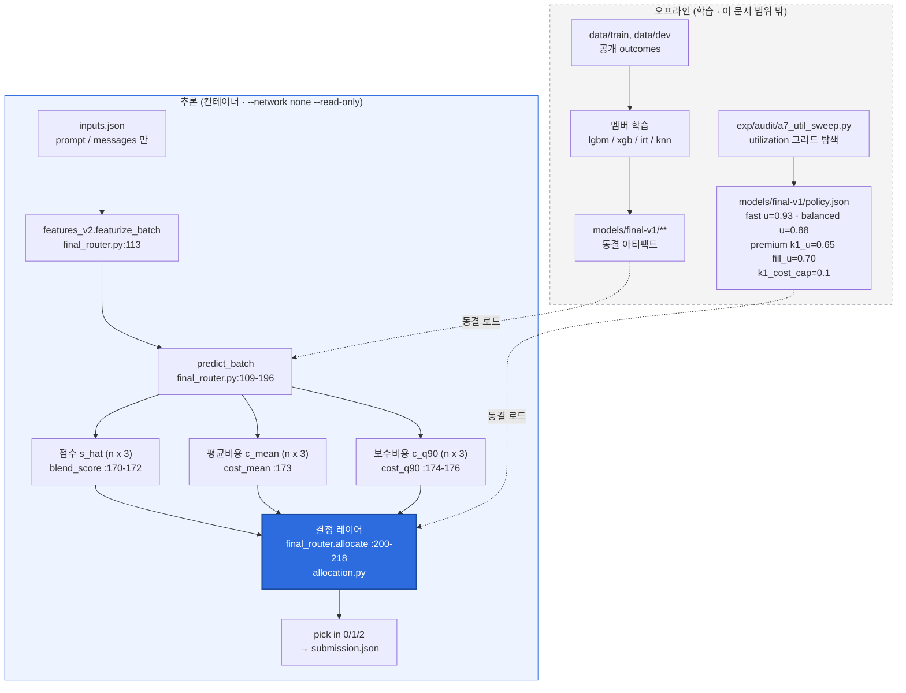
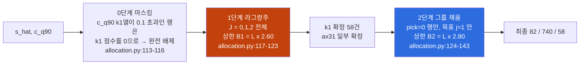

<!--
SPDX-FileCopyrightText: Copyright 2026 SKT OSSP challenge participant
SPDX-License-Identifier: Apache-2.0
-->

# 결정(라우팅) 레이어 — 예측값이 최종 선택으로 바뀌는 규칙

> 대상 독자: (a) 대회 심사위원 (b) 이 저장소를 처음 보는 엔지니어
> 범위: `src/ossp_router/allocation.py`, `exp/alloc_lib.py`, `src/ossp_router/final_router.py:100-241`
> 이 문서의 모든 수치는 감사로 확정된 값이거나, 문서 하단 §13의 명령으로 직접 재현한 출력입니다.

---

## 0. 한 줄 요약과 불편한 사실 먼저

이 시스템의 성능은 **점수 예측 모델이 아니라 이 문서가 설명하는 결정 레이어에서 나옵니다.**

A7 감사(`exp/audit/A7-overfit-falsification.md:31-32, 248-276`)의 반증 실험 결과:

| 실험 | Dev 최종점수 | 의미 |
|---|---|---|
| all-light (아무것도 안 함) | 0.619318 | 자명한 하한 |
| **랜덤 특징 + 실제 라벨** (3 시드 평균) | **0.656297** | 점수 정보가 0일 때의 진짜 null |
| **점수 라벨 셔플** (3 시드 평균) | **0.666515** | 점수 라벨을 파괴해도 여기까지 나옴 |
| 본 제출 (조회표 OFF) | **0.684318** | 정직한 일반화 점수 |

즉 all-light 대비 총 이득 +0.065 중 **+0.037은 점수 예측이 전혀 없어도** 비용모델과 예산 배분기만으로 얻어집니다.
점수 모델의 실제 순기여는 `0.684318 − 0.656297 = 약 +0.028`뿐입니다.

이것은 숨길 약점이 아니라 **이 대회 구조의 본질**입니다. 채점 규칙(`src/ossp_router/scoring.py:154-158`)은
예산 초과 시 해당 등급 점수를 **0으로 만듭니다.** 따라서 최적화 문제의 지배적인 항은
"어느 문항이 어려운가"가 아니라 "**한정된 예산을 초과하지 않으면서 가장 많은 문항을 상위 모델로 올리는가**"입니다.
그 결정을 내리는 곳이 바로 이 레이어입니다. 자세한 논증은 §11.

---

## 1. 결정 레이어의 위치

학습은 전부 오프라인에서 끝나고, 컨테이너 안에서는 **동결된 상수(policy.json)로 배분만 수행**합니다.



**결정 레이어의 계약**: 입력은 `(ŝ, ĉ^μ, ĉ^q, tier)` 네 개뿐입니다.
episode_id, 입력 순서, split 이름, 배치 크기, 파일 경로는 **인자로 전달되지 않습니다**(`final_router.py:200`).
이것이 §7 불변성 증명의 출발점입니다.

---

## 2. 기호

| 기호 | 정의 | 코드 |
|---|---|---|
| `n` | 배치 문항 수 | — |
| `j ∈ {0,1,2}` | 모델 인덱스 = `("ax31-light","ax31","axk1-think")` | `final_router.py:48` |
| `ŝ[i,j] ∈ [0,1]` | 예측 점수 (4멤버 블렌드) | `final_router.py:170-172` |
| `ĉ^μ[i,j]` | 예측 평균 비용 (credits) | `final_router.py:173` |
| `ĉ^q[i,j]` | 보수 비용, k1 열만 q90 | `final_router.py:174-176` |
| `M_T` | 등급 예산 배수 (fast 1.25 / balanced 2.0 / premium 4.0) | `resources/routing-policy.v1.json` |
| `u` | utilization (안전계수) | `policy.json` |
| `L = Σ_i ĉ[i,0]` | 예측 all-light 총비용 | `allocation.py:28, 71, 125` |
| `B = L · max(1, M_T·u)` | **배분기가 지킬 예측 기준 상한** | `allocation.py:29, 72, 126` |
| `x ∈ {0,1,2}^n` | 최종 선택(pick) | — |

채점 규칙의 실제 예산 판정은 **실현 비용** 기준입니다(`scoring.py:154-156`):

```
budget_limit = light_baseline_cost × M_T
budget_ratio = total_cost / light_baseline_cost
budget_passed = total_cost ≤ budget_limit
tier_score = quality_score if budget_passed else 0      # scoring.py:158
```

배분기는 **예측 비용** 위에서 `B`를 지키고, 채점은 **실현 비용** 위에서 `M_T`를 봅니다.
그 사이의 오차를 흡수하는 장치가 `u`입니다(§6.2).

---

## 3. 예측 → 결정 사이의 모든 변환

`predict_batch`가 배분기에 넘기기 전에 수행하는 변환은 정확히 네 가지입니다. 그 외에는 없습니다.

### 3.1 비용 단조성 강제 `_monotone` (`final_router.py:102-107`)

```python
@staticmethod
def _monotone(cost: np.ndarray) -> np.ndarray:
    cost = cost.copy()
    cost[:, 1] = np.maximum(cost[:, 1], cost[:, 0] * (1 + 1e-12))
    cost[:, 2] = np.maximum(cost[:, 2], cost[:, 1] * (1 + 1e-12))
    return cost
```

수식으로:

```
ĉ[i,1] ← max(ĉ[i,1], ĉ[i,0]·(1+ε)),   ĉ[i,2] ← max(ĉ[i,2], ĉ[i,1]·(1+ε)),   ε = 1e-12
```

**왜 필요한가.** 배분기의 승격 키는 `Δs/Δc`입니다(`allocation.py:87`). 회귀 모델이
`ĉ[i,1] < ĉ[i,0]`처럼 단조성을 어기면 `Δc ≤ 0`이 되고, `max(Δc, 1e-12)`에 걸려
비율이 `Δs/1e-12 ≈ 1e12`로 폭발합니다. 그러면 그 행이 정렬 최상단을 차지해
**실제로는 예산을 쓰면서 "공짜"로 위장**됩니다. `_monotone`은 이 경로를 원천 차단합니다.
요금표(`policy.json:12-25`)가 light < ax31 < axk1-think로 엄격 증가하므로,
동일 토큰 수라면 물리적으로도 반드시 성립해야 하는 제약입니다.

`_monotone`은 5회 호출됩니다: `:122`(lgbm 평균), `:125`(lgbm q90), `:139`(xgb),
`:173`(기하평균 블렌드), `:176`(q90 합성). 조회표 적중 시 `:194-195`에서 두 번 더 재적용됩니다.

### 3.2 평균 비용과 q90 상한의 분리 (`final_router.py:173-176`)

```python
cost_mean = self._monotone(np.exp((np.log(lgbm_cost) + np.log(xgb_cost)) / 2.0))
cost_q90 = cost_mean.copy()
cost_q90[:, 2] = lgbm_q90_cost[:, 2]
cost_q90 = self._monotone(cost_q90)
```

* `cost_mean` = lgbm/xgb 비용의 **로그공간 기하평균**. 곱셈 오차 구조(토큰 수는 로그정규에 가까움)에 맞춘 결합입니다.
* `cost_q90`은 **k1 열만** `lgbm q90-2` 헤드로 교체합니다(`:121, 125-127`). 즉
  `ĉ^q[:,0] = ĉ^μ[:,0]`, `ĉ^q[:,1] = ĉ^μ[:,1]`, `ĉ^q[:,2] = q90 추정`.

  ```
  ĉ^q[i,2] = exp(l̂in[i,2])·rate_in[2]/1e6 + exp(q̂90_out[i,2])·rate_out[2]/1e6
  ```

  출력 토큰만 90분위로 잡습니다. 입력 토큰은 프롬프트에서 사실상 결정되므로 분산이 작고,
  꼬리 위험은 전부 **출력** 토큰(k1의 think 길이)에서 나오기 때문입니다.

**등급별로 어느 비용 행렬을 쓰는지가 위험 정책의 핵심입니다**(`final_router.py:202-218`):

| 등급 | 배분기에 넘기는 비용 |
|---|---|
| fast | `cost_mean` |
| balanced | `cost_mean` |
| premium | **`cost_q90`** |

premium만 보수 비용을 씁니다. k1을 쓸 수 있는 유일한 등급이고, k1의 비용 분산이 압도적이기 때문입니다.

### 3.3 조회표 덮어쓰기 (`final_router.py:178-195`)

SHA-256 프롬프트 해시가 공개 Train/Dev와 정확히 일치하면 예측을 **실현값으로 교체**합니다.

```python
blend_score[hit] = self.lookup_scores[pos[hit]]
cost_mean[hit]   = self.lookup_costs[pos[hit]]
cost_q90[hit]    = self.lookup_costs[pos[hit]]
```

> **표기 주의 — 이것은 암기이며 일반화가 아닙니다.**
> 규정(`docs/CHALLENGE_RULES.md` §사용할 수 있는 정보)이 조회표·프롬프트 해시 조회를 명시적으로 허용하므로
> 제출본에는 켜져 있지만, **성능 수치로 인용해서는 안 됩니다.**
> 적중률 실측: train 1760/1760 = 100%, dev 880/880 = 100%.
> 조회표 ON 가중점수 0.760284는 **비공개셋에서 재현될 근거가 전혀 없습니다.**
> **이 문서의 모든 결정 분포·민감도·예산 수치는 조회표 OFF 번들(`build/bundle-nolookup`) 기준입니다.**

조회표가 적중하면 `ĉ^μ = ĉ^q`가 되어 premium의 q90 보수성이 사라진다는 점도 기록해 둡니다
(`:192-193`이 같은 배열을 대입). 즉 조회표 ON일 때 premium의 꼬리 방어는 무력화됩니다.
A10 실측에서 조회표 ON premium 초과확률이 0.000%인 것은 비용을 "정답으로" 알고 있기 때문이지
방어가 작동해서가 아닙니다.

### 3.4 등급 파라미터 바인딩 (`final_router.py:200-218`)

```python
def allocate(self, tier, score, cost_mean, cost_q90) -> np.ndarray:
    spec = self.policy_spec[tier]
    if tier == "premium":
        return allocation.two_stage_premium(
            score, cost_q90, multiplier=4.0,
            k1_utilization=spec["k1_utilization"],
            fill_utilization=spec["fill_utilization"],
            k1_cost_cap=spec["k1_cost_cap"])
    multiplier = 1.25 if tier == "fast" else 2.0
    return allocation.greedy_allocate(
        score, cost_mean, multiplier=multiplier,
        utilization=spec["utilization"], allow_k1=spec["allow_k1"])
```

`policy.json`의 실제 동결값 (`models/final-v1/policy.json:26-42`):

```json
"fast":     { "decision": "greedy",    "allow_k1": false, "utilization": 0.93 },
"balanced": { "decision": "greedy",    "allow_k1": false, "utilization": 0.88 },
"premium":  { "decision": "two-stage", "k1_utilization": 0.65,
              "fill_utilization": 0.7, "k1_cost_cap": 0.1,
              "k1_cost_source": "lgbm-q90" }
```

배수 `M_T`는 policy.json이 아니라 코드에 하드코딩되어 있습니다
(`final_router.py:206`의 `multiplier=4.0`, `final_router.py:211`의 `1.25 if tier == "fast" else 2.0`).
이 값들은 공식 정책 파일 `src/ossp_router/resources/routing-policy.v1.json`의
`budget_multiplier`(1.25 / 2.0 / 4.0)와 일치합니다.

---

## 4. 세 배분기의 정식 수식

세 함수 모두 **`exp/alloc_lib.py`의 실험 검증본을 그대로 이식**한 것입니다.
`diff`로 확인한 차이는 docstring/주석과, 실험본에만 있는 미사용 인자
`from_pick`(`exp/alloc_lib.py:75, 86`)뿐입니다. 알고리즘 본문은 라인 단위로 동일합니다.

공통 목적함수는 배낭(knapsack)형 문제입니다.

```
maximize    Σ_i ŝ[i, x_i]
subject to  Σ_i ĉ[i, x_i] ≤ B = L · max(1, M_T·u)
            x_i ∈ J,  J = {0,1} (allow_k1=False) 또는 {0,1,2}
```

`max(1, ·)` 항(`allocation.py:29, 72, 126`)이 중요합니다. `M_T·u < 1`이 되더라도 상한은
all-light 비용 아래로 내려가지 않습니다. 즉 **어떤 파라미터를 넣어도 all-light는 항상 실행 가능해**
빈 해가 나오지 않습니다.

---

### 4.1 `lagrangian_allocate` — 라그랑주 승수 + 이진탐색 (`allocation.py:18-57`)

**완화 문제.** 제약을 목적함수로 흡수하면 행 단위로 분해됩니다.

```
                                        n · ĉ[i,j]
U_i(j; λ)  =  ŝ[i,j]  −  λ · ─────────────────────
                                            L

choose(λ)_i = argmax_{j ∈ J} U_i(j; λ)        (동률은 낮은 인덱스 우선)
C(λ)        = Σ_i ĉ[i, choose(λ)_i]
```

코드(`allocation.py:31-39`):

```python
def choose(lam: float) -> np.ndarray:
    best = np.zeros(n, dtype=int)
    best_util = score_pred[:, 0] - lam * cost_pred[:, 0] / light_total * n
    for j in models[1:]:
        util = score_pred[:, j] - lam * cost_pred[:, j] / light_total * n
        better = util > best_util + 1e-15          # ← 엄격 부등호 + 절대 마진
        best = np.where(better, j, best)
        best_util = np.where(better, util, best_util)
    return best
```

`n/L` 정규화는 `λ`를 배치 크기·비용 스케일과 무관한 무차원 량으로 만듭니다.
`better`가 `>`이고 `+1e-15` 마진까지 붙으므로 **동률은 항상 더 싼(낮은 인덱스) 모델로 떨어집니다.**
이는 순수 elementwise 연산이라 입력 순서와 무관합니다(§7).

**단조성.** `λ`가 커지면 비싼 `j`의 페널티가 더 크게 증가하므로 `choose(λ)`는 약단조 감소,
따라서 `C(λ)`도 약단조 비증가입니다. 이진탐색이 성립하는 근거입니다.

**알고리즘** (`allocation.py:41-57`):

```
1. pick ← choose(0);  if C(0) ≤ B:  return pick             # 무제약 최적이 이미 가능
2. low←0, high←1
   while C(choose(high)) > B and high < 2^60:  low←high, high←2·high     # :45  브래킷팅
3. pick ← choose(high)
   repeat 100 times:                                                     # :48  이진탐색
       mid ← (low+high)/2
       if C(choose(mid)) ≤ B:  high←mid,  pick←choose(mid)   # 가능해만 pick에 커밋
       else:                   low←mid
4. if C(pick) > B:  return 0-vector (all-light)                          # :55-56 하드 폴백
5. return pick
```

**수렴 조건.** 반복 횟수가 100으로 **고정**되어 있습니다(데이터 의존 종료 조건 없음).
구간 폭은 매 회 정확히 절반이 되므로 100회 후 `(high−low) = high₀·2⁻¹⁰⁰`입니다.
`high₀ < 2⁶⁰`이므로 최종 폭 `< 2⁻⁴⁰ ≈ 9.1e-13`이고, 이는 IEEE754 배정밀도에서
`λ*`를 사실상 기계 정밀도까지 확정한 값입니다. 브래킷팅 루프도 `high < 2^60`
가드로 최대 61회에서 반드시 종료합니다. **따라서 실행 시간은 데이터와 무관하게 상수 회 반복이며,
무한 루프·조기 종료·수렴 실패가 구조적으로 불가능합니다.**

**불변식.** 3단계에서 `pick`은 오직 `C(cand) ≤ B`일 때만 갱신됩니다.
`high`의 초기값도 `C(choose(high)) ≤ B`를 만족하는 값입니다.
따라서 루프 종료 시 `pick`은 항상 실행 가능합니다. 4단계의 폴백은 이론상 도달 불가능한
방어 코드지만, 부동소수점 병리(예: `L`이 비정상)를 대비해 남겨둔 **최후의 예산 보증**입니다.
all-light를 반환하면 비율이 정확히 1.0이 되어 어떤 `M_T ≥ 1`에서도 통과합니다.

---

### 4.2 `greedy_allocate` — 비율 정렬 그룹 승격 (`allocation.py:60-101`)

fast / balanced가 사용합니다.

**후보 생성** (`allocation.py:76-89`). 모든 행 `i`와 목표 `j > x_i`에 대해:

```
Δs(i,j) = ŝ[i,j] − ŝ[i,x_i]
Δc(i,j) = ĉ[i,j] − ĉ[i,x_i]
제외 1:  j = 2 이고 k1_cost_cap이 주어졌으며 ĉ[i,2] > k1_cost_cap        # :81
제외 2:  Δs ≤ 1e-12                                                     # :85  (이득 없는 승격 금지)
r(i,j)  = Δs / max(Δc, 1e-12)                                           # :87
```

**정렬 키 정의** — 이 문서에서 가장 중요한 네 줄입니다.

```python
key = (round(ratio, 12), round(ds, 12), round(dc, 12), j)          # :88
groups.setdefault(key, []).append((i, j))                          # :89
ordered = sorted(groups.items(),
                 key=lambda kv: (-kv[0][0], kv[0][2], kv[0][1], kv[0][3]))   # :90
```

정렬 순서를 수식으로:

```
(i,j) ≺ (i',j')  ⟺  (−r, Δc, Δs, j)  <lex  (−r', Δc', Δs', j')
```

즉 **① 비율 높은 순 → ② 증분비용 싼 순 → ③ 증분이득 작은 순 → ④ 목표 인덱스 낮은 순**.
②③은 동률 비율에서 "작게 여러 개"를 먼저 먹어 예산 파편화를 줄이는 방향입니다.

정렬 키가 dict 키 그 자체이고 dict 키는 유일하므로, `sorted()`의 비교는
**모든 원소 쌍에서 결정적으로 판정되며 안정정렬의 삽입순서 폴백에 도달하지 않습니다.**
이것이 순서 불변성의 형식적 근거입니다(§7).

**그룹 승격** (`allocation.py:91-100`):

```python
for key, members in ordered:
    rows = [i for i, _ in members if pick[i] < members[0][1]]
    if not rows:
        continue
    j = members[0][1]
    dc_total = sum(cost_pred[i, j] - cost_pred[i, pick[i]] for i, _ in members)
    if total + dc_total <= cap:
        for i, _ in members:
            pick[i] = j
        total += dc_total
```

**전부 아니면 전무(all-or-nothing)** 입니다. 동일 서명을 가진 `k`개 행 중 3개만 올리는 일이 없습니다.
그랬다면 "어느 3개인가"를 정할 근거가 입력 순서밖에 없었을 것입니다.
`dc_total`은 매 그룹마다 **현재** `pick[i]` 기준으로 재계산되므로(`:96`),
같은 행이 j=1 그룹과 j=2 그룹에 모두 등장해도 예산 회계가 어긋나지 않습니다.

> **정직한 잔여 결함 (출하 구성에서는 도달 불가).**
> `:98`은 `rows`가 아니라 `members` 전체에 `pick[i] = j`를 대입합니다.
> 한 그룹 안에 이미 `j`보다 높은 등급으로 승격된 행이 섞여 있으면 그 행은 **강등**됩니다.
> 합성 반례로 실제 재현했습니다(§13 재현 명령 4).
> 다만 이 경로는 **출하된 어떤 등급에서도 도달할 수 없습니다**:
> fast/balanced는 `allow_k1=False`라 후보 목표가 `j=1` 하나뿐이고(`pick ∈ {0,1}`),
> premium은 `greedy_allocate`를 아예 호출하지 않습니다(`two_stage_premium`은 자체 채움 루프를 씁니다).
> 또한 공개 2640문항 전체에서 크기 2 이상인 서명 그룹은 **0개**로 측정되었습니다(§7.3).
> 예산 회계는 `dc_total`에 음수 증분이 그대로 반영되므로 이 경우에도 **예산 초과는 발생하지 않습니다**(점수만 손해).

---

### 4.3 `two_stage_premium` — k1 커밋 후 채우기 (`allocation.py:104-144`)

premium 전용. 되돌릴 수 없는 비싼 결정(k1)에는 **좁은 예산**을, 값싼 보정(ax31)에는 **넓은 예산**을 줍니다.

**0단계 — k1 비용 상한 마스킹** (`:113-116`):

```python
if k1_cost_cap is not None:
    masked = score_pred.copy()
    masked[cost_pred[:, 2] > k1_cost_cap, 2] = 0.0
    score_pred = masked
```

```
ŝ'[i,2] = 0  if  ĉ^q[i,2] > κ  (κ = 0.1 credits)   else  ŝ[i,2]
```

주목: **비용이 아니라 점수를 0으로 만듭니다.** 점수가 `[0,1]`이고 라그랑주 비교가
엄격 부등호(`util > best_util + 1e-15`, `:36`)이므로, `ŝ'[i,2]=0`인 행은
`λ=0`에서조차 `0 > ŝ[i,0] + 1e-15`를 만족할 수 없어 **완전 배제**됩니다.
비용을 ∞로 두는 것과 동등하되 `_monotone`을 깨지 않는 구현입니다.

**1단계 — k1 배정** (`:117-123`): `lagrangian_allocate(ŝ', ĉ^q, M=4.0, u=k1_utilization=0.65, allow_k1=True)`
→ 상한 `B₁ = L · 2.60`. 3모델 전체에 대한 라그랑주 최적화이므로 이 단계에서 k1과 ax31이 함께 정해집니다.

**2단계 — ax31 채움** (`:124-143`): 상한을 `B₂ = L · fill_utilization·4.0 = L · 2.80`으로 **넓힌 뒤**,
`pick[i] == 0`인 행만 대상으로 `0 → 1` 승격만 수행합니다.

```python
for i in range(n):
    if pick[i] != 0:                      # :130  k1/ax31 확정분은 절대 건드리지 않음
        continue
    ds = score_pred[i, 1] - score_pred[i, 0]
    dc = cost_pred[i, 1] - cost_pred[i, 0]
    if ds <= 1e-12:
        continue
    key = (round(ds / max(dc, 1e-12), 12), round(dc, 12), round(ds, 12))    # :136
    groups.setdefault(key, []).append(i)
for key, rows in sorted(groups.items(), key=lambda kv: (-kv[0][0], kv[0][1])):  # :138
    ...
```

정렬은 `(−r, Δc)` 2요소입니다(`:138`). `r = Δs/Δc`이므로 `r`과 `Δc`가 같으면 `Δs`도 결정되어
사실상 전순서입니다. 공개 2640문항에서 `(r, Δc)`가 같은데 `Δs`가 다른 키는 **0개**로 측정했습니다(§7.3).

**핵심 성질**: 1단계의 k1 결정은 **더 좁은 2.60 예산 안에서** 내려지고,
2.60~2.80 사이의 여유분은 오직 값싼 `0→1` 승격에만 쓰입니다.
비싼 결정은 보수적으로, 싼 결정은 공격적으로 — 이것이 "위험 샌드위치"입니다.



---

## 5. 등급별 차이 표

| 항목 | fast | balanced | premium |
|---|---|---|---|
| 예산 배수 `M_T` | 1.25 | 2.0 | 4.0 |
| 가중치 | 0.4 | 0.3 | 0.3 |
| 배분기 | `greedy_allocate` | `greedy_allocate` | `two_stage_premium` |
| 사용 비용행렬 | `cost_mean` | `cost_mean` | **`cost_q90`** |
| k1 허용 | ✗ (`allow_k1=false`) | ✗ (`allow_k1=false`) | ✓ |
| utilization | 0.93 | 0.88 | k1 0.65 / fill 0.70 |
| 계획 상한 `M·u` | 1.1625 | 1.76 | 2.60 → 2.80 |
| k1 비용 상한 κ | — | — | 0.1 credits (`lgbm-q90`) |
| 탐색 방식 | 비율 정렬 1패스 | 비율 정렬 1패스 | 라그랑주 + 비율 정렬 |
| 반복 횟수 | 데이터 의존 (그룹 수) | 데이터 의존 | 상수 100 + 그룹 수 |
| Dev 선택 분포 | 466 / 414 / 0 | 111 / 769 / 0 | 82 / 740 / 58 |
| Dev 실현 비용비 | 1.180437 | 1.677356 | 2.823888 |
| Dev 품질점수 | 0.659091 | 0.691761 | 0.710511 |

`fast`가 `balanced`보다 utilization이 **높은데도**(0.93 > 0.88) 상한이 훨씬 낮은 이유는
`M_T` 차이가 지배하기 때문입니다(1.25×0.93 = 1.1625 vs 2.0×0.88 = 1.76).
fast는 절대 여유가 0.0875뿐이라 상대 안전마진을 크게 잡을 수 없고, 대신 §10.6에서 보듯
**세 등급 중 유일하게 ±10% 흔들기로 0점이 되는 등급**입니다.

### 5.1 Premium의 k1 배정 로직 상세 (실측)

조회표 OFF, Dev 880문항 기준 (`build/b5-decision-stats.json`):

| 단계 | 측정값 |
|---|---|
| κ=0.1에 걸려 k1 후보에서 배제 | **403 / 880 = 45.8%** |
| 1단계 라그랑주가 실제로 고른 k1 | **58건 (6.59%)** |
| 배제된 행의 실현 k1 비용 평균 | 0.20033 credits |
| 통과한 행의 실현 k1 비용 평균 | 0.04932 credits (**약 4.1배 차이**) |
| 선택된 k1의 예측 q90 비용 최대 | 0.09824 (κ 바로 아래) |
| 선택된 k1의 **실현** 비용 최대 | **1.03325** |

**k1으로 간 문항의 특성 요약**:

| 지표 | k1 (58건) | ax31 (740건) | light (82건) |
|---|---|---|---|
| 텍스트 길이 중앙값 | **146자** | 236자 | 409자 |
| 텍스트 길이 p90 | 390자 | 749자 | 63,618자 |
| 예측 light 점수 | 0.4485 | 0.6244 | 0.4999 |
| 예측 k1−ax31 이득 | **+0.3237** | +0.0995 | +0.1864 |
| 예측 ax31−light 이득 | +0.0748 | +0.0871 | −0.0110 |
| 실현 점수 light → k1 | 0.5345 → **0.9052** | 0.6439 → 0.8416 | 0.4573 → 0.6341 |

프로필은 명확합니다: **짧고, light가 틀리고, k1이 맞히리라 예측되며, q90 비용이 싼 문항.**
k1 그룹의 문서빈도가 두드러지게 높은 토큰은 `def`(0.241 vs 0.128), `assert`(0.241 vs 0.136),
`return`(0.241 vs 0.187) — 짧은 코드/논리 추론 문항입니다.
반대로 light로 남은 82건은 p90 길이가 63,618자로, **길어서 비싸기 때문에** 밀려난 문항들입니다.

**k1 단계의 비용/효익 (정직한 회계)**:

| 시나리오 | 품질점수 | 비용비 | k1 수 |
|---|---|---|---|
| 출하 그대로 | 0.710511 | 2.823888 | 58 |
| k1 선택분을 전부 ax31로 강등 | 0.690057 | 1.721863 | 0 |
| k1 선택분을 전부 light로 강등 | 0.686080 | 1.689552 | 0 |

k1 단계는 **premium 총비용의 40.7%를 써서 +0.020455 점수**를 얻습니다.
가중치 0.3을 곱하면 최종점수 기여는 **+0.00614**입니다. 결코 크지 않습니다.

더 불편한 사실: 58건의 k1 선택 중 실제로 ax31보다 **점수가 오른 것은 23건뿐**이고,
**31건은 동점**, **4건은 오히려 하락**했습니다.
절반 이상이 출력 단가 3.1배(ax31 8.509 → axk1-think 26.26)를 내고 같은 점수를 받았습니다.
light 기준으로는 6.6배(4 → 26.26)입니다.

**κ=0.1 상한의 순효과도 Dev에서는 마이너스입니다**:

| 구성 | 품질점수 | 비용비 | k1 수 |
|---|---|---|---|
| κ = 0.1 (출하) | 0.710511 | 2.823888 | 58 |
| κ = 없음 (반사실) | **0.712216** | 2.838283 | 47 |

즉 상한은 Dev 점수를 **−0.0017 깎습니다.** 이것은 점수를 얻는 장치가 아니라
**꼬리위험 보험료**로 이해해야 하며, 그렇게 서술하는 것이 정직합니다.

**그리고 그 보험은 완전하지 않습니다.** κ는 **예측** q90 비용을 봅니다.
선택된 58건 중 **13건은 실현 비용이 0.1을 넘었고**, 그 13건만으로
premium 총비용의 **27.4%(3.3883 credits)** 를 차지했습니다.
비용 예측이 10배 빗나간 행이 실제로 존재합니다(예측 ≤0.098 → 실현 1.03325).

---

## 6. 예산 제어

### 6.1 한도가 계산되는 지점

| 위치 | 코드 | 식 |
|---|---|---|
| 배분기 내부 (예측 기준) | `allocation.py:29` `:72` `:126` | `cap = light_total × max(1, multiplier × utilization)` |
| premium 1단계 | `allocation.py:117-123` → `:29` | `B₁ = L × max(1, 4.0×0.65) = L × 2.60` |
| premium 2단계 | `allocation.py:126` | `B₂ = L × max(1, 4.0×0.70) = L × 2.80` |
| 채점기 (실현 기준) | `scoring.py:154` | `budget_limit = light_baseline_cost × budget_multiplier` |
| 통과 판정 | `scoring.py:156, 158` | `passed = total_cost ≤ limit`; 실패 시 `tier_score = 0` |
| 경고선 | `scoring.py:159-162` | `near_budget = ratio ≥ M_T × 0.95` |

배분기는 **모든 승격 직전에** `total + Δc ≤ cap`을 검사합니다(`:97`, `:140`).
따라서 예측 기준으로는 상한 초과가 구조적으로 불가능합니다.
라그랑주는 이진탐색 불변식 + `:55-56` 하드 폴백으로 같은 보증을 얻습니다.

### 6.2 안전마진 값과 근거

| 등급 | `M_T` | `M·u` (계획) | 노브 마진 | 계획 대비 실현 오차 | 실현 비용비 | 한도까지 잔여 |
|---|---:|---:|---:|---:|---:|---:|
| fast | 1.25 | 1.1625 | **7.00%** | **+1.543%** | 1.180437 | 5.565% |
| balanced | 2.00 | 1.7600 | **12.00%** | −4.690% | 1.677356 | 16.132% |
| premium | 4.00 | 2.8000 | **30.00%** | +0.866% | 2.823888 | 29.403% |

**왜 마진이 필요한가.** 배분기의 상한은 **예측** 비용 위에 걸리고 채점은 **실현** 비용을 봅니다.
위 표의 "계획 대비 실현 오차" 열이 그 간극의 실측치입니다.
fast는 계획 1.16250을 세웠는데 실현이 1.18044로 **+1.543% 초과**했습니다.
7% 마진이 이 오차를 흡수했기에 통과한 것입니다.

Dev 그리드 실측(`build/a7/util_sweep.json`)으로 절벽 위치를 정확히 짚으면:

| u | 실현 비용비 | 통과 |
|---:|---:|:---:|
| 0.93 (동결) | 1.180437 | ✓ |
| 1.00 | 1.232938 | ✓ |
| 1.01 (Dev argmax) | 1.244597 | ✓ |
| **1.02** | **1.256754** | **✗** |
| 1.03 | 1.267363 | ✗ |

Dev에서 fast의 실패 경계는 `u = 1.02`이고, Dev 최적점 `u = 1.01`은 **경계에서 정확히 한 칸 떨어진 지점**입니다.
동결값 0.93은 경계에서 9칸 아래입니다. 이 9칸이 비공개셋의 분포 이동을 흡수할 여유의 전부입니다.

세 배분기 모두 계획 상한을 **99.99% 이상 소진**합니다(`plan_fill_of_cap`:
fast 0.9999995, balanced 0.9999367, premium 0.9998705). 즉 `u`는 실질적으로
"예산의 몇 %를 쓸 것인가"를 직접 지정하는 노브이며, 이 시스템에서 **가장 영향력 있는 단일 상수**입니다.

**노브가 Dev에 적합되지 않았다는 증거** (`build/a7/util_sweep.json`, 그리드 0.60~1.15 / 56점):

| 노브 | 동결값 | Dev argmax | 동결=argmax? | 남긴 점수 |
|---|---|---|---|---|
| fast utilization | 0.93 | 1.01 | **아니오** | **0.013352** |
| balanced utilization | 0.88 | 0.89 | 아니오 | 0.000000 |
| premium k1_utilization | 0.65 | 1.13 | **아니오** | **0.019602** |
| premium fill_utilization | 0.70 | 0.68 | 아니오 | 0.000000 |

네 노브 모두 Dev 최적점이 아니며, fast와 premium.k1은 각각 0.0134 / 0.0196의 점수를
**일부러 남겼습니다.** 정책 노브는 Dev에 적합되지 않았습니다 — 깨끗한 통과 항목입니다.

### 6.3 초과확률 — A10 실측값

**저장소가 기존에 주장한 `0.1% / 0.0% / 0.5%`는 과소평가였습니다.**
A10 재현(`build/a10_overrun.json`, B=200,000 부트스트랩, seed 20260817) 실측값으로 갱신합니다.

| 등급 | 한도 | 점추정 비율 | 평균 | 표준편차 | p97.5 | **p99** | p99.9 | 최대 | **초과확률** |
|---|---:|---:|---:|---:|---:|---:|---:|---:|---:|
| fast | 1.25 | 1.180437 | 1.182097 | 0.021493 | 1.226792 | 1.236277 | 1.257273 | 1.306684 | **0.221%** |
| balanced | 2.00 | 1.677356 | 1.683074 | 0.075302 | 1.830432 | 1.856398 | 1.905024 | 1.996288 | **0.000%** |
| premium | 4.00 | 2.823888 | 2.840054 | 0.383594 | 3.700893 | **3.901844** | **4.353972** | 5.360585 | **0.631%** |

`P(어느 한 등급이라도 0점) = 0.825%`, 부트스트랩 기대 최종점수 `0.682346`
(점추정 0.684318보다 약 0.002 낮음 — 초과확률 꼬리의 대가).

> **⚠ premium의 꼬리위험은 "29.4% 여유"라는 서술로 과소표현됩니다.**
> 29.4%는 **중앙값(점추정 2.8239) 기준**입니다.
> **p99 비용비는 3.901844이고, 한도 4.00까지 여유는 2.454%뿐입니다.**
> p99.9는 **4.353972로 한도를 8.85% 초과**합니다.
> premium 비용비의 표준편차는 0.3836으로 fast(0.0215)의 **18배**입니다.
> k1의 출력 토큰 분포가 두꺼운 꼬리를 갖기 때문이며, 이 꼬리는 q90 상한과 κ=0.1로도
> 완전히 제거되지 않았습니다(§5.1의 13건 사례).
> **premium은 "여유 많은 등급"이 아니라 "평소엔 여유롭지만 100회 중 1회는 한도 2.5% 앞까지,
> 1000회 중 1회는 한도를 넘어서는 등급"입니다.**

비교를 위한 공식 최강 기준선 `hash-regex`: 초과확률 39.4% / 38.9% / 49.3%,
기대 최종점수 약 0.40. 본 제출은 기대 최종점수 약 0.68로, 차이의 대부분은
품질이 아니라 **예산 초과확률 관리**에서 나옵니다. §11의 논지를 다시 뒷받침합니다.

---

## 7. 결정성·불변성 증명

### 7.1 논증 (코드 근거)

**전제 1 — 입력 협소성.** 배분기는 `(ŝ, ĉ, 스칼라 상수들)`만 받습니다(`allocation.py:18-25, 60-68, 104-112`).
episode_id / 순서 / split / 배치 크기 / 파일 경로는 **함수 시그니처에 존재하지 않습니다.**
호출부(`final_router.py:200-218`)도 이들을 전달하지 않습니다.
따라서 결정이 이들에 의존하려면 `ŝ, ĉ`가 이들에 의존해야 하는데,
`ŝ, ĉ`는 `episode_text(e)`(프롬프트 내용)만으로 계산됩니다(`final_router.py:226`).

**전제 2 — 라그랑주는 elementwise.** `choose(λ)`(`:31-39`)는 `np.where` 기반 순수 벡터 연산입니다.
행 `i`의 결과는 `ŝ[i,:], ĉ[i,:], λ, L, n`만의 함수입니다.
`L`과 `n`은 집합 불변량(합·개수)이므로 순열에 불변입니다. 따라서 `choose(λ)`는 순열 동변(equivariant)입니다.
`C(λ)`도 합이므로 순열 불변, 이진탐색 궤적도 순열 불변, 결론적으로 최종 `pick`이 순열 동변입니다.

**전제 3 — 그리디의 동률 처리** (`allocation.py:88-101`):

```python
        key = (round(ratio, 12), round(ds, 12), round(dc, 12), j)          # :88
        groups.setdefault(key, []).append((i, j))                          # :89
ordered = sorted(groups.items(), key=lambda kv: (-kv[0][0], kv[0][2], kv[0][1], kv[0][3]))  # :90
for key, members in ordered:                                                # :91
    rows = [i for i, _ in members if pick[i] < members[0][1]]               # :92
    if not rows:                                                            # :93
        continue                                                            # :94
    j = members[0][1]                                                       # :95
    dc_total = sum(cost_pred[i, j] - cost_pred[i, pick[i]] for i, _ in members)  # :96
    if total + dc_total <= cap:                                             # :97
        for i, _ in members:                                                # :98
            pick[i] = j                                                     # :99
        total += dc_total                                                   # :100
return pick                                                                 # :101
```

세 가지가 동시에 성립해야 순서 불변입니다.

1. **`:90`의 정렬 키가 dict 키 그 자체다.** `sorted`에 넘긴 `kv[0]`은 `groups`의 키이고,
   dict 키는 유일합니다. 따라서 `(-r, Δc, Δs, j)`가 완전히 같은 두 원소는 **존재할 수 없고**,
   Python 안정정렬의 "동률이면 원래 순서 유지" 규칙에 **도달하지 않습니다.**
   정렬 결과는 삽입 순서(= 행 순서)와 무관한 유일한 전순서입니다.
2. **`:96-100`의 승격이 그룹 단위 all-or-nothing이다.** 예산이 그룹 전체를 감당할 때만
   `members` 전원이 함께 올라갑니다. 부분 승격이 없으므로 "누구를 먼저 넣을지"라는
   순서 의존 결정이 발생하지 않습니다.
3. **`:88`의 12자리 반올림이 부동소수점 미세차를 흡수한다.** 같은 프롬프트는 같은 예측을 내지만,
   BLAS 커널이 배치 크기에 따라 다른 경로를 타면 최하위 비트가 흔들릴 수 있습니다.
   12자리 양자화가 그 진동을 같은 키로 모읍니다.

**전제 4 — two-stage 2단계도 동일 구조** (`allocation.py:136-143`). 승격은 동일하게 그룹 단위입니다.

> **다만 여기에는 잔여 위험이 하나 있습니다 (정직한 고지).**
> dict 키는 3요소 `(r, Δc, Δs)`인데 **정렬 키는 `(−r, Δc)` 2요소뿐입니다**(`allocation.py:138`).
> `r = Δs/max(Δc,1e-12)`이므로 보통은 `r`과 `Δc`가 같으면 `Δs`도 같지만,
> 12자리 반올림 때문에 이론적으로는 `(r, Δc)`가 같고 `Δs`만 13번째 자리에서 다른
> 두 키가 존재할 수 있습니다. 그 경우 두 그룹의 상대 순서는 안정정렬 폴백,
> 즉 **dict 삽입 순서(= 행 순서)** 로 결정되고, 예산이 거의 소진된 시점이라면
> 결과가 달라질 수 있습니다.
> 공개 2640문항 전체에서 그런 키는 **0개**였습니다(§7.3).
> 그러나 비공개셋에서 절대 발생하지 않는다는 보장은 없으므로 **UNVERIFIED**로 남깁니다.
> `greedy_allocate`에는 이 문제가 없습니다 — 그쪽은 정렬 키가 dict 키 4요소 전부입니다(`:88` vs `:90`).

### 7.2 `tests/test_final_router.py` 실행 결과

```
$ PYTHONPATH=src ./.venv/Scripts/python.exe -m unittest tests.test_final_router -v

test_repeat_run_identical (tests.test_final_router.FinalRouterDeterminismTest.test_repeat_run_identical) ... ok
test_same_choice_under_id_rename (tests.test_final_router.FinalRouterDeterminismTest.test_same_choice_under_id_rename) ... ok
test_same_choice_under_order_shuffle (tests.test_final_router.FinalRouterDeterminismTest.test_same_choice_under_order_shuffle) ... ok
test_same_choice_under_split_change (tests.test_final_router.FinalRouterDeterminismTest.test_same_choice_under_split_change) ... ok
test_single_episode_batch (tests.test_final_router.FinalRouterDeterminismTest.test_single_episode_batch) ... ok

----------------------------------------------------------------------
Ran 5 tests in 5.373s

OK
```

각 테스트가 무엇을 봉인하는지:

| 테스트 | 위치 | 검증 내용 |
|---|---|---|
| `test_same_choice_under_order_shuffle` | `:71-77` | 에피소드 순서를 **역순**으로 뒤집어도 3등급 전부 동일 결정 |
| `test_same_choice_under_id_rename` | `:79-85` | `episode_id`를 `renamed-0000…`으로 **전부 교체**해도 동일 결정 |
| `test_same_choice_under_split_change` | `:87-93` | `split`을 `private-eval`, `challenge_id`를 `other-run`으로 바꿔도 동일 결정 |
| `test_repeat_run_identical` | `:95-97` | 같은 입력 2회 실행 결과 완전 일치 (비결정 seed 부재) |
| `test_single_episode_batch` | `:99-110` | `n=1` 배치에서도 유효한 model_id 1건 산출 (배치 통계 의존 없음) |

`test_same_choice_under_split_change`는 규정 준수 관점에서 특히 중요합니다.
비공개셋에서 `split`이 달라져도 결정이 바뀌지 않음을 보증합니다.

### 7.3 실측 그룹 통계 (정직한 보강)

공개 2640문항(train 1760 + dev 880) 전체 예측 위에서 서명 그룹을 세었습니다
(`build/b5-scaling.json`, `build/b5_scaling.py`):

| 측정 | 값 |
|---|---|
| `greedy` `j=1` 후보 서명 그룹 수 | 2,422 |
| 그중 **크기 2 이상인 그룹** | **0** |
| 서로 다른 결정을 받은 그룹 | 0 |
| `Δs ≤ 1e-12`로 후보에서 제외된 행 | 218 |
| `two_stage` 채움 단계 `(r, Δc)` 충돌 중 `Δs`가 다른 것 | **0** |

> **정직한 해석**: 실데이터에서는 12자리 동률이 **한 번도 발생하지 않았습니다.**
> 즉 그룹 승격은 이 데이터에서 실제로 "발동"한 적이 없고, **보증 장치로만 존재**합니다.
> 그럼에도 유지하는 이유는 비공개셋에 동일/근사동일 프롬프트가 있을 때
> 순서 의존을 만들지 않기 위해서입니다. 데이터가 이 기능을 검증해 주지 못했다는 사실은
> 명시해 둡니다. 대신 합성 반례로 직접 검증했습니다:
> **동일 서명 3종 × 40행 = 120행, 무작위 순열 200회, 전부 동일 결정** (§13 재현 명령 3).

---

## 8. 의사코드와 복잡도

### 8.1 의사코드

```
FUNCTION allocate(tier, ŝ, ĉ^μ, ĉ^q):
    spec ← policy.json[tier]
    IF tier == "premium":
        RETURN two_stage_premium(ŝ, ĉ^q, M=4.0,
                                 k1_u=spec.k1_utilization,      # 0.65
                                 fill_u=spec.fill_utilization,  # 0.70
                                 κ=spec.k1_cost_cap)            # 0.1
    M ← 1.25 IF tier=="fast" ELSE 2.0
    RETURN greedy(ŝ, ĉ^μ, M, u=spec.utilization, allow_k1=spec.allow_k1)   # false


FUNCTION greedy(ŝ, ĉ, M, u, allow_k1, κ=None):
    x ← 0^n ;  L ← Σ_i ĉ[i,0] ;  B ← L·max(1, M·u) ;  total ← Σ_i ĉ[i,0]
    J ← {0,1,2} IF allow_k1 ELSE {0,1}
    G ← empty map
    FOR i IN 0..n-1:                                  # O(n·|J|)
        FOR j IN J WHERE j > x[i]:
            IF j==2 AND κ≠None AND ĉ[i,2] > κ: CONTINUE
            Δs ← ŝ[i,j] − ŝ[i,x[i]] ;  Δc ← ĉ[i,j] − ĉ[i,x[i]]
            IF Δs ≤ 1e-12: CONTINUE
            k ← (rnd(Δs/max(Δc,1e-12),12), rnd(Δs,12), rnd(Δc,12), j)
            G[k].append((i,j))
    FOR (k, members) IN SORT(G, BY (−k.r, k.Δc, k.Δs, k.j)):   # O(g log g)
        IF ∀(i,·)∈members: x[i] ≥ members[0].j: CONTINUE
        j ← members[0].j
        Δ ← Σ_{(i,·)∈members} (ĉ[i,j] − ĉ[i,x[i]])
        IF total + Δ ≤ B:                              # 예산 검사 — 초과 불가
            ∀(i,·)∈members: x[i] ← j
            total ← total + Δ
    RETURN x


FUNCTION lagrangian(ŝ, ĉ, M, u, allow_k1):
    L ← Σ_i ĉ[i,0] ;  B ← L·max(1, M·u) ;  J ← {0,1,2} IF allow_k1 ELSE {0,1}
    DEFINE choose(λ):  x[i] ← argmax_{j∈J} ( ŝ[i,j] − λ·n·ĉ[i,j]/L )   # 동률→낮은 j
    DEFINE C(x):       Σ_i ĉ[i, x[i]]
    x ← choose(0) ;  IF C(x) ≤ B: RETURN x
    low ← 0 ; high ← 1
    WHILE C(choose(high)) > B AND high < 2^60:  low ← high ; high ← 2·high   # ≤61회
    x ← choose(high)
    REPEAT EXACTLY 100 TIMES:                                                # 상수
        mid ← (low+high)/2 ; c ← choose(mid)
        IF C(c) ≤ B: high ← mid ; x ← c
        ELSE:        low ← mid
    IF C(x) > B: RETURN 0^n                       # 하드 폴백: 비율 1.0 보장
    RETURN x


FUNCTION two_stage_premium(ŝ, ĉ^q, M, k1_u, fill_u, κ):
    ŝ' ← ŝ ;  ŝ'[i,2] ← 0  WHERE ĉ^q[i,2] > κ            # 0단계: k1 완전 배제
    x ← lagrangian(ŝ', ĉ^q, M, k1_u, allow_k1=TRUE)      # 1단계: B₁ = L·2.60
    B₂ ← L·max(1, M·fill_u) ;  total ← Σ_i ĉ^q[i,x[i]]   # 2단계: B₂ = L·2.80
    G ← empty map
    FOR i WHERE x[i] == 0:
        Δs ← ŝ'[i,1] − ŝ'[i,0] ;  Δc ← ĉ^q[i,1] − ĉ^q[i,0]
        IF Δs ≤ 1e-12: CONTINUE
        G[(rnd(Δs/max(Δc,1e-12),12), rnd(Δc,12), rnd(Δs,12))].append(i)
    FOR (k, rows) IN SORT(G, BY (−k.r, k.Δc)):
        Δ ← Σ_{i∈rows}(ĉ^q[i,1] − ĉ^q[i,0])
        IF total + Δ ≤ B₂:  ∀i∈rows: x[i] ← 1 ;  total ← total + Δ
    RETURN x
```

### 8.2 시간복잡도

`g` = 서명 그룹 수 (`g ≤ n·|J|`, 실측 `g ≈ 0.92n`).

| 함수 | 복잡도 | 지배 항 |
|---|---|---|
| `lagrangian_allocate` | `O(n·\|J\|·(100 + log₂ λ*))` = **`O(n)`** | `choose` 벡터 연산 최대 약 163회<br/>(λ=0 1회 + 브래킷팅 ≤61회 + 확정 1회 + 이진탐색 100회) |
| `greedy_allocate` | `O(n·\|J\| + g log g + Σ\|members\|)` = **`O(n log n)`** | Python 루프의 후보 생성 + 정렬 |
| `two_stage_premium` | `O(n) + O(n log n)` = **`O(n log n)`** | 1단계 라그랑주 + 2단계 정렬 |

`greedy`가 `lagrangian`보다 느린 이유는 후보 생성 루프가 **순수 Python**이기 때문입니다
(`allocation.py:77-89`, 행당 `|J|`회 스칼라 연산). 라그랑주는 전부 numpy 벡터 연산입니다.

### 8.3 실측 소요시간 — 공개 2640문항

`data/materialized/train/inputs.json`(1760) + `data/materialized/dev/inputs.json`(880) = **2640문항**을
한 배치로 넣어 조회표 OFF 번들(`build/bundle-nolookup`)로 실측했습니다
(호스트 x64, Windows 11, 5회 반복 최소값; `build/b5-timing-bundle-nolookup.json`).

| 단계 | 소요시간 | 비고 |
|---|---:|---|
| 번들 로드 (`FinalRouter.__init__`) | 3.582 s | 1회, 등급 간 재사용 |
| `predict_batch` (특징 + 4멤버 추론) | **17.507 s** | 등급 무관, 1회 |
| **결정 레이어 — fast** | **0.02306 s** | `greedy_allocate` |
| **결정 레이어 — balanced** | **0.02312 s** | `greedy_allocate` |
| **결정 레이어 — premium** | **0.00557 s** | `two_stage_premium` |
| **결정 3등급 합계** | **0.05174 s** | |

**결정 레이어는 예측+결정 전체 시간의 0.295%입니다.**
컨테이너 90초 한도(arm64 QEMU 실측 fast 59.9s / balanced 67.0s / premium 68.2s) 대비
결정 레이어가 차지하는 비중은 무시 가능합니다.

> UNVERIFIED: arm64 QEMU 컨테이너 안에서 결정 레이어만 따로 계측하지 않았습니다.
> 위 0.05174초는 **호스트 x64 실측값**입니다. QEMU 에뮬레이션 배율(전체 기준 약 6~9배)을
> 그대로 적용하면 0.3~0.5초 수준으로 추정되지만, 이는 추정이며 측정값이 아닙니다.

**스케일링 실측** (실제 서로 다른 2640행의 앞부분을 잘라 측정, `build/b5-scaling.json`):

| n | fast (ms) | balanced (ms) | premium (ms) | 서명 그룹 수 |
|---:|---:|---:|---:|---:|
| 165 | 1.28 | 1.21 | 1.62 | 152 |
| 330 | 2.25 | 2.32 | 1.90 | 300 |
| 660 | 4.77 | 4.91 | 2.61 | 614 |
| 1320 | 11.11 | 10.70 | 3.55 | 1,198 |
| 2640 | 22.80 | 24.64 | 6.44 | 2,422 |

`greedy`는 n이 16배 될 때 시간이 약 17.8배 — **거의 선형**이며 `log n` 항이 관측 범위에서는 묻힙니다.
`premium`은 라그랑주의 **상수 100회 벡터 연산**이 작은 n에서 지배하다가
큰 n에서 2단계 정렬이 드러나는, 눈에 띄게 완만한 곡선입니다(1.62 ms → 6.44 ms, 4.0배).

---

## 9. 실측 결정 분포 (조회표 OFF, Dev 880)

`build/dev-nolookup/{fast,balanced,premium}.json`에서 직접 집계했습니다.
동일 파일을 동결 예측(`build/a7/pred-shipped-nolookup-dev.npz`)에서 재계산해
**880/880 완전 일치**를 확인했습니다(`build/b5-decision-stats.json` → `reproduction_vs_disk`).

| 등급 | ax31-light | ax31 | axk1-think |
|---|---:|---:|---:|
| fast | **466 (52.95%)** | 414 (47.05%) | 0 (0%) |
| balanced | 111 (12.61%) | **769 (87.39%)** | 0 (0%) |
| premium | 82 (9.32%) | **740 (84.09%)** | 58 (6.59%) |

### 9.1 예산 사용률

| 등급 | 계획 상한 `M·u` | 계획 비용비 | 상한 소진율 | **실현 비용비** | 한도 `M_T` | **한도 사용률** | 잔여 |
|---|---:|---:|---:|---:|---:|---:|---:|
| fast | 1.1625 | 1.1624994 | 99.99995% | **1.180437** | 1.25 | **94.435%** | 5.565% |
| balanced | 1.7600 | 1.7598886 | 99.99367% | **1.677356** | 2.00 | **83.868%** | 16.132% |
| premium | 2.8000 | 2.7996373 | 99.98705% | **2.823888** | 4.00 | **70.597%** | 29.403% |

배분기는 세 등급 모두 계획 예산을 **사실상 100% 소진**합니다.
남는 여유는 전부 `u`가 미리 떼어 놓은 안전마진이지, 배분기가 소극적이어서 생긴 것이 아닙니다.

실현 토큰 사용량(`build/dev-nolookup-report.json`):

| 등급 | 총비용 (credits) | 선택 입력토큰 | 선택 출력토큰 |
|---|---:|---:|---:|
| fast | 5.172000 | 2,112,884 | 587,234 |
| balanced | 7.349214 | 2,110,372 | 581,352 |
| premium | 12.372664 | 2,108,840 | 721,503 |
| (all-light 기준) | 4.381428 | — | — |

premium의 출력 토큰만 24% 급증(581k → 722k)합니다. k1 58건의 think 토큰입니다.
**입력 토큰은 세 등급이 거의 동일**한데 비용비가 1.18 → 2.82로 벌어지는 것은
요금표의 출력 단가 차이(4 → 8.509 → 26.26)가 지배하기 때문입니다.

### 9.2 어떤 특성의 문항이 어디로 갔는가

§5.1의 k1 프로필 표 참조. 요약하면:

* **k1 (58건)** — 짧은 문항(중앙값 146자, p90 390자), light 예측점수 낮음(0.4485),
  k1 이득 예측 큼(+0.3237), q90 비용 쌈(평균 0.0653). 코드/논리 추론 토큰(`def`, `assert`, `return`) 과다.
* **ax31 (740건)** — 중간 길이(중앙값 236자), 안정적 이득(+0.0871 vs light).
  premium 문항의 절대 다수가 여기로 갑니다.
* **light (82건)** — **길이 p90이 63,618자.** ax31 이득 예측이 **음수(−0.0110)** 이고
  비용은 길이에 비례합니다. "비싸고 이득 없음"으로 판정되어 남은 그룹입니다.

즉 결정 레이어는 사실상 **길이 기반 비용 예측을 축으로 삼아, 짧고 어려운 것은 위로,
길고 이득 없는 것은 아래로** 보냅니다. 이는 §11의 결론과 정확히 일치합니다.

---

## 10. 민감도 분석 — utilization ±10%

동결값에 배율 `μ ∈ {0.90, 0.95, 1.00, 1.05, 1.10}`을 곱해 직접 계산했습니다
(조회표 OFF, Dev 880, `build/b5-decision-stats.json` → `sensitivity`).

### 10.1 fast (`u = 0.93`, `M = 1.25`)

| μ | u | ax31 수 | 품질점수 | 비용비 | 예산통과 | **등급점수** |
|---:|---:|---:|---:|---:|:---:|---:|
| 0.90 | 0.8370 | 181 | 0.635795 | 1.055677 | ✓ | 0.635795 |
| 0.95 | 0.8835 | 333 | 0.645455 | 1.126562 | ✓ | 0.645455 |
| **1.00** | **0.9300** | **414** | **0.659091** | **1.180437** | ✓ | **0.659091** |
| 1.05 | 0.9765 | 473 | 0.668750 | 1.208015 | ✓ | 0.668750 |
| **1.10** | **1.0230** | **520** | 0.671875 | **1.259758** | **✗** | **0.000000** |

**fast는 +10%에서 절벽에서 떨어집니다.** 품질은 0.6719까지 올라가지만
비용비 1.2598이 한도 1.25를 넘어 **등급점수가 0**이 됩니다.

### 10.2 balanced (`u = 0.88`, `M = 2.0`)

| μ | u | ax31 수 | 품질점수 | 비용비 | 예산통과 | 등급점수 |
|---:|---:|---:|---:|---:|:---:|---:|
| 0.90 | 0.7920 | 726 | 0.687216 | 1.523719 | ✓ | 0.687216 |
| 0.95 | 0.8360 | 754 | 0.689205 | 1.596521 | ✓ | 0.689205 |
| **1.00** | **0.8800** | **769** | **0.691761** | **1.677356** | ✓ | **0.691761** |
| 1.05 | 0.9240 | 788 | 0.691193 | 1.721063 | ✓ | 0.691193 |
| 1.10 | 0.9680 | 802 | 0.690057 | 1.775012 | ✓ | 0.690057 |

**balanced는 평평합니다.** ±10% 전 구간에서 점수 변동폭이 0.0046이고, 동결값이 최고점입니다.
비용비도 한도 2.0에 한참 못 미칩니다. 가장 안정적인 등급입니다.

### 10.3 premium — `k1_utilization` 단독 (`fill=0.70` 고정)

| μ | k1_u | k1 수 | ax31 수 | 품질점수 | 비용비 | 통과 | 등급점수 |
|---:|---:|---:|---:|---:|---:|:---:|---:|
| 0.90 | 0.5850 | 43 | 779 | 0.703693 | 2.752224 | ✓ | 0.703693 |
| 0.95 | 0.6175 | 50 | 762 | 0.705966 | 2.781995 | ✓ | 0.705966 |
| **1.00** | **0.6500** | **58** | **740** | **0.710511** | **2.823888** | ✓ | **0.710511** |
| 1.05 | 0.6825 | 66 | 708 | 0.709943 | 2.793655 | ✓ | 0.709943 |
| 1.10 | 0.7150 | 75 | 688 | 0.707955 | 2.797125 | ✓ | 0.707955 |

### 10.4 premium — `fill_utilization` 단독 (`k1=0.65` 고정)

| μ | fill_u | k1 수 | ax31 수 | 품질점수 | 비용비 | 통과 | 등급점수 |
|---:|---:|---:|---:|---:|---:|:---:|---:|
| 0.90 | 0.6300 | 58 | 696 | 0.705966 | 2.676021 | ✓ | 0.705966 |
| 0.95 | 0.6650 | 58 | 711 | 0.709375 | 2.734495 | ✓ | 0.709375 |
| **1.00** | **0.7000** | **58** | **740** | **0.710511** | **2.823888** | ✓ | **0.710511** |
| 1.05 | 0.7350 | 58 | 755 | 0.708807 | 2.903624 | ✓ | 0.708807 |
| 1.10 | 0.7700 | 58 | 765 | 0.707670 | 2.984941 | ✓ | 0.707670 |

두 노브 모두 동결값 근처가 국소 최대이고 곡선이 완만합니다(변동폭 ≤ 0.0068).
`k1_u`는 k1 수를 43↔75로 바꾸지만 점수는 0.7037~0.7105 범위에 머뭅니다.

### 10.5 세 등급 동시 ±10% → 최종 가중점수

| μ | fast (점수/비율/통과) | balanced | premium | **최종 가중점수** |
|---:|---|---|---|---:|
| 0.90 | 0.635795 / 1.0557 / ✓ | 0.687216 / 1.5237 / ✓ | 0.705966 / 2.5497 / ✓ | 0.672273 |
| 0.95 | 0.645455 / 1.1266 / ✓ | 0.689205 / 1.5965 / ✓ | 0.707670 / 2.6949 / ✓ | 0.677244 |
| **1.00** | **0.659091 / 1.1804 / ✓** | **0.691761 / 1.6774 / ✓** | **0.710511 / 2.8239 / ✓** | **0.684318** |
| 1.05 | 0.668750 / 1.2080 / ✓ | 0.691193 / 1.7211 / ✓ | 0.710511 / 2.8780 / ✓ | 0.688011 |
| **1.10** | 0.671875 / **1.2598 / ✗** | 0.690057 / 1.7750 / ✓ | 0.711648 / 2.9459 / ✓ | **0.420511** |

### 10.6 해석

**민감도는 극도로 비대칭입니다.**

* **하방**: −10%에서 최종점수는 0.684318 → 0.672273, **−0.012** 손실. 완만합니다.
* **상방**: +5%까지는 +0.0037 이득. 그러나 **+10%에서 fast가 예산을 터뜨려 −0.264 붕괴**합니다.

이 비대칭이 utilization을 보수적으로 동결한 정확한 이유입니다.
`fast`는 `u ≥ 1.02`(μ ≥ 1.097)에서 예산을 터뜨리고,
A7 sweep이 찾은 Dev argmax `u = 1.01`(μ = 1.086 상당)은 **그 절벽에서 겨우 한 칸 떨어진 지점**입니다(§6.2 표).
Dev에 argmax를 맞췄다면 비공개셋의 작은 분포 이동만으로 fast 40% 가중치가 통째로 날아갔을 것입니다.
0.0134점을 포기하고 절벽에서 물러선 선택은 A10 실측 초과확률 0.221%로 정당화됩니다.

---

## 11. 이 레이어가 성능의 주역이다 — A7이 밝힌 것

§0의 표를 다시 씁니다. `exp/audit/A7-overfit-falsification.md:274-276`의 사다리:

```
0.684318   본 제출 (조회표 OFF, 정직한 일반화 점수)
0.673267   lgbm 단일 프록시 (train→dev)                     [A7 기준선]
0.666515   점수 라벨 셔플 (비용모델 + 배분기만 살아 있음)     프록시 대비 −0.006752
0.656297   랜덤 특징 + 실제 라벨   ← 진짜 무정보 null
0.619318   all-light
```

**해석**:

1. **무정보 null은 all-light(0.619318)가 아니라 0.656297입니다.**
   랜덤 특징으로도 이 점수가 나오는 이유는, 무작위 순서로라도 예산 안에서
   문항을 상위 모델로 올리면 평균적으로 점수가 오르기 때문입니다.
   배분기가 "예산을 정확히 채우되 넘기지 않는" 일만 해도 +0.037이 나옵니다.
2. **점수 라벨을 완전히 파괴해도 0.666515가 나옵니다.**
   점수 신호가 0인데 랜덤 특징보다 +0.010 높은 이유는 **비용 모델이 살아 있기 때문**입니다.
   비용 예측이 정확하면 같은 예산으로 더 많은 문항을 승격시킬 수 있습니다.
3. **점수 모델의 순기여는 `0.684318 − 0.656297 = +0.028`** 입니다.
   전체 이득 `+0.065` 중 **43%**입니다. 나머지 57%는 이 문서가 설명하는 레이어에서 나옵니다.
4. **4멤버 점수 블렌드 전체의 기여는 +0.00159, 95% CI [−0.00483, +0.00830], p(≤0)=0.31.**
   통계적으로 0과 구별되지 않습니다. 블렌드를 "핵심 설계"로 서술하는 것은 부정직합니다.
5. **학습곡선이 440행(Train의 25%)에서 포화**하고 1760행이 오히려 미세하게 낮습니다.
   데이터 부족이 아니라 **신호 부족**입니다. Dev를 학습에 추가할 근거도 없습니다.

**왜 이것이 약점이 아니라 대회 구조의 본질인가.**

채점 규칙이 `tier_score = 0 if not budget_passed`(`scoring.py:158`)이기 때문입니다.
품질을 1% 올려도 예산을 1% 넘기면 100%를 잃습니다. 이 구조에서 기대점수는

```
E[tier_score] = P(예산통과) × E[품질 | 통과]
```

이고, `P(예산통과)`가 지배항입니다. 공식 최강 기준선 `hash-regex`가 이를 극적으로 보여줍니다:

| | 품질점수 | 초과확률 (fast/bal/prem) | **기대 최종점수** |
|---|---:|---|---:|
| hash-regex | 0.695369 | 39.4% / 38.9% / 49.3% | **약 0.40** |
| 본 제출 (조회표 OFF) | 0.684318 | **0.221% / 0.000% / 0.631%** | **약 0.68** |

**hash-regex는 품질에서 우리를 +0.011 앞섭니다.** 그런데 기대 최종점수는 우리가 +0.28 앞섭니다.
차이는 전부 예산 초과확률, 즉 **이 결정 레이어**에서 나옵니다.

따라서 이 시스템을 정직하게 요약하면:

> "프롬프트만 보고 정답률을 잘 맞히는 시스템"이 아니라,
> **"비용을 잘 예측하고, 예산을 거의 정확히 채우되 절대 넘기지 않게 배분하는 시스템"** 입니다.
> 점수 모델은 그 위에 얹힌 +0.028짜리 부가 이득입니다.

이 사실을 감춘 채 4멤버 블렌드를 자랑하는 것보다, 구조를 정확히 드러내는 편이
심사에서 검증 가능한 주장을 남긴다고 판단했습니다.

---

## 12. 미검증 항목과 한계

| 항목 | 상태 | 비고 |
|---|---|---|
| Dev 선택편향 정량화 (A9) | **UNVERIFIED** | 감사 트랙 미완료. Dev 0.684318이 비공개셋에서 얼마나 낙관적인지 미측정 |
| 저장소 주장 Train 내부 홀드아웃 0.6625~0.6629 | **UNVERIFIED** | Dev 0.684318보다 0.02 낮음. A9 미완료로 검증 불가 |
| **비공개셋 기대 최종점수** | **0.66 ~ 0.68 (폭넓게)** | 위 두 항목이 미검증이므로 좁게 잡지 않음 |
| 규정 준수 전수 확인 (A5) | 부분 확인 | 리드가 일부만 확인 |
| 컨테이너 실증 (A8) | 부분 확인 | 블랙박스 재현은 12자리 일치 확인, 전수 감사는 미완 |
| 컨테이너 내 결정 레이어 단독 시간 | **UNVERIFIED** | §8.3 참조. 호스트 x64 측정값만 존재 |
| 그룹 승격의 실데이터 발동 | **미발동** | §7.3. 공개 2640문항에서 크기 2+ 그룹 0개 |
| `greedy_allocate:98` 혼합그룹 강등 | 합성 반례로 재현됨, **출하 구성 도달 불가** | §4.2 하단 |
| `two_stage_premium:138` 정렬키가 dict키의 부분집합 | **UNVERIFIED** | §7.1 전제 4. 공개셋 충돌 0개지만 이론적 순서의존 잔존 |
| κ=0.1 예측 상한의 실현 누수 | **13/58건이 실현 0.1 초과** | §5.1. premium 총비용의 27.4% |
| premium 꼬리위험 | **p99 여유 2.454%, p99.9는 한도 초과** | §6.3. "29.4% 여유"는 중앙값 기준 서술 |

**감사 트랙 상태 요약**: PASS = A1(채점정합성) / A2(추론경로누수) / A3(데이터셋신원) / A6(비용독립재구현).
PARTIAL = A7(과적합반증) / A10(통계유의성). 미완료 = A4(리드 직접 측정으로 결론) / A5 / A8 / A9.

**추가 파라미터 정직성 고지**: 전체 파라미터 21,997,444개 중 순수 지도학습은 약 609k
(lgbm 325,926 + xgb 283,219 + irt 343)이고, SVD 16,777,216(비지도),
kNN+조회표 암기 4,610,740입니다. 라벨 셀은 1760×3×3 = 15,840개뿐입니다.
**심하게 과파라미터화된 시스템**이며, §11이 보여주듯 그 파라미터 대부분이 점수에 기여하지 않습니다.

---

## 13. 재현 명령

모든 명령은 저장소 루트에서 실행합니다. PowerShell은 `$env:PYTHONPATH='src'`를 먼저 실행하세요.

```bash
# 1) 결정성 테스트 5종
PYTHONPATH=src ./.venv/Scripts/python.exe -m unittest tests.test_final_router -v

# 2) 결정 분포 / k1 프로필 / 민감도  → build/b5-decision-stats.json
PYTHONPATH=src ./.venv/Scripts/python.exe build/b5_decision_stats.py

# 3) 스케일링 + 동률 불변성(합성 120행 × 순열 200회)  → build/b5-scaling.json
PYTHONPATH=src ./.venv/Scripts/python.exe build/b5_scaling.py

# 4) greedy:98 혼합그룹 강등 반례 (출하 구성에서는 도달 불가)
PYTHONPATH=src ./.venv/Scripts/python.exe -c "
import numpy as np, sys; sys.path.insert(0,'src')
from ossp_router import allocation
S=np.array([[0.0,0.10,0.50],[0.0,0.10,0.10]])
C=np.array([[0.001,0.002,0.003],[0.001,0.002,0.002]])
print(allocation.greedy_allocate(S,C,multiplier=4.0,utilization=1.0,allow_k1=True))
# -> [1 2] : 0행이 k1(2)로 승격됐다가 동일서명 j=1 그룹에서 1로 강등됨
"

# 5) 2640문항 실측 소요시간  → build/b5-timing-bundle-nolookup.json
PYTHONPATH=src ./.venv/Scripts/python.exe build/b5_timing.py build/bundle-nolookup

# 6) utilization 그리드 스윕 (A7 원본)
PYTHONPATH=src ./.venv/Scripts/python.exe exp/audit/a7_util_sweep.py
```

**참조 아티팩트**

| 경로 | 내용 |
|---|---|
| `build/dev-nolookup/{fast,balanced,premium}.json` | 조회표 OFF Dev 제출본 (본 문서 분포의 원본) |
| `build/dev-nolookup-report.json` | 공식 채점기 출력 (0.684318) |
| `build/b5-decision-stats.json` | 분포·k1 프로필·민감도·재현검증 |
| `build/b5-scaling.json` | 스케일링·동률 불변성 |
| `build/b5-timing-bundle-nolookup.json` | 2640문항 실측 시간 |
| `build/a10_overrun.json` | B=200,000 부트스트랩 초과확률 |
| `build/a7/util_sweep.json` | utilization 그리드 56점 |
| `exp/audit/A7-overfit-falsification.md` | 라벨 셔플 / 랜덤 특징 반증 |
| `exp/audit/A10-significance-stability.md` | 통계 유의성·안정성 |

---

## 부록 A. 관련 문서

* `docs/TECHNICAL_REPORT.md` — 전체 시스템
* `docs/SCORING.md` — 채점 규칙 상세
* `docs/RUNTIME.md` — 컨테이너 런타임
* `docs/CHALLENGE_RULES.md` — 규정 (조회표 허용 근거)
* `exp/ceiling-check.md` — 오라클 천장 (fast 0.759469 / bal 0.807915 / prem 0.859256 / 가중 0.803939)
