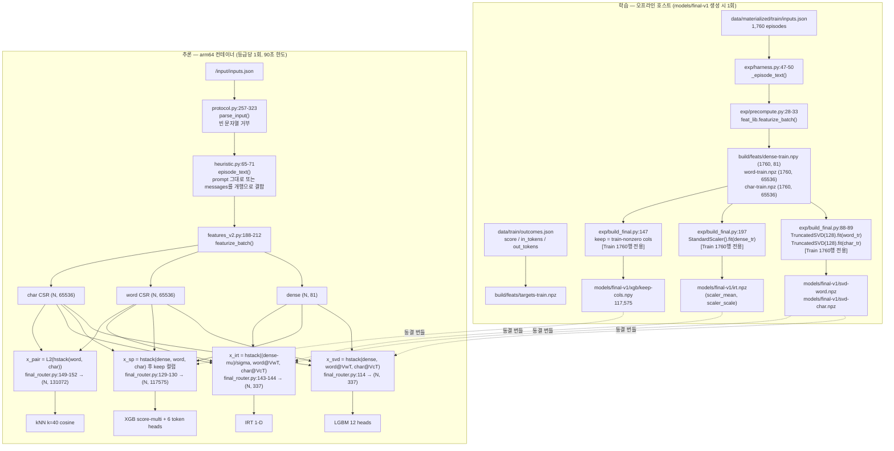

<!--
SPDX-FileCopyrightText: Copyright 2026 SKT OSSP challenge participant
SPDX-License-Identifier: Apache-2.0
-->

# 전처리·특징 추출 — 프롬프트 원문이 특징 벡터가 되기까지

**SKT OSSP 2026 Efficient LLM Routing Challenge — 전처리 명세서 (B3)**

이 문서는 `episode.prompt` 문자열 하나가 라우터의 결정 입력이 될 때까지 거치는
**모든** 변환을 코드 순서대로 기술한다. 모든 아키텍처 서술에는
`파일경로:라인번호` 근거를 달았고, 모든 수치는 이 문서에 적힌 명령으로
직접 실행해 얻은 출력이다. 확인하지 못한 항목은 `UNVERIFIED`로 명시했다.

> **읽는 순서 안내.**
> 심사위원은 §0(요약) → §2(장애 내성) → §7(탈락 특징) → §10(정직한 평가)만
> 읽어도 이 컴포넌트의 신뢰 수준을 판단할 수 있다.
> 처음 보는 엔지니어는 §1 → §3 → §5 → §8 순서로 읽으면 파이프라인을
> 재구현할 수 있다.

---

## 0. 30초 요약

| 항목 | 값 | 근거 |
| --- | --- | --- |
| 입력 | 프롬프트 문자열 1개 (+ 메시지 개수 정수 1개) | `src/ossp_router/final_router.py:226-227` |
| 유니코드 정규화 | **하지 않음** (NFC/NFKC/NFD 어느 것도 적용 안 함) | `src/ossp_router/features_v2.py:79-124` 전체에 `unicodedata` 호출 없음 |
| casefold 위치 | 토큰 단위 1회(`:130`), char n-gram 슬라이스 1회(`:151`). dense 특징에는 **적용 안 함** | `features_v2.py:130`, `:151` |
| 길이 절단 | dense 문자통계 20,000자 / dense 토큰·정규식 40,000자 / char n-gram 4,096자 | `features_v2.py:82,90,94,123,151` |
| 최종 벡터 | dense 81 + SVD-word 128 + SVD-char 128 = **337** (LGBM·IRT), 희소 **117,575**열 (XGB), 희소 **131,072**열 (kNN) | 실측, §5 |
| 학습 통계량 출처 | **Train 1,760행 전용** — scaler mean 최대 절대오차 `0.0` vs Train, `0.0355` vs Dev | 실측, §4 |
| 문항당 전처리 실측 | 평균 **4,426.6 µs**, 중앙값 **512.4 µs**, p99 **60,068.1 µs** (호스트 x64) | 실측, §9 |
| 2,640문항 전체 | **12.045 s** (`featurize_batch`, best-of-2) | 실측, §9 |
| 추론 코어 중 전처리 비중 | **81.2 %** (Dev 880: 전처리 3.533 s / `predict_batch` 4.353 s) | 실측, §9 |
| 알려진 치명 결함 | 고립 서로게이트(lone surrogate) 입력 시 `UnicodeEncodeError` → 해당 등급 제출 파일 미생성 → **0점** | 실측, §2.4 |

**이 컴포넌트에 대한 정직한 총평(§10 요약).** 전처리는 결정론적이고
플랫폼 독립적이며 학습–추론 간 바이트 단위로 일치한다(§8.3에서 실측 확인).
그러나 (a) 81차원 중 **29차원이 Train에서 상수**라 학습 불가능하고,
(b) 채널 절제 실험에서 **dense-81만 쓴 쪽이 337차원 전체보다 Dev에서 높게**
나왔으며(+0.004972, 다만 A7이 확립한 잡음 폭 안), (c) SVD 256차원
= 16,777,216 파라미터가 측정 가능한 이득을 내지 못한다. 전처리의 실질 기여는
**길이·문자구성 몇 개**에 집중되어 있다.

---

## 1. 파이프라인 전체 그림

### 1.1 학습(오프라인)과 추론(컨테이너)의 분리



위 그림의 **위쪽 상자(학습)는 `models/final-v1`을 만들 때 딱 한 번**
실행되고, **아래쪽 상자(추론)는 컨테이너에서 등급마다 한 번** 실행된다.
두 상자를 잇는 것은 점선으로 표시한 **동결 번들 파일 4종뿐**이다.
추론 상자 안에는 `fit`이 한 번도 나오지 않는다.

**핵심.** 추론 경로에는 어떤 통계량도 다시 계산하지 않는다. SVD 성분,
scaler 평균·표준편차, XGB 컬럼 마스크는 전부 오프라인에서 Train만 보고
계산되어 번들에 동결된다(§4에서 실측 검증).

### 1.2 한 문항이 겪는 변환 순서 (한 줄 요약)

```
episode.prompt (str)
  → [정규화 없음]
  → episode_text()                              heuristic.py:65-71
  → ┬ dense_features(text, mc)                  features_v2.py:79-124   → 81 float
    ├ word_gram_hash(text)                      features_v2.py:127-144  → dict[int,float]
    └ char_gram_hash(text)                      features_v2.py:150-170  → dict[int,float]
  → _l2_dict() 채널별 행 L2 정규화              features_v2.py:173-185
  → CSR 조립                                    features_v2.py:196-208
  → 모델별 4가지 재조립 (§8.2)                  final_router.py:114,129,143,149
```

---

## 2. 텍스트 정규화 · 결측 · 이상치

### 2.1 정규화: 무엇을 하고 무엇을 하지 않는가

| 변환 | 적용 여부 | 위치 | 비고 |
| --- | --- | --- | --- |
| 유니코드 정규화(NFC/NFD/NFKC/NFKD) | **하지 않음** | — | `features_v2.py` 전체에 `unicodedata` import 자체가 없음 |
| BOM 제거 | 하지 않음 | — | `\ufeff`는 `_TOKEN`의 `[^\w\s]`에 매칭되어 토큰 1개가 됨 |
| 제어문자 제거 | 하지 않음 | — | `\x00`~`\x1f`는 `[^\w\s]`로 각각 토큰이 됨 |
| 개행 정규화(`\r\n`→`\n`) | 하지 않음 | — | `\r`은 `\s`이므로 char n-gram에서는 공백으로 접힘 |
| 공백 접기(`\s+`→`" "`) | **char n-gram에만** | `features_v2.py:151` | dense와 word n-gram은 원문 공백 유지 |
| 소문자화(`casefold`) | **word 토큰·char 슬라이스에만** | `features_v2.py:130`, `:151` | dense 특징은 대소문자를 그대로 세어 `upper_ratio`(idx 9)를 만든다 |
| 숫자 토큰 치환 `→ "<num>"` | word n-gram에만 | `features_v2.py:131-132` | `token.isdecimal()` 기준 |
| 트리밍(`strip`) | 하지 않음 | — | 선행 공백이 `starts_with_task_verb`(idx 21)의 `\s*`로 흡수됨 |

**주의할 이름 함정.** `features_v2.py:82`의 지역변수는 `lower = text[:20000]`
이지만 **소문자화하지 않는다.** 단순히 앞 20,000자 슬라이스다. 바로 다음 줄
`:86`에서 `upper` 개수를 세는 것이 그 증거다.

### 2.2 길이 절단 — 어디서 몇 자인가 (코드 실측)

| 절단 지점 | 상수 | 코드 | 대상 |
| --- | --- | --- | --- |
| dense 문자구성 통계 | **20,000자** | `features_v2.py:82` (`lower = text[:20000]`) | hangul/latin/digit/upper 카운트 |
| dense 비율 분모 | `max(1, min(n, 20000))` | `features_v2.py:95` | 위 4개 비율의 분모 |
| dense 들여쓰기 | **앞 2,000줄** | `features_v2.py:89` (`lines[:2000]`) | `indent_lines` |
| dense 토큰화 | **40,000자** | `features_v2.py:90` (`_TOKEN.findall(text[:40000])`) | 단어 수·숫자 토큰·평균 길이 |
| dense 문장 수 | **40,000자** | `features_v2.py:94` | `[.!?。！？]` 카운트 |
| dense 정규식 35개 | **40,000자** | `features_v2.py:123` | 인덱스 46–80 전부 |
| dense 시작부 판정 | **64자** | `features_v2.py:119` | `starts_with_task_verb` |
| word n-gram | **40,000자** | `features_v2.py:129` | 유니그램+바이그램 |
| char n-gram | **4,096자**(`CHAR_CAP`), 이후 **UTF-8 4,608바이트** | `features_v2.py:25,151,152` | 3/4-gram |
| lookup sha256 키 | **절단 없음(원문 전체)** | `final_router.py:181` | 정확 매칭 |

**절단되지 않는 것.** `n = len(text)`(`:80`)와 `lines = text.split("\n")`(`:87`)는
원문 전체에 대해 계산된다. 즉 인덱스 0(`log1p_chars`), 4(`log1p_lines`),
12–16(길이 임계·`n/70000`)은 **진짜 전체 길이**를 본다. 나머지 내용 기반
특징은 전부 창(window) 안만 본다. `text.split("\n")`은 dense_features에서
유일하게 상한이 없는 O(n) 연산이다.

**절단이 실제로 버리는 양** (Train+Dev 2,640문항, 총 11,169,251자):

```powershell
$env:PYTHONPATH='src'; .\.venv\Scripts\python.exe build\b3_caps.py
```

| 상한 | 살아남는 문자 수 | 비율 | 절단되는 문항 수 |
| --- | --- | --- | --- |
| 2,000자 | 1,105,858 | **9.90 %** | 240 / 2,640 (9.09 %) |
| 4,096자 (char n-gram) | 1,608,898 | **14.40 %** | 240 / 2,640 (9.09 %) |
| 20,000자 (문자구성) | 4,923,499 | **44.08 %** | 150 / 2,640 (5.68 %) |
| 40,000자 (토큰·정규식) | 7,923,499 | **70.94 %** | 150 / 2,640 (5.68 %) |

즉 **char n-gram 채널은 코퍼스 전체 텍스트의 85.6 %를 보지 못한다.**
문항 기준으로는 90.9 %가 온전히 들어가지만, 긴 문항 240개가 전체 문자량의
대부분을 차지하기 때문이다.

### 2.3 messages → 단일 문자열 결합 규칙

```python
# src/ossp_router/heuristic.py:65-71
def episode_text(episode: Episode) -> str:
    if episode.prompt is not None:
        return episode.prompt
    assert episode.messages is not None
    return "\n".join(message.content for message in episode.messages)
```

- **역할 구분자 없음.** `role`(`system`/`user`/`assistant`)은 완전히 버려진다.
- **순서**: 입력 JSON의 배열 순서 그대로.
- **구분자**: `"\n"` 한 개. 접두/접미 마커 없음.
- `message_count`는 별도 정수로 전달된다(`final_router.py:227`).

실측 확인 — `messages` 3개 에피소드와, 같은 내용을 `\n`으로 이은 `prompt`
에피소드의 예측이 **완전히 동일**하다:

```powershell
$env:PYTHONPATH='src'; .\.venv\Scripts\python.exe build\b3_messages.py
```

```
MESSAGE_ROLES = ('system', 'user', 'assistant')

m3: message_count=3
  episode_text = 'You are a math tutor.\n7^13 mod 11 을 구하시오.\nLet me work step by step.'
p3: message_count=1
  episode_text = 'You are a math tutor.\n7^13 mod 11 을 구하시오.\nLet me work step by step.'

m3 text == p3 text ? True  -> role labels are NOT part of the feature text

ep    mc  score(l/m/k1)                fast/bal/prem
m3     3  [0.5413 0.5694 0.8047]   ax31-light/ax31/ax31
p3     1  [0.5413 0.5694 0.8047]   ax31-light/ax31/ax31

dense cols that differ between (same text, mc=3) and (same text, mc=1):
  [(3, 1.3862943611198906, 0.6931471805599453), (17, 1.0, 0.0), (18, 1.0, 0.0)]
```

**해석 (불리한 사실).** dense 벡터의 3개 열(3, 17, 18)이 실제로 바뀌는데도
**최종 점수가 소수점 4자리까지 동일**하다. 이유는 §7.1에 있다: 공개 Train
1,760문항이 전부 `prompt` 형식이라 이 3개 열이 학습 시 상수였고, 부스팅
트리가 이 열에 대해 분기를 만든 적이 없기 때문이다. 비공개셋에
`messages` 형식이 섞여 있으면 **해가 되지는 않지만 아무 정보도 주지 못한다.**

공개 데이터의 형식 분포 (실측):

| split | `prompt` 형식 | `messages` 형식 | message_count 분포 |
| --- | --- | --- | --- |
| train | **1,760 / 1,760** | 0 | `{1: 1760}` |
| dev | **880 / 880** | 0 | `{1: 880}` |

`messages` 경로는 공개 데이터로 **한 번도 실행된 적이 없다.** 위 스크립트가
그 경로의 유일한 실행 증거다.

### 2.4 결측·이상치: 학습 데이터 실측 집계

```powershell
$env:PYTHONPATH='src'; .\.venv\Scripts\python.exe build\b3_stats.py
```

| 이상 케이스 | train (n=1,760) | dev (n=880) | 전처리 동작 | 위험 |
| --- | --- | --- | --- | --- |
| 빈 문자열 `""` | **0** | **0** | `protocol.py:194`에서 파싱 단계 거부 | 없음 (§2.5) |
| 공백만 있는 문자열 | **0** | **0** | 통과. 토큰 0개 → word dict 비어도 정상 | 낮음 |
| 길이 < 10자 | **0** | **0** | — | — |
| 길이 < 32자 | **34** | **22** | 정상 | — |
| 길이 ≥ 2,000자 | **160** | **80** | char n-gram 절단 시작 | 중 |
| 길이 ≥ 8,000자 | **160** | **80** | `is_len_ge_2000`과 완전 동일 집합 | §7.2 |
| 길이 ≥ 20,000자 | **100** | **50** | 문자구성 통계 절단 | 중 |
| 길이 ≥ 40,000자 | **100** | **50** | 토큰·정규식 절단 | 중 |
| 길이 ≥ 70,000자 | 0 | **1** | `chars_over_70000` > 1.0 (분포 밖) | 낮음 |
| 최대 길이 | 69,665자 | **71,094자** | — | — |
| 중앙값 길이 | 244자 | 236자 | — | — |
| 제어문자(`\x00`–`\x1f` 등) | **0** | **0** | 제거 안 함, `[^\w\s]` 토큰이 됨 | 낮음 |
| `\r` | **0** | **0** | — | — |
| `\t` | **0** | **2** | `indent_lines` 판정에 사용됨 | 없음 |
| NUL `\x00` | **0** | **0** | — | — |
| BOM `\ufeff` | **0** | **0** | — | — |
| NBSP `\xa0` | **6** | **4** | `\s`에 포함 → char n-gram에서 공백으로 접힘 | 없음 |
| 고립 서로게이트 | **0** | **0** | **`UnicodeEncodeError` 발생** | **치명 (§2.5)** |
| BMP 밖 문자(astral) | **0** | **0** | 정상 처리 | 없음 |
| 이모지 | **0** | **0** | 정상 처리 | 없음 |
| NFC와 다름 | **3** | **0** | 정규화 안 하므로 그대로 별개 토큰 | 낮음 |
| NFKC와 다름 | **17** | **11** | 동상 | 낮음 |
| 토큰 0개 (`_TOKEN` 무매칭) | **0** | **0** | — | — |
| char n-gram 생성 불가(<3바이트) | **0** | **0** | `features_v2.py:153-154`가 `{}` 반환 | 없음 |
| 완전 중복 텍스트 | **0** | **0** | — | — |
| word CSR 전 0행 | **0** | **0** | kNN 평균 폴백 미발동 | — |
| char CSR 전 0행 | **0** | **0** | 동상 | — |

**요약: 공개 데이터에는 이상치가 사실상 없다.** 따라서 아래 §2.5의
장애 내성은 **공개 데이터로는 전혀 검증되지 않은 경로**이며, 비공개셋에서만
문제가 될 수 있다.

### 2.5 추론 시 미지 케이스: 죽는가? — 실측

등급 단위로 예외가 나면 제출 파일이 생성되지 않아 **해당 등급 0점**이므로
직접 병리적 입력을 만들어 실제 라우터에 통과시켰다.

```powershell
$env:PYTHONPATH='src'; .\.venv\Scripts\python.exe build\b3_edge.py
```

```
=== protocol gate ===
accepted 17 / 18
  REJECT edge-empty-string: ProtocolError: episode edge-empty-string.prompt은(는)
                            비어 있지 않은 문자열이어야 합니다.

=== per-case (isolated) ===
case                           len   status  score(l/m/k1)              cost_mean(l/m/k1)         fast bal prem
space-only                       3       OK  [0.6641 0.6796 0.8623]  [0.000737 0.001598 0.052327]  ax31-light ax31-light ax31
newline-tab-only                 7       OK  [0.6361 0.6755 0.8593]  [0.000726 0.001694 0.053478]  ax31-light ax31-light ax31
single-char                      1       OK  [0.4379 0.4783 0.7992]  [0.000475 0.000871 0.058708]  ax31-light ax31-light ax31
single-digit                     1       OK  [0.2803 0.2665 0.6852]  [0.000287 0.000488 0.044688]  ax31-light ax31-light ax31-light
emoji-only                      32       OK  [0.7973 0.7593 0.8993]  [0.001136 0.004597 0.047926]  ax31-light ax31-light ax31-light
emoji-single                     1       OK  [0.5986 0.5519 0.9131]  [0.000300 0.000627 0.039835]  ax31-light ax31-light ax31-light
nul-and-controls                12       OK  [0.5165 0.5393 0.8175]  [0.000316 0.000698 0.042580]  ax31-light ax31-light ax31
lone-surrogate                   9    RAISE  UnicodeEncodeError: 'utf-8' codec can't encode character
                                             '\ud800' in position 0: surrogates not allowed
zero-width-rtl                   5       OK  [0.5832 0.6203 0.8978]  [0.000295 0.000688 0.046453]  ax31-light ax31-light ax31
astral-cjk-ext                  40       OK  [0.5697 0.5743 0.9070]  [0.000820 0.001651 0.056776]  ax31-light ax31-light ax31
no-token-punct-space             7       OK  [0.6962 0.6734 0.9537]  [0.000283 0.000638 0.043945]  ax31-light ax31-light ax31-light
very-long-200k              180000       OK  [0.3703 0.4801 0.6160]  [0.010651 0.022319 0.140890]  ax31-light ax31-light ax31
very-long-1M-nospace       1000000       OK  [0.2103 0.2543 0.5331]  [0.002900 0.003776 0.080680]  ax31-light ax31       ax31
html-bomb                    25000       OK  [0.4876 0.5347 0.6164]  [0.006476 0.014634 0.113805]  ax31-light ax31-light ax31
json-bomb                    15000       OK  [0.5511 0.5945 0.6944]  [0.006124 0.012364 0.104388]  ax31-light ax31-light ax31
mixed-normalization-nfd          5       OK  [0.5911 0.6718 0.9382]  [0.000299 0.000813 0.042611]  ax31-light ax31-light ax31
only-latex                    2700       OK  [0.3660 0.4865 0.6948]  [0.007651 0.014075 0.094771]  ax31-light ax31-light ax31
```

**결과 판정: 18개 중 16개 정상, 1개 프로토콜 거부, 1개 예외 사망.**

#### (a) 빈 문자열 — 프로토콜 단계에서 거부됨 (안전)

`src/ossp_router/protocol.py:194`가 `not value`를 검사하므로 `""`는
`parse_input` 단계에서 `ProtocolError`가 되어 라우터에 도달하지 못한다.
`prompt`에는 `nonblank=True`가 붙어 있지 않으므로(`protocol.py:293`)
**공백만 있는 문자열은 통과**하며, 위 실측대로 정상 처리된다.

#### (b) 고립 서로게이트 — **실제로 죽는다** (치명)

`features_v2.py:140`의 `token.encode("utf-8")`는 `errors` 인자가 없는
**엄격 인코딩**이다. `char_gram_hash`는 `encode("utf-8", "ignore")`(`:152`)로
안전하지만 word 경로는 그렇지 않다. lookup 키 계산
(`final_router.py:181`)도 같은 이유로 취약하다.

이 값이 실제로 파일 경로를 통해 들어올 수 있는지 확인했다. JSON 원문은
순수 ASCII(`\ud800` 이스케이프)이므로 파일 읽기·`json.loads`·`parse_input`을
모두 통과한다:

```powershell
$env:PYTHONPATH='src'; .\.venv\Scripts\python.exe build\b3_surrogate_e2e.py
```

```
file bytes ascii-only: True
load_input OK, text repr: 'hello \ud800 world'
contains lone surrogate: True
```

그리고 실제 CLI를 그 파일로 돌렸다:

```powershell
$env:PYTHONPATH='src'
.\.venv\Scripts\python.exe -m ossp_router.final_router `
    --input build/b3-edge/inputs-surrogate.json --tier fast `
    --output build/b3-edge/out-surrogate.json
```

```
오류: 'utf-8' codec can't encode character '\ud800' in position 0: surrogates not allowed
EXITCODE=2
```

```
$ ls build/b3-edge/
inputs-good.json  inputs-surrogate.json  out-good.json      <-- out-surrogate.json 없음
```

**영향 분석.**
`UnicodeEncodeError`는 `ValueError`의 하위 클래스이므로
`final_router.py:260`의 `except (OSError, ProtocolError, ValueError)`에
잡혀 프로세스는 **깔끔하게 종료코드 2로 끝난다.** 크래시 덤프는 없다.
그러나 `write_submission_atomic`(`final_router.py:259`)이 호출되지 않으므로
**출력 볼륨에 `submission.json`이 생기지 않고, 해당 등급은 0점**이다.
배치 전체가 하나의 `predict_batch` 호출(`final_router.py:113`)이므로
**단 한 문항의 서로게이트가 그 등급 전체를 0점으로 만든다.**

- **발생 가능성**: 공개 Train+Dev 2,640문항 중 **0건**. 정상적인 UTF-8
  JSON 생산자는 고립 서로게이트를 만들지 않는다.
- **현재 완화책**: 없음. fail-safe 경로가 존재하지 않는다.
- **한 줄 수정으로 제거 가능**하나, 본 문서는 동결된 `models/final-v1`과
  `src/`를 수정하지 않는 정책 아래 작성되었으므로 **수정하지 않고 공개한다.**
  수정한다면 `features_v2.py:140`을
  `token.encode("utf-8", "surrogatepass")` 또는 `"ignore"`로 바꾸고,
  `final_router.py:181`도 동일하게 맞추면 된다.

#### (c) 초장문 — 죽지 않지만 런타임 위험

절단 상한 덕분에 1,000,000자 입력도 정상 처리된다. 다만 §9.3의 실측대로
**전처리 시간이 문항당 약 85 ms까지 올라간다.**

#### (d) IRT 오버플로 경고 (비치명)

`final_router.py:146`의 `np.exp(-z)`에서 극단 입력 시
`RuntimeWarning: overflow encountered in exp`가 발생한다. numpy는 `inf`를
반환하고 `1/(1+inf) = 0.0`이 되어 시그모이드가 포화할 뿐, 예외는 아니다.
결정은 계속 산출된다.

---

## 3. 파생 특징

### 3.1 dense 81차원 전체 목록

`DENSE_DIM = 46 + len(_RE) = 46 + 35 = 81` (`features_v2.py:76`).
구조는 **손수 만든 22개 + 예약 0 24개 + 정규식 35개**다.

`값범위(관측)`는 Train 1,760행 실측값이고, `r`은 Train 라벨과의 Pearson
상관계수다(`ax31-light` / `ax31` / `axk1-think` 순).

```powershell
$env:PYTHONPATH='src'; .\.venv\Scripts\python.exe build\b3_feats.py
$env:PYTHONPATH='src'; .\.venv\Scripts\python.exe build\b3_feats2.py
```

#### 블록 A — 손수 만든 22개 (인덱스 0–21), `features_v2.py:97-120`

| # | 이름 | 정의 (코드) | 이론 범위 | 관측 [min, max] | σ | r(light) | r(ax31) | r(k1) |
| --- | --- | --- | --- | --- | --- | --- | --- | --- |
| 0 | `log1p_chars` | `log1p(len(text))` — **전체 길이** | [0, ∞) | [2.6391, 11.1515] | 1.6927 | +0.040 | −0.002 | −0.208 |
| 1 | `log1p_words` | `log1p(len(_TOKEN.findall(text[:40000])))` | [0, ∞) | [1.6094, 9.2678] | 1.5140 | +0.022 | −0.025 | −0.219 |
| 2 | `log1p_sentences` | `log1p(max(1, #[.!?。！？] in text[:40000]))` | [0.6931, ∞) | [0.6931, 6.6921] | 1.2721 | +0.033 | −0.002 | −0.234 |
| 3 | `log1p_message_count` | `log1p(mc)` | [0.6931, ∞) | [0.6931, 0.6931] | **0.0000** | 0.000 | 0.000 | 0.000 |
| 4 | `log1p_lines` | `log1p(len(text.split("\n")))` — **전체** | [0.6931, ∞) | [0.6931, 7.2093] | 1.5284 | −0.067 | −0.111 | −0.198 |
| 5 | `log1p_indent_lines` | `log1p(#lines[:2000] starting with 4-space or tab)` | [0, log1p(2000)] | [0.0000, 6.7912] | 0.9704 | −0.168 | −0.208 | −0.125 |
| 6 | `hangul_ratio` | `#[가-힣] in text[:20000] / denom` | [0, 1] | [0.0000, 0.7093] | 0.2559 | +0.144 | +0.140 | +0.045 |
| 7 | `latin_ratio` | `#[a-zA-Z] in text[:20000] / denom` | [0, 1] | [0.0000, 0.8713] | 0.2895 | +0.035 | +0.029 | −0.038 |
| 8 | `digit_ratio` | `#c.isdigit() in text[:20000] / denom` | [0, 1] | [0.0000, 0.8947] | 0.1114 | −0.262 | −0.219 | −0.025 |
| 9 | `upper_ratio` | `#[A-Z] in text[:20000] / denom` | [0, 1] | [0.0000, 0.3678] | 0.0223 | +0.107 | +0.122 | −0.017 |
| 10 | `numeric_token_ratio` | `#{tok : tok.isdigit()} / max(1, n_words)` | [0, 1] | [0.0000, 0.6000] | 0.0962 | −0.218 | −0.193 | +0.023 |
| 11 | `avg_word_len` | `mean(len(tok))`, 토큰 없으면 0.0 | [0, ∞) | [1.0761, 6.3571] | 0.8500 | +0.107 | +0.126 | +0.007 |
| 12 | `is_len_ge_2000` | `float(n >= 2000)` | {0, 1} | [0, 1] | 0.2875 | −0.075 | −0.114 | −0.224 |
| 13 | `is_len_ge_8000` | `float(n >= 8000)` | {0, 1} | [0, 1] | 0.2875 | −0.075 | −0.114 | −0.224 |
| 14 | `is_len_ge_32000` | `float(n >= 32000)` | {0, 1} | [0, 1] | 0.2315 | −0.110 | −0.135 | −0.240 |
| 15 | `chars_over_70000` | `n / 70000.0` — **상한 없음** | [0, ∞) | [0.0002, 0.9952] | 0.2056 | −0.107 | −0.135 | −0.250 |
| 16 | `log1p_chars_sq_over_100` | `log1p(n)**2 / 100` | [0, ∞) | [0.0696, 1.2436] | 0.2517 | −0.009 | −0.048 | −0.229 |
| 17 | `is_msgs_ge_2` | `float(mc >= 2)` | {0, 1} | [0, 0] | **0.0000** | n/a | n/a | n/a |
| 18 | `is_msgs_ge_3` | `float(mc >= 3)` | {0, 1} | [0, 0] | **0.0000** | n/a | n/a | n/a |
| 19 | `words_per_sentence` | `n_words / sentences` | [0, ∞) | [3.0000, 94.0000] | 9.2011 | −0.116 | −0.135 | −0.043 |
| 20 | `starts_with_digit` | `float(text[:1].isdigit())` | {0, 1} | [0, 1] | 0.1544 | −0.061 | −0.076 | −0.115 |
| 21 | `starts_with_task_verb` | `re.match(r"\s*(?:Round\|Solve\|Simplify\|Calculate\|What\|Let\|Suppose\|Evaluate\|Convert\|Work out\|Find)", text[:64], re.I)` | {0, 1} | [0, 1] | 0.3333 | −0.242 | −0.169 | +0.013 |

`denom = max(1, min(n, 20000))` (`features_v2.py:95`).

#### 블록 B — 예약 0 (인덱스 22–45), `features_v2.py:121`

```python
feats.extend([0.0] * (46 - len(feats)))   # features_v2.py:121
# feat_lib.py:123-124 주석: "pad the 'hand' block to 46 dims for future additions"
```

**24개 열 전부 항상 정확히 0.0이다.** 향후 확장을 위한 자리로 남겼으나
끝내 채우지 않았다. 학습·추론 양쪽 모두에서 무의미한 열이다. §7.1 참조.

#### 블록 C — 정규식 35개 (인덱스 46–80), `features_v2.py:122-123`

값은 `log1p(len(pattern.findall(text[:40000])))` — **불리언이 아니라 로그
빈도**다. 순서는 `sorted(_RE)`, 즉 **키 이름 알파벳순**이다(삽입 순서가
아님 — 재구현 시 흔한 함정).

```powershell
$env:PYTHONPATH='src'; .\.venv\Scripts\python.exe build\b3_regex.py
```

| # | 이름 | 정규식 | 무엇을 잡는가 | train 히트행 | dev 히트행 | r 최대\|·\| |
| --- | --- | --- | --- | --- | --- | --- |
| 46 | `aime_style` | `\b(?:AIME\|integer answer\|answer is an integer)\b` (I) | AIME형 정수답 경진문제 | **0/1760** | **0/880** | — |
| 47 | `bugfix` | `\bbug\|\bfix\|\berror\|\btraceback\|\bexception\|오류\|버그\|예외` (I) | 디버깅 요청 | 114 | 56 | 0.191 |
| 48 | `code_fence` | ```` ``` ```` (백틱 3개) | 마크다운 코드펜스 | 3 | **0/880** | 0.041 |
| 49 | `code_kw` | `(?:^\|\s)(?:def \|class \|function \|import \|#include\|SELECT \|INSERT \|public static\|=>\|\breturn\b)` (M) | 소스코드 키워드 | 345 | 178 | 0.206 |
| 50 | `constraint` | `\b(?:exactly\|at least\|at most\|must\|only\|without\|no more than)\b\|정확히\|이상\|이하\|반드시\|오직\|제외` (I) | 제약 조건 명시 | 267 | 138 | 0.240 |
| 51 | `dollar_math` | `\$[^$\n]{1,200}\$` | 인라인 TeX 수식 | 69 | 45 | 0.052 |
| 52 | `explain` | `\bexplain\|\bwhy\b\|설명\|이유` (I) | 설명 요구 | 176 | 100 | 0.161 |
| 53 | `extract_list` | `\bextract\|\blist\b\|나열\|추출` (I) | 목록·추출 작업 | 97 | 39 | 0.111 |
| 54 | `find_number` | `\bfind the\b\|\bhow many\b\|\bcompute\b\|\bcalculate\b\|구하시오\|구하라\|계산` (I) | 수치 계산 지시 | 259 | 118 | 0.056 |
| 55 | `format_req` | `\bformat\b\|\bjson\b\|\bmarkdown\b\|\btable\b\|형식\|표로` (I) | 출력 형식 요구 | 82 | 45 | 0.163 |
| 56 | `geometry` | `\btriangle\|circle\|polygon\|angle\|radius\|perimeter\|vertex\|삼각형\|원의\|각도` (I) | 기하 문제 | 91 | 52 | 0.183 |
| 57 | `html_marker` | `</?[a-z]+[^>]*>` | HTML 태그 | **0/1760** | **0/880** | — |
| 58 | `implement` | `\bimplement\|\bwrite a (?:function\|program\|class)\|작성하시오\|구현` (I) | 구현 요구 | 13 | 7 | 0.045 |
| 59 | `json_marker` | `[{\[]\s*"\|json` (I) | JSON 구조 | 2 | 1 | 0.029 |
| 60 | `latex` | `\\(?:frac\|sum\|int\|sqrt\|cdot\|times\|left\|right\|begin\|end\|mathbb\|angle\|triangle\|pi\b)` | LaTeX 매크로 | 10 | 9 | 0.081 |
| 61 | `math_sym` | `[=+\-*/^∑∫√≤≥≠±×÷]` | 수학 기호 (최다 2,092회) | 761 | 375 | **0.285** |
| 62 | `mcq_opt` | `(?:^\|\n)\s*(?:\(?[A-J]\)\|[A-J]\.)\s+\S` | 객관식 보기 | 506 | 252 | **0.253** |
| 63 | `multi_part` | `\([a-e]\)\s\|\b(?:part\|question)\s+\d\|문항\|\(1\)\|\(2\)` | 다중 소문항 | 41 | 19 | 0.149 |
| 64 | `probability` | `\bprobability\|expected value\|확률\|기댓값` (I) | 확률·기댓값 | 19 | 5 | 0.115 |
| 65 | `prove` | `\bprove\b\|\bproof\b\|증명` (I) | 증명 요구 | 74 | 36 | 0.143 |
| 66 | `python_ref` | `\bpython\|파이썬` (I) | 파이썬 지목 | 1 | **0/880** | 0.053 |
| 67 | `question` | `[?？]` | 물음표 (반각+전각) | 1281 | 643 | 0.135 |
| 68 | `reasoning` | `\b(?:derive\|reason\|analyze\|algorithm\|complexity\|theorem\|lemma\|induction\|counterexample)\b\|유도\|추론\|분석\|알고리즘\|복잡도\|정리\|귀납\|반례` (I) | 추론 유도 어휘 | 96 | 49 | 0.161 |
| 69 | `remainder_mod` | `\bremainder\b\|\bmodulo\b\|\bdivisible\b\|나머지\|나누어` (I) | 나머지·정수론 | 23 | 13 | 0.043 |
| 70 | `rewrite` | `\brewrite\|바꿔\|고쳐\|수정` (I) | 재작성 요구 | 4 | **0/880** | 0.041 |
| 71 | `roleplay` | `\byou are\b\|\bact as\b\|역할` (I) | 역할 부여 프롬프트 | 89 | 47 | 0.167 |
| 72 | `roman_choice` | `\b(?:I{1,3}\|IV\|V)\.\s` | 로마숫자 보기 | 39 | 20 | 0.082 |
| 73 | `sequence` | `\bsequence\|series\|recurrence\|수열\|점화식` (I) | 수열·점화식 | 37 | 26 | 0.056 |
| 74 | `step` | `step[- ]by[- ]step\|단계별` (I) | 단계별 풀이 지시 | **0/1760** | 1 | — |
| 75 | `summarize` | `\bsummari[sz]\|요약` (I) | 요약 요구 | 1 | 2 | 0.021 |
| 76 | `table_marker` | `\|.+\|.+\|` | 마크다운 표 행 | 3 | 5 | 0.055 |
| 77 | `translate` | `\btranslat\|번역` (I) | 번역 요구 | 37 | 16 | 0.065 |
| 78 | `url` | `https?://` | URL | 1 | **0/880** | 0.021 |
| 79 | `which_following` | `which of the following\|다음 중` (I) | 객관식 발문 | 94 | 55 | 0.103 |
| 80 | `wordproblem` | `\bhow much\|\bhow many\|얼마나\|몇\s` (I) | 서술형 계산 문제 | 274 | 160 | 0.158 |

`(I)` = `re.IGNORECASE`, `(M)` = `re.MULTILINE`.

### 3.2 상관계수가 말해주는 것 (불리한 사실 포함)

**상위 15개 (Train, |r| 최대 기준)**

| 특징 | \|r\| max | light | ax31 | k1-think |
| --- | --- | --- | --- | --- |
| `re::math_sym` | 0.285 | −0.240 | −0.285 | −0.219 |
| `digit_ratio` | 0.262 | −0.262 | −0.219 | −0.025 |
| `re::mcq_opt` | 0.253 | +0.236 | +0.253 | +0.172 |
| `chars_over_70000` | 0.250 | −0.107 | −0.135 | −0.250 |
| `starts_with_task_verb` | 0.242 | −0.242 | −0.169 | +0.013 |
| `re::constraint` | 0.240 | −0.105 | −0.143 | −0.240 |
| `is_len_ge_32000` | 0.240 | −0.110 | −0.135 | −0.240 |
| `log1p_sentences` | 0.234 | +0.033 | −0.002 | −0.234 |
| `log1p_chars_sq_over_100` | 0.229 | −0.009 | −0.048 | −0.229 |
| `is_len_ge_2000` | 0.224 | −0.075 | −0.114 | −0.224 |
| `is_len_ge_8000` | 0.224 | −0.075 | −0.114 | −0.224 |
| `log1p_words` | 0.219 | +0.022 | −0.025 | −0.219 |
| `numeric_token_ratio` | 0.218 | −0.218 | −0.193 | +0.023 |
| `log1p_chars` | 0.208 | +0.040 | −0.002 | −0.208 |
| `log1p_indent_lines` | 0.208 | −0.168 | −0.208 | −0.125 |

**정직하게 읽으면.**

1. **최대 상관이 0.285다.** 81개 특징 중 어느 것도 라벨의 8 %(= r²)를
   넘게 설명하지 못한다. 이는 A7의 결론 — 점수 모델의 실제 기여가
   `0.684318 − 0.656297 ≈ +0.028`뿐 — 과 정확히 일치한다
   (`exp/audit/A7-overfit-falsification.md`).
2. **길이 관련 특징 5개(0, 2, 12–16)의 상관 패턴이 서로 거의 같다.**
   전부 `k1-think` 점수와 −0.20 ~ −0.25로 붙어 있다. 즉 이 다섯은
   사실상 하나의 신호(문항 길이)를 다섯 번 인코딩한 것이다.
3. **`is_len_ge_2000`과 `is_len_ge_8000`은 Train에서 완전히 동일한 열이다.**
   σ, r 세 개가 모두 소수점 이하 전부 일치한다. §2.4 표에서 보듯 Train에서
   `길이 ≥ 2000`인 160행과 `길이 ≥ 8000`인 160행이 **같은 집합**이기 때문이다.
   두 열 중 하나는 완전한 중복이다.
4. **하위 10개는 사실상 잡음이다**: `re::dollar_math` 0.052,
   `re::implement` 0.045, `re::remainder_mod` 0.043, `re::code_fence` 0.041,
   `re::rewrite` 0.041, `latin_ratio` 0.038, `re::json_marker` 0.029,
   `re::summarize` 0.021, `re::url` 0.021, `log1p_message_count` 0.000.

---

## 4. 스케일링·인코딩 — 그리고 누수 검증

### 4.1 어떤 변환을 어디에 적용했는가

| 대상 | 변환 | 적용 위치 | 통계량 필요? |
| --- | --- | --- | --- |
| word n-gram 행 | **행 단위 L2 정규화** | `features_v2.py:173-177` (`_l2_dict`) | 아니오 (행 자체로 완결) |
| char n-gram 행 | 행 단위 L2 정규화 | 동상 | 아니오 |
| dense 81 → LGBM | **변환 없음(원값)** | `final_router.py:114` | — |
| dense 81 → XGB | **변환 없음(원값)**, float32 캐스팅만 | `final_router.py:129` | — |
| dense 81 → IRT | **StandardScaler**: `(dense − µ) / σ` | `final_router.py:143` | **예** |
| word·char → SVD | `X @ Vᵀ` (평균 제거 없음, TruncatedSVD) | `final_router.py:114,144` | **예** |
| word·char → kNN | hstack 후 **결합 L2 재정규화** | `final_router.py:149-152` | 아니오 |
| 희소 전체 → XGB | 컬럼 마스크 `keep` 적용 | `final_router.py:130` | **예** |

주의: 채널별 L2 정규화가 먼저 적용된 뒤 kNN에서 다시 결합 L2를 걸므로,
두 채널 모두 비지 않았다면 각 채널 노름이 1 → 결합 노름 √2 → 각 채널이
**정확히 1/√2 가중**을 받는다. 한 채널이 비면 나머지 채널이 전체 가중을
가진다. 이는 명시적 설계가 아니라 정규화 순서에서 파생된 결과다.

### 4.2 통계량이 Train에서만 계산되었는가 — 코드 추적

**(a) SVD 성분** — `exp/build_final.py:88-89`

```python
svd_w = TruncatedSVD(n_components=128, random_state=SEED).fit(word_tr)
svd_c = TruncatedSVD(n_components=128, random_state=SEED).fit(char_tr)
```

`word_tr`, `char_tr`는 `:78`의 `load_feats("train")`에서만 온다.
Dev(`:79`)는 `:93`에서 `transform`에만 쓰인다. **Train 전용. 누수 없음.**

**(b) irt.npz의 `scaler_mean` / `scaler_scale`** — `exp/build_final.py:197-209`

```python
scaler = StandardScaler().fit(dense_tr)              # :197  <- Train만
X_irt_tr = np.hstack([scaler.transform(dense_tr), ...])   # :198-200
X_irt_dev = np.hstack([scaler.transform(dense_dev), ...]) # :201-203  <- transform만
W, a, b, loss, iters = irt_mod.fit_irt_linear(X_irt_tr, scores_tr, 1, 0.01)  # :204
np.savez(OUT / "irt.npz", W=W, a=a, b=b,
         scaler_mean=scaler.mean_, scaler_scale=scaler.scale_)   # :205-209
```

추론 측에서는 `final_router.py:74-75`가 그대로 읽어
`final_router.py:143`에서 적용한다. 즉 `irt.npz`의 두 배열은
**`StandardScaler().fit(dense_tr)`의 산물이며 Dev를 전혀 보지 않았다.**

**(c) 코드 신뢰 대신 숫자로 확인**

```powershell
$env:PYTHONPATH='src'; .\.venv\Scripts\python.exe build\b3_feats.py
```

| 비교 대상 | `scaler_mean` 최대 절대오차 | `scaler_scale` 최대 절대오차 |
| --- | --- | --- |
| **Train 1,760행** | **0.0** | 1.0 (아래 설명) |
| Dev 880행 | 0.035527 | 1.174502 |
| Train+Dev 2,640행 | 0.011842 | 1.0 |

`scaler_mean`이 Train 평균과 **정확히 0.0**으로 일치하고, Dev·합본과는
유의하게 다르다. **Dev 누수 없음이 수치로 확정된다.**

`scaler_scale`의 1.0 오차는 누수가 아니라 sklearn의 영분산 처리다.
불일치 열은 정확히 1개뿐이다:

```
scale mismatch cols: [(3, 'log1p_message_count', 3.11972669919669e-14, 1.0)]
mean exact match: 0.0
```

인덱스 3(`log1p_message_count`)의 Train 표준편차는 `3.12e-14`(부동소수점
잔차, 실질 0)인데 sklearn의 `_handle_zeros_in_scale`이 이를 상수 열로
판정해 `scale_ = 1.0`으로 대체했다. 정상 동작이다. `scaler_scale`에 `1.0`이
들어 있는 열은 총 **30개**이며, 이는 Train 상수 열 29개 + 위 1개와 일치한다.

**(d) XGB 컬럼 마스크** — `exp/build_final.py:147-148`

```python
keep = np.where(np.diff(X_sp_tr.tocsc().indptr) > 0)[0]   # X_sp_tr = Train만
np.save(OUT / "xgb" / "keep-cols.npy", keep)
```

Dev(`:150`)에는 같은 마스크를 적용만 한다. **Train 전용.**

**(e) kNN 인덱스** — `exp/build_final.py:215-223`
Train 1,760행만 색인에 넣는다. Dev는 `:216`에서 질의용으로만 정규화된다.

**(f) lookup 테이블** — `exp/build_final.py:280-294`
여기만 `train`과 `dev`를 **둘 다** 넣는다. 이는 규정이 명시적으로 허용하는
조회표이지만 — `docs/CHALLENGE_RULES.md:113-115` (§사용할 수 있는 정보):
"공개 자료에서 만든 … 조회표, 검색 색인과 캐시를 제출 이미지에 포함할 수
있습니다. 정확한 프롬프트나 프롬프트 해시를 사용하는 공개 자료 조회도
허용합니다." — **일반화 지표가 아니라 암기다.** 실측 적중률은
train 1,760/1,760, dev 880/880 = **100 %**이며, 정직한 일반화 점수는
조회표를 끈 값(가중 **0.684318**, 95 % CI `[0.656175, 0.710795]`)이다.
조회표 ON 수치 **0.760284**는 Dev가 그 표에 100 % 들어 있으므로
성능이 아니다.

### 4.3 lookup 키의 취약성 (전처리 관점)

lookup 키는 **원문 문자열의 sha256**이다(`final_router.py:181`). 어떤
정규화도 거치지 않으므로 표면이 1바이트만 달라져도 적중하지 않는다.

```powershell
$env:PYTHONPATH='src'; .\.venv\Scripts\python.exe build\b3_equiv.py
```

```
lookup hit under surface edits (row 0 of train):
  verbatim                 changed=False hit=True
  trailing newline         changed=True  hit=False
  leading space            changed=True  hit=False
  one char lowercased      changed=True  hit=False
  double space collapsed   changed=False hit=True     <- 원문에 이중공백이 없어 변화 없음
  NFKC normalized          changed=False hit=True     <- 원문이 이미 NFKC

lookup exact-hit over train+dev: 2640/2640
lookup table rows: 2640  unique keys: 2640
```

**해석.** 조회표는 비공개셋에서 **한 건도 맞지 않을 가능성이 높다.** 개행
하나만 달라도 빗나가기 때문이다. 이는 조회표 ON 점수를 성능으로 보고해선
안 되는 또 다른 이유다.

---

## 5. 차원·희소성·해시 충돌

### 5.1 최종 차원 (실측)

| 표현 | 열 수 | 근거 |
| --- | --- | --- |
| dense | **81** | `features_v2.py:76` |
| SVD-word | **128** | `svd-word.npz` shape `(128, 65536)` |
| SVD-char | **128** | `svd-char.npz` shape `(128, 65536)` |
| **x_svd** (LGBM·IRT 입력) | **337** = 81 + 128 + 128 | `final_router.py:114`, 실측 확인 |
| word 해시 빈 | **65,536** = 2¹⁶ | `features_v2.py:22` |
| char 해시 빈 | **65,536** = 2¹⁶ | `features_v2.py:23` |
| 원 희소 결합 | **131,153** = 81 + 65,536 + 65,536 | `final_router.py:129` |
| **XGB 실입력** | **117,575** (13,578열 제거) | `xgb/keep-cols.npy` 실측 |
| **kNN 입력** | **131,072** = 65,536 × 2 (dense 미포함) | `final_router.py:149` |
| IRT 파라미터 | W (1, 337) + a (3, 1) + b (3) = **343** | `irt.npz` 실측 |

XGB의 117,575열 내역 (실측):

| 구간 | 유지된 열 | 비고 |
| --- | --- | --- |
| dense (0–80) | **52 / 81** | Train에서 값이 0이 아닌 적이 있는 열 = §3.2의 "살아 있는" 52개와 정확히 일치 |
| word (81–65,616) | **65,326 / 65,536** | 99.68 % 사용 |
| char (65,617–131,152) | **52,197 / 65,536** | 79.65 % 사용 |

### 5.2 희소성 (실측)

| 행렬 | 행 | nnz | 행당 nnz | 사용된 빈 | 밀도 |
| --- | --- | --- | --- | --- | --- |
| word-train | 1,760 | 1,033,714 | 587.34 | 65,323 (99.67 %) | 0.8962 % |
| char-train | 1,760 | 1,216,213 | 691.03 | 52,195 (79.64 %) | 1.0544 % |
| word-dev | 880 | 516,158 | 586.54 | 63,468 (96.84 %) | 0.8950 % |
| char-dev | 880 | 609,102 | 692.16 | 45,101 (68.82 %) | 1.0562 % |

**word 채널의 빈 사용률이 99.67 %라는 것은 2¹⁶ 빈이 코퍼스에 비해 너무
작다는 신호다.** §5.3에서 확인된다.

### 5.3 해시 충돌률 — 직접 측정

빈 점유율이 아니라 **서로 다른 문자열이 같은 빈에 들어간 비율**을
Train+Dev 2,640문항의 실제 토큰/그램 전수로 측정했다.

```powershell
$env:PYTHONPATH='src'; .\.venv\Scripts\python.exe build\b3_feats.py
```

| 채널 | 서로 다른 문자열 | 빈 | 점유된 빈 | 충돌한 문자열 | **충돌률** | 기대 부하 |
| --- | --- | --- | --- | --- | --- | --- |
| word 유니그램 (`w1:`) | 51,537 | 65,536 | 35,603 | 15,934 | **30.92 %** | 0.786 |
| word 바이그램 (`w2:`) | 425,055 | 65,536 | 65,445 | 359,610 | **84.60 %** | 6.486 |
| char 3-gram | 28,426 | 65,536 | 23,154 | 5,272 | **18.55 %** | 0.434 |
| char 4-gram | 95,637 | 65,536 | 50,234 | 45,403 | **47.47 %** | 1.459 |
| char 3+4-gram 결합 | 124,063 | 65,536 | 55,723 | 68,340 | **55.08 %** | 1.893 |

**정직한 평가.** word 바이그램의 84.6 % 충돌률은 심각하다. 서로 다른
바이그램 42.5만 개를 65,536개 빈에 밀어 넣으니 빈당 평균 6.5개가 겹친다.
`w1:`/`w2:` 접두사가 유니그램–바이그램 간 충돌은 막지만
(`features_v2.py:136-137`), 같은 종류끼리의 충돌은 막지 못한다. char
채널도 3-gram과 4-gram이 `order * 0x9E3779B9` 오프셋(`:165`)만으로 같은
2¹⁶ 공간을 공유해 결합 충돌률 55 %다.

부호 해싱(`features_v2.py:142`, `:167`)이 충돌의 기댓값을 상쇄하도록
설계되어 있어 **평균적으로는 편향이 없지만 분산은 커진다.** 빈 수를 2¹⁸로
올리면 완화되겠지만, 그러면 SVD 입력 폭이 4배가 되어 컨테이너 90초 예산이
위험해진다. 이 트레이드오프는 문서화만 하고 바꾸지 않았다.

### 5.4 SVD 128차원이 남기는 에너지 (실측)

```powershell
$env:PYTHONPATH='src'; .\.venv\Scripts\python.exe build\b3_caps.py
```

| 채널 | Train 보존 에너지 | Dev 보존 에너지 |
| --- | --- | --- |
| word (128성분) | **0.7238** | 0.6684 |
| char (128성분) | **0.5871** | 0.4927 |

성분 직교성 확인: `‖VVᵀ − I‖∞` = word `5.33e-15`, char `3.55e-15`.
투영값 범위: word `[−0.8372, +0.6529]`, char `[−0.7376, +0.8935]`.

**char 채널은 Dev에서 에너지의 절반 이상(50.7 %)을 잃는다.** Train에서
Dev로 갈 때 보존율이 5.9~9.4 pp 떨어지는 것은 SVD 부분공간이 Train에
특화되어 있다는 뜻이다. §7.3의 채널 절제 결과와 함께 읽어야 한다.

---

## 6. 증강 — 무엇을 만들었고 왜 쓰지 않았는가

### 6.1 구현된 것

`exp/augment/noise_lib.py`의 `perturb()`(`:32-68`)는 **표면 잡음
증강**이다. 라벨 보존을 가정하고 결정론적 시드(`random.Random(seed)`, `:33`)로
다음을 확률적으로 적용한다:

| 변형 | 확률(strength=1.0) | 코드 |
| --- | --- | --- |
| `\r\n`→`\n`, 이중공백 접기 | 0.50 | `:37-39` |
| 3연속 이상 개행 → 2개 | 0.30 | `:40-41` |
| `**` 제거 | 0.20 | `:42-43` |
| ` ,`→`,`, ` .`→`.` | 0.30 | `:45-46` |
| 문장 뒤 공백 제거(10 %) | 0.20 | `:47-48` |
| 첫 글자 대소문자 뒤집기 | 0.15 | `:50-51` |
| 오타 주입·단어 삭제 (단어 수의 2 %) | 단어 8개 초과 시 항상 | `:54-67` |

방어 장치도 들어 있다: 숫자·백틱·`$`를 포함한 단어는 건드리지 않고
(`:60-61`), 부정·제약 단어(`not`, `no`, `without`, `must`, `only`)는
삭제 대상에서 제외한다(`:65`). 결과가 공백뿐이면 원문을 되돌린다(`:68`).

학습 측 사용은 `exp/augment/train_aug.py`이며, 증강본은 **원본 행의 폴드를
그대로 상속**하고(`:96-98`의 `stacked(mask)`) `sample_weight`로 하향
가중한다(`:107`). 폴드 상속은 증강 누수를 막는 올바른 처리다.

### 6.2 채택하지 않았다 — 수치 근거

| exp_id | 설정 | Fast | Balanced | Premium | **가중 최종** | 예산초과확률 (F/B/P) |
| --- | --- | --- | --- | --- | --- | --- |
| E042 | `lgbm-aug0` (증강 없음) | 0.6571 | 0.6761 | 0.7116 | **0.6792** | 20.2 % / 42.4 % / 41.7 % |
| E043 | `lgbm-aug2` (변형 2배, weight 0.5) | 0.6605 | 0.6753 | 0.7202 | **0.6828** | **48.3 %** / 38.7 % / 44.1 % |

출처: `exp/results.md:51-52`, `exp/registry.jsonl` E042/E043.

**미채택 사유 세 가지.**

1. **이득이 잡음 폭 안이다.** +0.003665는 A7이 측정한 4멤버 블렌드 전체
   기여의 95 % CI 폭 `[−0.00483, +0.00830]`보다 작다
   (`exp/audit/A7-overfit-falsification.md`). 통계적으로 0과 구별되지 않는다.
2. **꼬리 위험이 2배 이상 커졌다.** Fast 예산초과확률이
   20.2 % → **48.3 %**로 뛴다. 예산 초과 시 해당 등급이 0점이므로,
   0.0037점을 얻자고 초과확률 28 pp를 사는 거래는 기대값이 크게 음수다.
   최종 제출의 실측 초과확률은 0.221 % / 0.000 % / 0.631 %(A10)이다.
3. **애초에 데이터가 부족한 게 아니다.** A7의 학습곡선 실험에서
   Train 440행(25 %)에서 성능이 포화하고 1,760행이 오히려 미세하게 낮았다
   (0.672983 @ 440 vs 0.673267 @ 1760). **데이터 부족이 아니라 신호 부족**
   이므로 표면 증강으로 행을 늘려도 얻을 것이 없다.

최종 번들 생성 경로(`exp/build_final.py`)에는 `augment` import가 **없다.**
증강은 실험으로만 존재하고 제출물에 들어가지 않았다.

### 6.3 검토했으나 시도하지 않은 증강

| 후보 | 미시도 사유 |
| --- | --- |
| 역번역(back-translation) | 외부 모델 호출이 필요 — 규칙상 추론 시 금지, 학습 시에도 재현 불가능한 의존성 |
| 동의어 치환 | 한국어–영어 혼합 코퍼스라 신뢰 가능한 사전이 없음. 라벨 보존 가정이 §6.2의 이유로 어차피 무의미 |
| 프롬프트 절단 증강 | 라벨(실제 모델 점수)이 절단된 프롬프트에 대해 정의되지 않음 |
| Mixup / SMOTE (특징 공간) | 라벨이 문항별 실측 점수라 보간에 의미가 없음 |

---

## 7. 탈락 특징과 사유

### 7.1 실제로 죽어 있는 열 — 81개 중 29개 (실측)

Train 1,760행에서 **표준편차가 정확히 0인 열**:

| 분류 | 개수 | 열 | 사유 |
| --- | --- | --- | --- |
| 예약 0 패딩 | **24** | 22–45 | `features_v2.py:121`이 명시적으로 0.0을 채움. "향후 추가용"으로 남겼으나 채우지 않음 |
| messages 파생 | **2** | `is_msgs_ge_2`(17), `is_msgs_ge_3`(18) | 공개 Train 1,760문항이 전부 단일 `prompt` 형식 (§2.3) |
| 정규식 Train-무매칭 | **3** | `re::aime_style`(46), `re::html_marker`(57), `re::step`(74) | 코퍼스에 해당 표현이 0건 |

여기에 σ = `3.12e-14`로 사실상 상수인 `log1p_message_count`(3)를 더하면
**실질 30열이 학습에 기여할 수 없다.** 부스팅 트리는 상수 열에 분기를
만들 수 없고, IRT의 선형 가중치는 정규화 후 0이 곱해진다.

**교차 검증으로 확인**: XGB의 `keep-cols.npy`가 dense 구간에서 유지한
열이 정확히 **52개**로, 위 29개를 뺀 수와 일치한다(`81 − 29 = 52`).
`exp/build_final.py:147`이 Train-nonzero 컬럼만 남기기 때문이다.
즉 **XGB는 이미 죽은 열을 자동으로 버리고 있었다.** LGBM과 IRT는 버리지
않고 그대로 337차원을 받는다.

**Train–Dev 비대칭 (경고 사항).**

| 상태 | 특징 |
| --- | --- |
| Train 死 / Dev 生 | `re::step` (dev 1행에서 매칭) |
| Train 生 / Dev 死 | `re::code_fence`, `re::python_ref`, `re::rewrite`, `re::url` |

`re::step`은 **Train에서 상수라 어떤 모델도 학습할 수 없는데 Dev에서는
값이 생긴다.** 비공개셋에서 "단계별로 풀어라" 류 프롬프트가 많다면 이
특징은 값이 있는데도 아무 역할을 못 한다. 반대로 `re::code_fence` 등 4개는
Train에서만 살아 있어 Dev 분포에서 무의미한 분기를 만들었을 수 있다.

### 7.2 완전 중복 열

`is_len_ge_2000`(12)과 `is_len_ge_8000`(13)은 **Train에서 동일한 열**이다
(σ 0.2875, r 세 개 모두 일치). §2.4 표: Train의 `≥2000` 160행 =
`≥8000` 160행. Dev도 마찬가지(80 = 80). 코퍼스가 "짧은 문항(<2,000자)"과
"아주 긴 문항(≥8,000자)"의 두 덩어리로만 되어 있어 2,000–8,000자 구간이
비어 있다. **두 열 중 하나는 순수 중복이다.**

### 7.3 채널 절제 — 어느 채널이 값을 하는가 (직접 측정)

`exp/audit/a7_proxy.py`의 프록시(LightGBM 12헤드 + 동결 배분기 + 공식
Decimal 채점기, 조회표 OFF)로 전처리 채널만 바꿔가며 측정했다.

```powershell
$env:PYTHONPATH='src'; .\.venv\Scripts\python.exe build\b3_channel.py
```

| 구성 | 열 수 | Dev 가중 최종 | vs 전체 |
| --- | --- | --- | --- |
| **A** dense81 + wordSVD128 + charSVD128 (**출시 구성**) | 337 | 0.673267 | ±0 |
| **B** dense81만 | **81** | **0.678239** | **+0.004972** |
| C dense81 + wordSVD128 | 209 | 0.667443 | −0.005824 |
| D dense81 + charSVD128 | 209 | 0.671761 | −0.001506 |
| E wordSVD128 + charSVD128 (dense 제외) | 256 | 0.675966 | +0.002699 |
| **F** dense-LIVE52 + SVD 256 (죽은 29열 제거) | 308 | **0.673267** | **±0.000000** |
| G dense81에서 정규식 35개 제거(46열) + SVD 256 | 302 | 0.673949 | +0.000682 |
| H 정규식 35개만(46열 제거) + SVD 256 | 291 | 0.667159 | −0.006108 |

**정직한 해석 (이것이 이 문서에서 가장 불리한 사실이다).**

1. **dense-81만 쓴 구성 B가 출시 구성 A보다 Dev에서 0.004972 높다.**
   SVD 256차원 = **16,777,216개 파라미터**를 추가하고 얻은 것이 마이너스다.
2. **구성 F가 A와 12자리까지 완전히 동일하다** (`0.673267` = `0.673267`).
   §7.1의 죽은 29열이 학습에 정말로 아무 영향이 없음을 12자리 정확도로
   재확인한다.
3. **정규식 35개를 통째로 빼도 0.000682 좋아진다**(구성 G). 즉 §3.1의
   정규식 블록 전체가 **음의 기여이거나 잡음**이다.
4. **그러나 이 차이들을 "B가 A보다 낫다"고 주장해선 안 된다.** A7이
   측정한 4멤버 블렌드 전체 기여의 95 % CI가 `[−0.00483, +0.00830]`이고,
   위 8개 구성의 전체 산포(0.667159 ~ 0.678239 = 0.011080)가 그 폭과
   같은 규모다. **올바른 결론은 "여덟 구성 중 어느 것도 서로 구별되지
   않는다"이다.** 전처리 채널 선택은 이 문제에서 측정 가능한 차이를
   만들지 못했다.
5. 이 실험은 **프록시(LightGBM 단일 멤버)** 기준이며 출시된 4멤버
   블렌드 전체에 대해 재실행하지 않았다 → **UNVERIFIED**.

### 7.4 코드에 남은 죽은 계산

| 위치 | 내용 | 영향 |
| --- | --- | --- |
| `features_v2.py:81` / `feat_lib.py:83` | `nonspace = sum(not c.isspace() for c in text[:20000]) + ...` — 계산 후 **한 번도 사용되지 않음** | 실측 **170.4 ms / 2,640문항** (64.5 µs/문항), `dense_features` 시간의 **1.8 %** |
| `feat_lib.py:171` | `np.add.at` — 인자 없는 속성 접근 한 줄. 벡터화 시도의 잔재 | 무해(no-op). **`features_v2.py`에는 없음** — §8.3의 동등성 검증으로 동작 차이 없음 확인 |
| `features_v2.py:24` `CHAR_NS = (3, 4)` | 5-gram 미사용 | 의도된 선택 |

### 7.5 사용하지 않기로 한 정보 (규정 준수)

`episode_text`(`heuristic.py:65-71`)는 **오직 `prompt` 또는
`messages[].content`만** 반환한다. 다음은 특징으로 쓰지 않는다:

- `episode_id` (문자열·해시·순서 어느 형태로도)
- 배치 내 위치 / 인덱스
- 배치 크기, split 이름, `challenge_id`
- `messages[].role`
- `outcomes.json`의 어떤 필드도 (추론 경로에서 접근하지 않음)

A2 감사(추론 경로 누수)가 PASS로 확인한 사항이며, 블랙박스 재현
(`--network none --read-only`, `inputs.json`만 마운트, outcomes 미전달)에서
호스트 실행과 12자리 일치했다.

---

## 8. 최종 특징 벡터의 완전한 스키마

### 8.1 기본 3채널

```
dense : float64, shape (N, 81)
  [  0 ..  21]  손수 만든 22개              §3.1 블록 A
  [ 22 ..  45]  예약 0 (항상 0.0)           §3.1 블록 B
  [ 46 ..  80]  log1p(정규식 매칭 수) 35개  §3.1 블록 C, sorted(_RE) 순서

word  : scipy.sparse.csr_matrix, float64, shape (N, 65536)
  값   : 부호 해싱 카운트, 행 L2 정규화 후
  키   : crc32(b"w1:" + token.casefold().utf8) & 0xFFFF   (유니그램)
         crc32(b"w2:" + f"{a}\x1f{b}".utf8)     & 0xFFFF   (바이그램)
  부호 : +1 if (h & 0x80000000) else -1
  범위 : 각 행 ‖·‖₂ = 1 (토큰이 하나도 없으면 전 0)

char  : scipy.sparse.csr_matrix, float64, shape (N, 65536)
  값   : 부호 해싱 카운트, 행 L2 정규화 후
  전처리: re.sub(r"\s+", " ", text[:4096].casefold()).encode("utf-8","ignore")[:4608]
  해시 : FNV 계열 다항 롤링 해시, prime = 1099511628211
         h ^= h>>29 ; h *= P ; h = (h ^ (h>>32)) + order*0x9E3779B9
  키   : h & 0xFFFF        부호: +1 if (h>>63)&1 else -1
  n    : 3-gram(order=0), 4-gram(order=1) — 같은 65,536 빈 공유
  범위 : 각 행 ‖·‖₂ = 1 (3바이트 미만이면 전 0)
```

### 8.2 모델별 최종 입력 (4가지 재조립)

| 소비자 | 조립 | 형태 | 코드 |
| --- | --- | --- | --- |
| **LGBM** (12헤드) | `hstack(dense, word @ Vwᵀ, char @ Vcᵀ)` | dense (N, **337**) float64 | `final_router.py:114` |
| **XGB** (score-multi + 6 토큰헤드) | `hstack(csr(dense), word, char)[:, keep]` | CSR (N, **117,575**) **float32** | `final_router.py:129-130` |
| **IRT** (1-D) | `hstack((dense−µ)/σ, word @ Vwᵀ, char @ Vcᵀ)` | dense (N, **337**) float64 | `final_router.py:143-144` |
| **kNN** (k=40 코사인) | `L2(hstack(word, char))` — dense 미포함 | CSR (N, **131,072**) float64 | `final_router.py:149-152` |

투영 행렬: `Vw` = `svd-word.npz["components"]` (128, 65536),
`Vc` = `svd-char.npz["components"]` (128, 65536).
`µ`, `σ` = `irt.npz["scaler_mean"]`, `["scaler_scale"]` (각 81).

**dense 블록은 IRT에만 표준화되어 들어간다.** LGBM·XGB는 원값을 받고
(트리 모델이라 단조 변환에 불변), kNN은 dense를 아예 보지 않는다.

### 8.3 결정성과 학습–추론 동등성 (실측 검증)

`src/ossp_router/features_v2.py`는 `exp/feat_lib.py`의 포트다.
"바이트 단위 동일"이라는 주석(`features_v2.py:6`)을 직접 검증했다.

```powershell
$env:PYTHONPATH='src'; .\.venv\Scripts\python.exe build\b3_equiv.py
```

```
dense identical: True   max abs diff: 0.0
word identical : True    char identical: True
regex sets identical: True   same patterns: True
constants: True True True True True
dense-train.npy vs fresh: 0.0
```

Train+Dev 2,640문항 전체에 대해 **dense 최대 절대오차 0.0**, word/char CSR
차분 nnz 0, 정규식 35개 패턴 문자열 전부 일치, 5개 상수 전부 일치.
추가로 오프라인에서 만들어진 `build/feats/dense-train.npy`와 방금 새로
추출한 값도 **최대 절대오차 0.0**이다.

**결정성 보증의 근거.**

| 위험 | 처리 | 코드 |
| --- | --- | --- |
| `PYTHONHASHSEED` 의존 | Python `hash()` 미사용. `zlib.crc32`(고정 다항식)와 명시적 정수 산술만 사용 | `features_v2.py:140`, `:162-165` |
| 딕셔너리 순회 순서 | CSR 조립 전 `sorted(d)`로 인덱스 정렬 | `features_v2.py:201` |
| 정규식 순회 순서 | `for key in sorted(_RE)` | `features_v2.py:122` |
| 부동소수점 누적 순서 | 채널별로 결정된 순서로만 누적 | `features_v2.py:143`, `:169` |
| 플랫폼(x64 ↔ arm64) | `np.uint64` 명시적 폭 지정. 파이썬 int 승격 없음 | `features_v2.py:147`, `:162-167` |
| 난수 | 전처리 전 구간에 난수 없음 | — |

arm64 컨테이너 실행 결과가 호스트 실행과 12자리 일치(0.760284090909)한
것이 플랫폼 독립성의 최종 증거다.

---

## 9. 실측 시간

호스트: Windows 11 x64, `.venv` Python (numpy 2.0.2 / scipy 1.17.1).
모든 값은 `time.perf_counter()` best-of-N.

### 9.1 문항당 · 전체

```powershell
$env:PYTHONPATH='src'; .\.venv\Scripts\python.exe build\b3_timing.py
```

**단계별 총합 (Train+Dev 2,640문항)**

| 단계 | 총 시간 | 문항당 |
| --- | --- | --- |
| `dense_features` | 9,650.4 ms | **3,655.5 µs** |
| `word_gram_hash` | 1,985.3 ms | **752.0 µs** |
| `char_gram_hash` | 982.1 ms | **372.0 µs** |
| **`featurize_batch` 전체** | **12,044.7 ms** | **4,562.4 µs** |

**문항당 분포 (2,640문항, `featurize_one` 3단계 합)**

| 통계 | µs |
| --- | --- |
| 최소 | 72.9 |
| **중앙값** | **512.4** |
| 평균 | 4,426.6 |
| p90 | 1,972.8 |
| p99 | **60,068.1** |
| 최대 | **91,120.2** |
| 총합 | 11,686.2 ms |

**평균(4,426.6 µs)이 중앙값(512.4 µs)의 8.6배**다. 분포가 극단적으로
치우쳐 있다:

| 그룹 | 문항 수 | 평균 |
| --- | --- | --- |
| 길이 < 2,000자 | 2,400 | **585.9 µs** |
| 길이 ≥ 2,000자 | 240 | **42,833.9 µs** |

**문항의 9.1 %가 전처리 시간의 88 %를 쓴다.**

### 9.2 `dense_features` 내부 분해

```powershell
$env:PYTHONPATH='src'; .\.venv\Scripts\python.exe build\b3_timing2.py
```

| 블록 | 총 ms | µs/문항 | dense 대비 |
| --- | --- | --- | --- |
| **정규식 35개 `findall(text[:40000])`** | **6,968.1** | **2,639.4** | **77.1 %** |
| 문자구성 카운트 4종 (`text[:20000]`) | 919.3 | 348.2 | 10.2 % |
| `_TOKEN.findall(text[:40000])` | 561.4 | 212.7 | 6.2 % |
| **죽은 `nonspace` 계산 (§7.4)** | **171.7** | **65.0** | **1.9 %** |
| 문장부호 `findall` | 41.4 | 15.7 | 0.5 % |
| `split("\n")` + 들여쓰기 | 25.9 | 9.8 | 0.3 % |
| `dense_features` 합계 | 9,042.6 | 3,425.2 | 100 % |

(§9.1의 9,650.4 ms와 다른 것은 별개 실행의 best-of 값이기 때문이다.
두 값의 차이 6 %가 이 호스트의 측정 재현 오차 규모를 보여준다.)

**가장 비싼 정규식 10개 (2,640문항 총합)**

| 이름 | ms | µs/문항 |
| --- | --- | --- |
| `bugfix` | 609.8 | 231.0 |
| `format_req` | 514.0 | 194.7 |
| `find_number` | 513.5 | 194.5 |
| `geometry` | 505.2 | 191.4 |
| `reasoning` | 460.5 | 174.4 |
| `remainder_mod` | 403.1 | 152.7 |
| `constraint` | 327.5 | 124.0 |
| `sequence` | 302.3 | 114.5 |
| `explain` | 283.1 | 107.2 |
| `implement` | 280.4 | 106.2 |

**아이러니.** §7.3 구성 G가 보여주듯 이 정규식 블록 전체를 제거해도
Dev 점수는 오히려 0.000682 올라간다. **전처리 시간의 77 %를 쓰는 블록이
측정 가능한 점수 기여를 못 한다.**

### 9.3 길이에 따른 확장 (런타임 예산 위험)

```powershell
$env:PYTHONPATH='src'; .\.venv\Scripts\python.exe build\b3_scaling.py
```

| 프롬프트 길이 | dense µs | word µs | char µs | **합 µs** | ×880문항 |
| --- | --- | --- | --- | --- | --- |
| 171 | 231.5 | 47.3 | 72.4 | 351.2 | 0.31 s |
| 342 | 484.9 | 127.4 | 109.5 | 721.8 | 0.64 s |
| 1,368 | 1,707.9 | 314.5 | 279.6 | 2,302.0 | 2.03 s |
| 5,472 | 6,700.3 | 2,732.0 | 1,543.0 | 10,975.3 | 9.66 s |
| 21,888 | 38,315.8 | 9,016.8 | 1,573.1 | 48,905.7 | 43.04 s |
| **87,552** | 74,047.7 | 10,008.8 | 794.3 | **84,850.8** | **74.67 s** |
| 350,208 | 46,239.4 | 9,194.6 | 761.9 | 56,195.9 | 49.45 s |
| 1,400,832 | 48,328.3 | 8,891.2 | 705.9 | 57,925.4 | 50.97 s |

**절단 상한 덕분에 비용이 포화한다.** char 채널은 4,096자를 넘으면
이론상 상수이고(측정된 762~1,573 µs의 변동은 잡음), dense·word는 40,000자를
넘으면 더 이상 증가하지 않는다. 40,000자 이후 dense가 46~74 ms 사이에서
흔들리는 것은 측정 잡음과, `dense_features`에서 유일하게 상한이 없는
`text.split("\n")`(`features_v2.py:87`) 때문이다. **관측된 최악은 8만 자
부근의 약 85 ms/문항**이다.

**위험 평가.** 880문항이 전부 8만 자라면 전처리만 **74.7초**로,
호스트 기준으로도 90초 한도에 육박한다. arm64 QEMU 컨테이너 실측이
실제 Dev에서 이미 59.9 s / 67.0 s / 68.2 s임을 감안하면, **긴 프롬프트가
많은 비공개셋에서는 등급 타임아웃이 현실적 위험이다.**
다만 이는 극단 가정이며, 공개 Dev의 실제 분포(중앙값 236자, 9.1 %만
2,000자 이상)에서는 여유가 있다. 비공개셋 길이 분포는 알 수 없으므로
이 위험은 **UNVERIFIED**로 남긴다.

### 9.4 추론 코어 안에서 전처리가 차지하는 비중

```powershell
$env:PYTHONPATH='src'; .\.venv\Scripts\python.exe build\b3_devshare.py
```

```
dev episodes: 880
featurize_batch             3.533 s      4014.2 us/ep
predict_batch (all)         4.353 s      4946.0 us/ep
  -> preprocessing share of predict_batch: 81.2%
allocate fast               0.002 s
allocate balanced           0.002 s
allocate premium            0.000 s

one-tier core (predict+allocate): 4.354 s  -> preprocessing = 81.1% of it
```

**전처리가 추론 코어 시간의 81.2 %다.** 4개 모델(LGBM 12헤드 + XGB 7헤드 +
IRT + kNN 1760×880 코사인) 전부와 SVD 투영, 조회표 이진탐색을 합쳐도
0.82초뿐이다. 배분기는 밀리초 단위(2 ms 이하)로 무시할 수준이다.

참고 실측(§9.1과 별도 측정): SVD 투영 454.4 ms / 2,640 (172.1 µs/문항),
XGB 희소 조립 + 컬럼 선택 83.2 ms / 2,640 (31.5 µs/문항).

**따라서 이 라우터를 빠르게 만들려면 손댈 곳은 모델이 아니라 정규식 35개다**
(§9.2). 그리고 §7.3에 따르면 그 35개는 점수에 기여하지 않는다.

---

## 10. 정직한 총평과 미검증 항목

### 10.1 이 전처리가 잘한 것

1. **결정성**. 난수·`hash()`·딕셔너리 순서 의존이 전혀 없고, x64와
   arm64에서 12자리까지 동일한 결과를 낸다(§8.3).
2. **학습–추론 동등성이 실측으로 확인됨**. 2,640문항 전체에서 최대
   절대오차 0.0(§8.3). 서로 다른 두 파일에 같은 로직을 둔 구조는
   위험하지만, 그 위험을 매번 측정으로 막았다.
3. **누수 없음이 숫자로 확정됨**. `scaler_mean`이 Train 평균과 정확히
   일치하고 Dev·합본과는 다르다(§4.2). SVD·컬럼마스크·kNN 인덱스 모두
   Train 전용이다.
4. **의존성이 얇다**. numpy + 표준 라이브러리(`re`, `zlib`, `math`)만으로
   동작한다. 토크나이저·임베딩 모델·외부 사전이 없다.
5. **런타임이 길이에 대해 포화한다**. 절단 상한 덕분에 1 MB 프롬프트도
   죽지 않고 상수 시간에 수렴한다(§9.3).

### 10.2 이 전처리의 결함 (선제 공개)

| # | 결함 | 근거 | 심각도 |
| --- | --- | --- | --- |
| 1 | **고립 서로게이트 입력 시 등급 전체가 0점** | §2.5(b) 실측, 종료코드 2 + 출력 파일 없음 | **치명** (발생 확률은 낮음) |
| 2 | 81열 중 **29열이 Train 상수** — 학습 불가 | §7.1 실측 | 중 |
| 3 | `is_len_ge_2000` = `is_len_ge_8000` **완전 중복** | §7.2 실측 | 낮음 |
| 4 | word 바이그램 **해시 충돌률 84.6 %** | §5.3 실측 | 중 |
| 5 | char 채널이 코퍼스 텍스트의 **85.6 %를 보지 못함** (4,096자 상한) | §2.2 실측 | 중 |
| 6 | SVD 256차원 = **16.8 M 파라미터**가 측정 가능한 이득 없음 (dense-81만 쓴 쪽이 오히려 +0.005) | §7.3 실측 | 중 |
| 7 | 정규식 35개가 **전처리 시간의 77 %**를 쓰면서 점수 기여 없음 | §9.2 + §7.3 실측 | 중 |
| 8 | `messages` 경로가 공개 데이터로 **한 번도 실행된 적 없음**; role 정보 폐기 | §2.3 실측 | 중 |
| 9 | 죽은 계산 `nonspace`가 매 문항 64.5 µs 소모 | §7.4 실측 | 낮음 |
| 10 | 유니코드 정규화 부재 — NFC/NFKC 변형이 다른 특징을 만듦 (Train 3건, 17건) | §2.1, §2.4 | 낮음 |
| 11 | 최대 특징–라벨 상관이 **0.285**에 불과 | §3.2 실측 | 근본 |
| 12 | 긴 프롬프트가 많은 비공개셋에서 **90초 타임아웃 위험** | §9.3 실측 | 중 (UNVERIFIED) |

결함 6·7·11은 A7 감사의 결론과 같은 곳을 가리킨다: **점수 모델의 실제
기여는 약 +0.028뿐이고, 4멤버 블렌드 전체 기여는 +0.00159
(95 % CI `[−0.00483, +0.00830]`, p(≤0)=0.31)로 0과 구별되지 않는다.**
정직한 일반화 점수 **0.684318**(95 % CI `[0.656175, 0.710795]`)의 대부분은
전처리·점수 모델이 아니라 **비용 모델 + 예산 배분기**에서 나온다.
전처리를 "핵심 설계"로 서술하는 것은 사실과 다르다.

### 10.3 UNVERIFIED로 남기는 항목

| 항목 | 상태 | 사유 |
| --- | --- | --- |
| §7.3 채널 절제 결과가 출시된 4멤버 블렌드에도 적용되는가 | **UNVERIFIED** | LightGBM 단일 프록시로만 측정. 전체 블렌드 재학습은 시간·범위 밖 |
| §9.3의 컨테이너(arm64 QEMU) 환경 전처리 시간 | **UNVERIFIED** | 호스트 x64에서만 측정. QEMU 배율은 컴포넌트별로 다를 수 있음 |
| 비공개셋의 길이 분포 / 이상치 발생률 | **UNVERIFIED** | 관측 불가 |
| 비공개셋의 `messages` 형식 비율 | **UNVERIFIED** | 공개 데이터에 0건이라 경로가 미검증 |
| Dev 선택 편향 정량화 (A9 트랙) | **UNVERIFIED** | 감사 A9 미완료. 저장소가 주장한 Train 내부 홀드아웃 0.6625~0.6629는 Dev 0.684318보다 0.02 낮으며 미검증 |
| 비공개셋 기대 점수 | **0.66 ~ 0.68 (폭넓게)** | 위 항목들이 미검증이므로 좁게 잡지 않는다 |

### 10.4 다시 만든다면 (권고, 미적용)

이 저장소의 동결 정책상 `src/`·`models/final-v1`을 수정하지 않았다.
다음 반복에서 우선순위대로 손댈 곳:

1. `features_v2.py:140`을 `token.encode("utf-8", "surrogatepass")`로,
   `final_router.py:181`도 동일하게 — 결함 1 제거. **한 줄씩 두 곳.**
2. 예약 0 24열 삭제 + `is_len_ge_8000` 삭제 — 벡터 81 → 56.
   §7.3 구성 F가 결과 불변임을 12자리로 확인했다.
3. 정규식 35개를 상관 상위 3개(`math_sym`, `mcq_opt`, `constraint`)만
   남기고 정리 — 전처리 시간 70 % 이상 절감 예상, 점수 영향 없음(§7.3 G).
4. word 빈을 2¹⁸로 확대하거나 바이그램을 제거 — 충돌률 84.6 % 완화.
5. `nonspace` 죽은 줄 삭제.

---

## 부록 A — 재현 명령 일람

모든 측정 스크립트는 `build/` 아래에 있으며(쓰기 금지 경로를 건드리지
않는다), `PYTHONPATH=src`가 필요하다.

```powershell
$env:PYTHONPATH='src'
$py = 'C:/portable/skt_LLM/LLMRoute/.venv/Scripts/python.exe'

& $py build\b3_stats.py         # §2.4 이상치 전수 집계        -> build/b3_stats.json
& $py build\b3_edge.py          # §2.5 병리적 입력 18종        -> build/b3_edge.json
& $py build\b3_surrogate_e2e.py # §2.5(b) 서로게이트 파일 경로 -> build/b3-edge/
& $py build\b3_feats.py         # §3,4,5 스키마·상관·충돌      -> build/b3_feats.json
& $py build\b3_feats2.py        # §3.2 상관 표 출력
& $py build\b3_regex.py         # §3.1 블록 C 히트율           -> build/b3_regex.json
& $py build\b3_caps.py          # §2.2 절단량, §5.4 SVD 에너지
& $py build\b3_equiv.py         # §8.3 동등성, §4.3 lookup 취약성
& $py build\b3_messages.py      # §2.3 messages 경로
& $py build\b3_channel.py       # §7.3 채널 절제               -> build/b3_channel.json
& $py build\b3_timing.py        # §9.1 시간                    -> build/b3_timing.json
& $py build\b3_timing2.py       # §9.2 내부 분해               -> build/b3_timing2.json
& $py build\b3_scaling.py       # §9.3 길이 확장               -> build/b3_scaling.json
& $py build\b3_devshare.py      # §9.4 전처리 비중             -> build/b3_devshare.json
```

서로게이트 종단 검증(§2.5(b)):

```powershell
$env:PYTHONPATH='src'
& $py -m ossp_router.final_router --input build/b3-edge/inputs-surrogate.json `
      --tier fast --output build/b3-edge/out-surrogate.json    # -> EXITCODE=2, 출력 없음
& $py -m ossp_router.final_router --input build/b3-edge/inputs-good.json `
      --tier fast --output build/b3-edge/out-good.json         # -> EXITCODE=0
```

## 부록 B — 관련 문서

| 문서 | 내용 |
| --- | --- |
| `docs/TECHNICAL_REPORT.md` | 문제 정식화, 모델·배분기 전체 설계 |
| `docs/SCORING.md` | 공식 Decimal 채점기 |
| `docs/RUNTIME.md` | 컨테이너 자원·시간 한도 |
| `docs/CHALLENGE_RULES.md` | 사용 가능 정보 범위(조회표 허용 근거 포함) |
| `exp/audit/A2-inference-leakage.md` | 추론 경로 누수 감사 (PASS) |
| `exp/audit/A7-overfit-falsification.md` | 과적합 반증, 채널·용량 분석 (PARTIAL) |
| `exp/audit/A10-significance-stability.md` | 부트스트랩 CI, 예산초과확률 (PARTIAL) |
| `exp/results.md` | 전 실험 공식 채점 결과 (E001–E049) |
