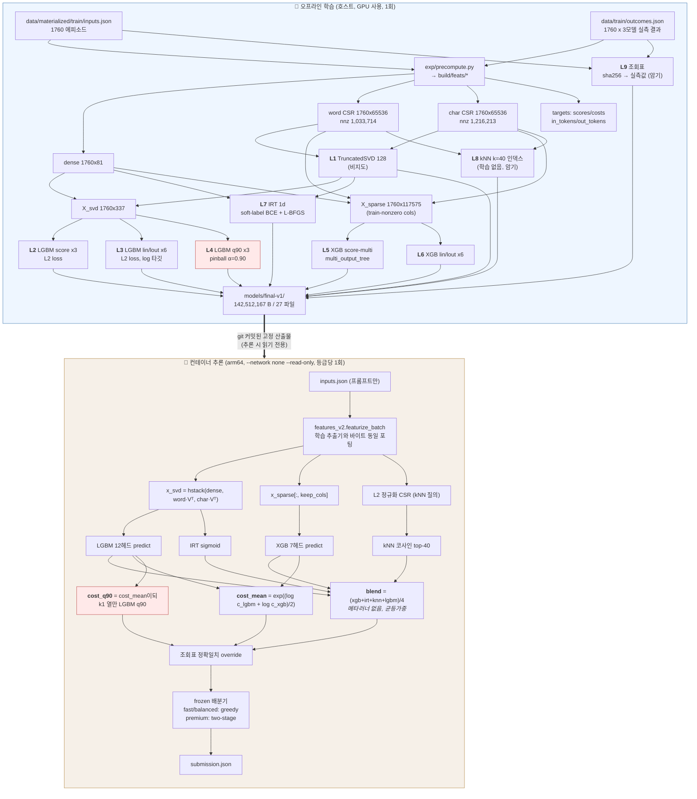

<!--
SPDX-FileCopyrightText: Copyright 2026 SKT OSSP challenge participant
SPDX-License-Identifier: Apache-2.0
-->

# 레이어별 학습 방법 (TRAINING_DETAILS)

이 문서는 제출 번들 `models/final-v1/` 안의 **학습 가능한 구성요소 하나하나가 어떻게 만들어졌는지**를
코드 근거(`파일:라인`)와 실측 숫자로 기록한다. 서술의 대상은 두 부류다.

- **심사위원**: §1(정직한 평가), §5(손실함수 설계 근거), §6(앙상블), §8(검증 못 한 것)만 읽어도 판단이 선다.
- **처음 보는 엔지니어**: §2(구조) → §3(공통 사양) → §4(레이어 카드) → §7(재현 명령) 순으로 읽으면 그대로 재현된다.

이 문서의 모든 수치는 (a) 감사 트랙 A1~A10의 확정값이거나, (b) 이 문서를 쓰면서 직접 실행한
`build/b4_metrics.py` · `build/b4_pinball.py` · `build/b4_rebuild.py`의 출력이다.
확인하지 못한 것은 **UNVERIFIED**로 명시했다.

---

## 1. 정직한 평가 — 먼저 읽어야 할 불리한 사실

이 절은 성과 자랑이 아니라 반증 결과다. 아래 다섯 가지를 먼저 읽고 §4의 카드를 보라.
카드에 적힌 정교함의 상당 부분은 **최종 점수에 기여하지 않는다.**

### 1.1 4멤버 점수 블렌드 전체의 기여는 통계적으로 0과 구별되지 않는다

A7 감사에서 점수 채널만 상수(학습셋 모델별 평균)로 갈아끼우고 비용 채널은 그대로 둔 반사실 실행을 했다.

| 실행 | 구성 | Fast | Balanced | Premium | 가중 최종 |
|---|---|---|---|---|---|
| A (제출본) | score=blend4, cost=실제 | 0.659091 | 0.691761 | 0.710511 | **0.684318** |
| B | score=**상수**, cost=실제 | 0.658523 | 0.693466 | 0.704261 | 0.682727 |
| C | score=blend4, cost=**상수** | 0.637500 | 0.673864 | 0.700852 | 0.667415 |
| D | score=상수, cost=상수 | 0.619318 | 0.619318 | 0.691761 | 0.641051 |

- **A − B = +0.001591**. 부트스트랩 평균 +0.0016446, 95% CI **[−0.004831, +0.008295]**, **p(≤0) = 0.3094**.
- **A − C = +0.016903**, 95% CI [+0.006932, +0.026563], p(≤0) = 0.0005.

근거: `build/a7/shipped_ablate.json`, `build/a7/significance.json`(키 `bootstrap.A_minus_B_score_head`).

즉 **비용 채널(§4의 L3·L4·L6)은 통계적으로 유의하고, 점수 채널(L2·L5·L7·L8)은 아니다.**
LightGBM·XGBoost·IRT·kNN 네 멤버를 평균내는 구조를 "핵심 설계"라고 부르면 그건 과장이다.
이 문서는 그렇게 부르지 않는다. 점수 블렌드는 **비용이 0에 가까운 보험**이지 성능의 원천이 아니다.

### 1.2 무정보 null은 all-light(0.619318)가 아니라 0.656297이다

"우리 모델 0.684 vs all-light 0.619, +6.5pp"는 부정직한 비교다. 실제 null은 훨씬 높다.

| null 구성 | 가중 최종 | 근거 |
|---|---|---|
| all-light (전부 최저가) | 0.619318 | 레지스트리 E001 |
| score/cost 모두 상수 (D) | 0.641051 | `build/a7/shipped_ablate.json` |
| **랜덤 특징으로 학습** (seed 7/8/9: 0.658608 / 0.654943 / 0.655341) | **0.656297** | `build/a7/randfeat.json` |
| **라벨 셔플 후 학습** (seed 101/202/303: 0.667898 / 0.665455 / 0.666193) | **0.666515** | `build/a7/shuffle.json` |
| 제출본 (조회표 OFF) | 0.684318 | `build/dev-nolookup-report.json` |

랜덤 가우시안 특징으로 학습해도 0.656이 나온다. 프롬프트 내용을 전혀 안 봐도 그렇다.
**점수 모델이 실제로 벌어온 몫은 0.684318 − 0.656297 ≈ +0.028**이고, 나머지는 비용모델과 배분기가 만든다.
라벨을 섞어도 0.6665가 나오는 이유는, 셔플해도 **토큰 분포의 주변 통계**는 남아서 비용 추정이 여전히 작동하기 때문이다.

### 1.3 학습곡선은 440행(Train의 25%)에서 포화한다

`build/a7/curve.json` (seed 2026 순열로 부분집합 추출, LightGBM 단일 프록시 파이프라인, Dev 평가):

| 학습 행 수 | Fast | Balanced | Premium | 가중 최종 |
|---|---|---|---|---|
| 176 (10%) | 0.655682 (**예산 초과 → 0점**) | 0.674716 | 0.692045 | 0.410028 |
| **440 (25%)** | 0.652273 | 0.676989 | 0.696591 | **0.672983** |
| 880 (50%) | 0.658239 | 0.675852 | 0.701136 | 0.676392 |
| 1760 (100%) | 0.654261 | 0.675852 | 0.696023 | 0.673267 |

440행에서 이미 0.672983이고, 1760행은 **오히려 미세하게 낮다**(0.673267 vs 880행 0.676392).
이건 데이터 부족이 아니라 **신호 부족**이다. 따라서 "Dev를 학습에 추가하면 오를 것"이라는 주장은 근거가 없고,
이 제출은 그렇게 하지 않았다(kNN 인덱스·모든 지도학습 헤드는 Train 1760행만 사용, §4에서 확인).

> 주의: 이 곡선은 **LightGBM 4헤드 프록시**로 측정한 것이고 4멤버 전체 스택으로 다시 재지 않았다
> (`exp/audit/a7_proxy.py:285-298`, `fit_predict` 정의는 `:169-199`). 전체 스택의 학습곡선은 **UNVERIFIED**.

### 1.4 파라미터 21,997,444개 vs 라벨 셀 15,840개

`build/a7/capacity.json`의 실측 집계다.

| 구분 | 스칼라 수 | 성격 |
|---|---:|---|
| LightGBM 12 부스터 | 325,926 | 지도학습 |
| XGBoost 7 부스터 (+ keep-cols 117,575 저장) | 283,219 | 지도학습 |
| IRT 1d (W 337 + a 3 + b 3) | 343 | 지도학습 |
| **지도학습 소계** | **609,488** | |
| TruncatedSVD word/char (2 × 128 × 65536) | 16,777,216 | **비지도** |
| kNN 인덱스 (nnz 2,249,927, 값+인덱스) + 결과표 | 4,510,420 | **암기** |
| 조회표 (2640 × (32B 키 + 3 점수 + 3 비용)) | 100,320 | **암기** |
| **총계** | **21,997,444** | |

지도학습 라벨 셀은 **1760 × 3모델 × 3타깃(score, in_tok, out_tok) = 15,840개**뿐이다.
라벨 셀당 파라미터 **1,097.65개**(SVD 제외 시 38.48개). 심하게 과파라미터화되어 있다.
§1.3의 포화와 §1.1의 무의미한 점수 기여는 이 사실과 정확히 일치한다.

### 1.5 그럼에도 이 구성을 제출하는 근거: 기대값

점수를 조금 더 짜내는 것보다 **예산 초과로 등급 0점을 맞지 않는 것**이 압도적으로 중요하다.
공식 규칙상 등급 예산비가 배수를 넘으면 그 등급 점수는 0이 된다(`docs/SCORING.md`).

| 구성 | Fast (점수 / 초과확률) | Balanced | Premium | **기대 최종점수** |
|---|---|---|---|---|
| hash-regex (공식 최강 기준선, E003) | 0.663068 / 39.4% | 0.693750 / 38.9% | 0.740057 / 49.3% | **0.400455** |
| 본 제출 (조회표 OFF) | 0.659091 / 0.221% | 0.691761 / 0.000% | 0.710511 / 0.631% | **0.682390** |

초과확률은 A10 실측값(에피소드 부트스트랩)이다. hash-regex는 **관측 점수가 우리보다 높은데도**
기대값은 0.40이다. 등급 점수를 반쯤 확률로 통째로 잃기 때문이다.
따라서 이 제출의 실제 설계 목표는 "점수 최대화"가 아니라 **"예산 절벽 회피 하의 점수 최대화"**이며,
§5의 pinball 손실 선택이 그 목표의 직접적 구현이다.

계산 재현: `.venv/Scripts/python.exe -c "w={'fast':.4,'balanced':.3,'premium':.3}; ..."` — §7 참조.

---

## 2. 전체 구조: 오프라인 학습 vs 컨테이너 추론

붉게 칠한 두 상자(L4, cost_q90)가 §5에서 다루는 비대칭 위험 처리 경로다.

추론 경로 코드 근거: `src/ossp_router/final_router.py:113`(특징) → `:116-127`(LGBM) → `:129-141`(XGB)
→ `:143-146`(IRT) → `:148-168`(kNN) → `:170-176`(블렌드/비용 합성) → `:178-195`(조회표) → `:200-218`(배분).

---

## 3. 공통 사양

| 항목 | 값 | 근거 |
|---|---|---|
| 학습 분할 | Train 1760 에피소드 (Dev 880은 지도학습에 미사용) | `exp/build_final.py:78-84`, 실측 `build/b4-rebuild.json` `n_train=1760` |
| 대상 모델 3종 | `ax31-light`, `ax31`, `axk1-think` | `exp/models/lgbm.py:59` |
| 토큰 단가 (rin, rout) / 1e6 | (1.0, 4.0) / (2.127, 8.509) / (6.565, 26.260) | `exp/build_final.py:37` |
| dense 특징 | 81차원 (46 수치 + 35 정규식 카운트의 log1p) | `src/ossp_router/features_v2.py:76` (`DENSE_DIM = 46 + len(_RE)`) |
| word 해시 | crc32, 2^16=65536 bin, 1·2-gram, 행 L2 정규화 | `features_v2.py:22,127-148,173-178` |
| char 해시 | 다항 롤링해시, 2^16 bin, n∈{3,4}, 앞 4096자만 | `features_v2.py:23-25,150-171` |
| SVD 결합 특징 차원 | **337** = 81 + 128 + 128 | 실측 `build/b4-rebuild.json` `svd_feature_dim` |
| 희소 결합 특징 차원 | 131,153 → train-nonzero **117,575**열만 사용 | `exp/build_final.py:147`, 실측 `xgb_keep_cols` |
| 전역 시드 | **42** (모든 레이어) | `exp/build_final.py:36`, `models/lgbm.py:56`, `models/xgb.py:52`, `models/irt.py:50`, `models/knn.py:32` |
| 폴드 규칙 | `fold_id = np.arange(N) % 5`, 5폴드 | `models/lgbm.py:139`, `models/xgb.py:166`, `models/irt.py:318`, `models/knn.py:125` |
| 라이브러리 | lightgbm 4.7.0 / xgboost 3.2.0 / scikit-learn 1.9.0 / numpy 2.0.2 / scipy 1.17.1 | 실행 환경 실측 |
| 조기종료 | **전 레이어 없음** (부스팅 라운드 수 고정) | `grep -n "early_stopping" exp/build_final.py exp/models/*.py` → 히트는 `models/mlp.py`뿐이며 mlp는 번들 미포함 |
| 미니배치 | **없음** (부스팅·L-BFGS 모두 풀배치) | 아래 각 카드 참조 |

**중요한 구분 — OOF는 어디에 쓰였나.**
`exp/models/*.py`의 5폴드 OOF는 **하이퍼파라미터/변형 선택에만** 쓰였다.
`models/final-v1/`에 실제로 실린 부스터·계수는 전부 **Train 1760행 전체로 다시 적합한 것**이다
(`exp/build_final.py:107-119, 160-184, 204`). 따라서 §4 카드의 "학습결과지표"는
번들 모델을 Train에 넣은 **in-sample**과 Dev에 넣은 **held-out** 두 가지로 제시한다.
번들 자체의 OOF 지표는 존재하지 않는다(그런 모델이 번들에 없다).

---

## 4. 레이어 카드

각 카드의 지표는 `build/b4_metrics.py` 실행 결과(`build/b4-metrics.json`),
소요시간·재현오차는 `build/b4_rebuild.py` 실행 결과(`build/b4-rebuild.json`)다.

---

### L1. TruncatedSVD (word / char) — 비지도 차원축소

| 항목 | 내용 |
|---|---|
| **학습데이터** | Train 1760행만. Dev 미사용 (`exp/build_final.py:88-89`) |
| **입력(차원)** | word CSR 1760×65536 (nnz 1,033,714), char CSR 1760×65536 (nnz 1,216,213) — 각각 별도 적합 |
| **예측대상** | 없음(비지도). 상위 128 우특이벡터 `components_` |
| **라벨 전처리** | 해당 없음. 입력은 이미 행 L2 정규화된 해시 카운트 |
| **손실함수** | 명시적 손실 없음. 랜덤화 절단 SVD가 최소화하는 것은 Frobenius 재구성 오차 ‖X − X V Vᵀ‖_F² |
| **손실 가중치** | 해당 없음 |
| **최적화기/LR/스케줄** | `algorithm='randomized'`(sklearn 기본), `n_iter=5`, `n_oversamples=10`, `power_iteration_normalizer='auto'`, `tol=0.0`. 경사하강 아님 → 학습률 없음 |
| **배치크기** | 풀배치 (1760×65536 전체를 한 번에) |
| **에폭/조기종료** | 멱반복 5회 고정. 조기종료 없음 |
| **정규화** | 없음 (alpha/dropout 해당 없음) |
| **검증방식** | 없음. 128이라는 성분 수는 다운스트림 LGBM OOF score MSE로만 간접 선택됨(`exp/models/lgbm.py:105-119`) |
| **HP 탐색** | `n_components`는 **탐색하지 않고 128로 고정**. `exp/models/lgbm.py:8` 주석이 "SVD(word,128)"로 명시. 이건 탐색 부재이지 최적화 결과가 아님 |
| **학습결과지표** | 설명분산 합: **word 0.660214 / char 0.544881** (128성분, 실측) |
| **학습 소요시간** | word **7.11초**, char **8.39초** (호스트 x64 CPU 실측) |
| **산출물** | `models/final-v1/svd-word.npz` **64,973,998 B**, `svd-char.npz` **52,538,910 B**. 각 128×65536 float64 = **8,388,608 파라미터**, 합 **16,777,216** |
| **컨테이너 재구현** | 학습 객체를 직렬화하지 않고 `components_` 행렬만 저장. 추론은 `word @ svd_word.T` 단순 밀집 행렬곱(`final_router.py:114,144`). sklearn 런타임 의존 없음 |
| **재현 검증** | 재적합 결과가 번들 `components`와 **max abs err = 0.0** (완전 일치) |

> 이 레이어 하나가 번들 용량의 **82.5%**(117.5MB / 142.5MB)와 파라미터의 **76.3%**를 차지한다.
> 그런데 지도학습이 아니고, §1.2에서 랜덤 특징으로도 0.656이 나왔다. 비용 대비 효용이 낮은 부분이다.

---

### L2. LightGBM score 3-head — 품질점수 회귀

| 항목 | 내용 |
|---|---|
| **학습데이터** | Train **1760행** 전량, 헤드당 1760개 라벨 (3헤드 = 5280 라벨 셀) |
| **입력(차원)** | `X_svd` 1760×**337** (dense 81 + SVD word 128 + SVD char 128), `exp/build_final.py:92` |
| **예측대상** | 모델 j의 실측 품질점수 `score_j ∈ [0,1]` (관측값은 {0, 0.25, 0.5, 0.75, 1.0} 5수준, `build/a7/lift.json`) |
| **라벨 전처리** | **없음**. 원 점수를 그대로 회귀 (`exp/build_final.py:114`). 추론 시에만 출력을 `clip(0,1)` (`:130`) |
| **손실함수** | LightGBM `objective="regression"` = **L2 (제곱오차)**: `L = (1/N) Σᵢ (yᵢ − ŷᵢ)²`. gradient `g = ŷ − y`, hessian `h = 1` |
| **손실 가중치** | 균등 1.0. 샘플 가중치 미지정 |
| **최적화기 / 학습률 / 스케줄** | 그래디언트 부스팅(GBDT). `learning_rate = 0.05` **상수**, 스케줄 없음. `boost_from_average=1`(초기값 = 라벨 평균) |
| **배치크기** | 풀배치 — `bagging_fraction=1`, `bagging_freq=0`, `feature_fraction=1` (번들 `.txt` 파일 `parameters:` 절에서 실측) |
| **에폭 / 조기종료** | `num_boost_round = 300` **고정**, `early_stopping_round = 0`. monitor·patience **없음**, 종료 지점 = 300라운드 소진 |
| **정규화 (실제 값)** | `lambda_l1 = 0`, `lambda_l2 = 0`, `min_gain_to_split = 0`, `min_data_in_leaf = 20`, `min_sum_hessian_in_leaf = 0.001`, `num_leaves = 31`, `max_depth = -1`(무제한), `max_bin = 255`, dropout 없음. **드롭아웃·L1/L2 모두 실제로 0이며 유일한 정규화는 잎당 최소 표본 20과 잎 수 31** |
| **검증방식** | 번들 적합에는 검증 분할 없음(전량 적합). 하이퍼파라미터는 별도로 5폴드 OOF(`fold_id = arange(N)%5`, seed 42)로 선택 (`exp/models/lgbm.py:139,148-162`) |
| **HP 탐색** | 공간: `mode ∈ {svd, sparse}` × `num_leaves ∈ {31,63}` × `n_estimators ∈ {300,600}` × `min_child_samples ∈ {10,20}` = **16 조합** (`exp/models/lgbm.py:62-64`). 방법: **전수 그리드**, 기준 = 3모델 평균 OOF score MSE(`:198-220`). 600라운드 모델을 1회 학습해 300라운드 프리픽스도 함께 평가하므로 실제 적합 횟수는 8. 채택된 점 = `svd / 31 / 300 / 20` (`exp/build_final.py:99-101,109`에 하드코딩된 값과 일치). **탐색 결과표 `build/lgbm-work/sweep.json`은 현재 저장소에 없음 → 16행 표 자체는 UNVERIFIED**, 채택값만 코드로 확인됨 |
| **학습결과지표** | in-sample(Train 1760) RMSE **0.040541 / 0.036228 / 0.027676** (light/ax31/k1), MAE 0.026376 / 0.022219 / 0.015458 · held-out(Dev 880) RMSE **0.417218 / 0.380385 / 0.316817**, MAE 0.334752 / 0.287418 / 0.210401. 전체 RMSE: train 0.035223 → dev **0.373781** |
| **학습 소요시간** | 헤드당 2.67–3.07초, 3헤드 합 **8.52초** (4 스레드) |
| **산출물** | `lgbm/score-{0,1,2}.txt` — 923,186 / 925,489 / 929,207 B. 헤드당 300트리 × 31잎 = 9,300잎 + 9,000내부노드 → **27,300 학습 스칼라**, 3헤드 **81,900** |
| **컨테이너 재구현** | `lgb.Booster(model_file=...)`로 텍스트 모델을 그대로 로드해 `predict` (`final_router.py:76-79,117`). 재구현이 아니라 **동일 라이브러리 로드**이므로 수치 차이 0 |
| **재현 검증** | 재학습 후 Dev 예측 **max abs err = 0.0** |

---

### L3. LightGBM lin / lout 토큰헤드 — 비용의 본체

| 항목 | 내용 |
|---|---|
| **학습데이터** | Train **1760행**, 6헤드(입력토큰 3 + 출력토큰 3) = 10,560 라벨 셀 |
| **입력(차원)** | L2와 동일한 `X_svd` 1760×337 |
| **예측대상** | `log(in_tokens_j)`, `log(out_tokens_j)` |
| **라벨 전처리** | **자연로그 변환**(`exp/build_final.py:115-116`). 토큰 분포가 극단적 우편향이라 원공간 회귀는 무의미하다. 실측(Train, k1 출력토큰): p10 464 / p50 1,588 / p90 7,086 / p99 39,087 / **max 130,072**. `exp/models/lgbm.py:234,237`은 `np.log(np.maximum(·, 1.0))` 클램프를 쓰지만 **번들 경로(`build_final.py:115-116`)는 클램프 없이 `np.log`** — Train에 0토큰 행이 없어 동작상 동일 |
| **손실함수** | `objective="regression"` = L2, **로그 공간에서**. 즉 실제로 최소화하는 것은 `Σ (log y − log ŷ)²` = **상대오차 제곱**. 비용 예측에서 옳은 선택이다(절대 토큰수가 아니라 배수 오차가 예산에 영향) |
| **손실 가중치** | 균등 1.0 |
| **최적화기 / LR / 스케줄** | GBDT, `learning_rate=0.05` 상수. `boost_from_average=1` → 초기값이 `mean(log y)`. 실측 초기값: log(in) **6.128561 / 6.108667 / 6.075502**, log(out) **5.098316 / 5.407664 / 7.470622** |
| **배치크기** | 풀배치 (bagging 없음) |
| **에폭 / 조기종료** | 300라운드 고정, 조기종료 없음 |
| **정규화 (실제 값)** | L2와 동일: `lambda_l1=0`, `lambda_l2=0`, `min_data_in_leaf=20`, `num_leaves=31`, `max_depth=-1` |
| **검증방식 / HP 탐색** | 토큰헤드는 **독립 탐색을 하지 않는다**. score 헤드가 고른 `(mode, leaves, trees, mcs)`를 그대로 상속(`exp/models/lgbm.py:229-231`). 선택 편향 관점에서 이건 보수적인 쪽 — 토큰헤드에 유리하게 다시 고르지 않았다 |
| **비용 합성** | `cost_j = exp(lin_j)·rin_j/1e6 + exp(lout_j)·rout_j/1e6`, 이후 단조보정 `cost[:,1] ≥ cost[:,0]`, `cost[:,2] ≥ cost[:,1]` (`exp/build_final.py:128,51-55`) |
| **학습결과지표** | 로그공간 RMSE — **lin**: train 0.008166/0.008529/0.009513 → dev **0.070290/0.070436/0.073058**. **lout**: train 0.092570/0.067474/0.076750 → dev **0.923732/0.649071/0.759052**. 합성 비용의 로그공간 RMSE: train 0.054556/0.115747/0.069353 → dev **0.519594/0.415954/0.657318** |
| **학습 소요시간** | 헤드당 2.76–3.54초, 6헤드 합 **18.94초** |
| **산출물** | `lgbm/lin-{0,1,2}.txt` 938,801 / 938,480 / 937,306 B, `lgbm/lout-{0,1,2}.txt` 909,529 / 914,958 / 912,633 B. 헤드당 27,300 스칼라, 6헤드 **163,800** |
| **컨테이너 재구현** | 동일 Booster 로드 후 `final_router.py:119-124`에서 같은 합성식·같은 단조보정 적용 |
| **재현 검증** | Dev 예측 max abs err = **0.0** (lin, lout 모두) |

**입력토큰은 거의 완벽히 맞히고 출력토큰은 못 맞힌다.** dev 로그 RMSE 0.070 vs 0.65–0.92.
입력토큰은 프롬프트 길이의 결정적 함수에 가깝지만, 출력 길이는 생성 과정의 확률변수라 예측 불가능한 부분이 크다.
이 비대칭이 §5의 전제다.

---

### L4. LightGBM q90 분위수헤드 — 출력토큰 상위분위 예측 ⚠️

| 항목 | 내용 |
|---|---|
| **학습데이터** | Train **1760행**, 3헤드 = 5,280 라벨 셀 |
| **입력(차원)** | `X_svd` 1760×337 (L2·L3과 동일) |
| **예측대상** | `log(out_tokens_j)`의 **조건부 0.90 분위수** |
| **라벨 전처리** | L3의 lout 헤드와 **완전히 동일한 타깃**(`np.log(out_tr[:, j])`, `exp/build_final.py:118`). 바뀌는 것은 손실함수뿐 |
| **손실함수** | LightGBM `objective="quantile"`, `alpha = 0.90` — **pinball(check) loss**:   `L_τ(y, ŷ) = τ·max(y−ŷ, 0) + (1−τ)·max(ŷ−y, 0)`, τ = 0.90   즉 **과소추정(y > ŷ) 벌점이 과대추정 벌점의 9배**(0.9 : 0.1). 코드: `exp/build_final.py:117-119`, 실장은 `alpha` 파라미터로 전달(`:104`). 번들 `.txt`에서 `[objective: quantile]`, `[alpha: 0.9]` 실측 확인 |
| **손실 가중치** | 균등 1.0 (비대칭은 가중치가 아니라 손실 자체의 형태에서 나온다) |
| **최적화기 / LR / 스케줄** | GBDT, `learning_rate=0.05` 상수, 300라운드 |
| **배치크기 / 에폭 / 조기종료** | 풀배치 / 300라운드 고정 / 조기종료 없음 |
| **정규화 (실제 값)** | `lambda_l1=0`, `lambda_l2=0`, `min_data_in_leaf=20`, `num_leaves=31`. q90 헤드는 잎이 조금 덜 자란다 — 실측 잎 수 9,015 / 9,032 / 9,295 (< 300×31 = 9,300). 분위수 손실 하에서 일부 분할이 이득을 못 내기 때문 |
| **검증방식 / HP 탐색** | 별도 탐색 없음. `alpha ∈ {0.75, 0.90}` 두 변형이 만들어졌고(`exp/models/lgbm.py:241`), 레지스트리 E031(lgbm-q75, 0.682131 계열)·E032(lgbm-q90, 0.682131) 비교 후 **최종 정책은 premium k1 열에만 q90을 씀**(`exp/build_final.py:253-256`) |
| **학습결과지표** | **RMSE로 보면 나쁘다** — dev 로그공간 RMSE 1.427497 / 1.147003 / 0.977795 (L3 lout의 0.92/0.65/0.76보다 **큼**). 이건 실패가 아니라 **설계 의도**다. 옳은 지표는 아래 두 가지:   · **pinball(τ=0.90) 손실**(dev): q90 헤드 **0.148990 / 0.138823 / 0.177867** (평균 0.155227) vs lout 헤드 0.302022 / 0.235521 / 0.286212 (평균 0.274585) → **43.5% 낮음**   · **커버리지 P(예측 ≥ 실제)**(dev): q90 **0.765909 / 0.781818 / 0.776136** vs lout 0.485227 / 0.463636 / 0.518182 (train에서는 q90이 0.934659 / 0.893750 / 0.878977) |
| **학습 소요시간** | 헤드당 2.58–2.80초, 3헤드 합 **8.07초** |
| **산출물** | `lgbm/q90-{0,1,2}.txt` 882,881 / 885,425 / 906,228 B. 학습 스칼라 26,445 / 26,496 / 27,285 = **80,226** |
| **컨테이너 재구현** | 동일 Booster 로드. `final_router.py:121,125-127`에서 `cost_q90 = exp(lin)·rin/1e6 + exp(q90)·rout/1e6` 합성 후, `:174-176`에서 **k1 열(인덱스 2)만** `cost_mean`에 덮어씀 |
| **재현 검증** | Dev 예측 max abs err = **0.0** |

> Dev 커버리지가 목표 0.90이 아니라 **0.77**로 내려앉은 것은 숨기지 않는다. Train 0.88–0.93 → Dev 0.77은
> 분위수 추정의 일반화 손실이다. §5는 이 열화를 감안하고도 pinball이 이긴다는 것을 실측으로 보인다.

---

### L5. XGBoost score-multi — 다중출력 단일 트리 앙상블

| 항목 | 내용 |
|---|---|
| **학습데이터** | Train **1760행**. 라벨은 (1760, 3) 행렬 한 덩어리 |
| **입력(차원)** | 희소 `hstack(dense 81, word 65536, char 65536)` = 131,153열 → **train에서 nnz>0인 117,575열만** 남김 (`exp/build_final.py:141-150`). 이 절삭은 무손실이다(모든 폴드에서 상수 0인 열은 분할될 수 없음). float32 CSR |
| **예측대상** | 3모델 점수를 **한 트리가 동시에** (`num_target=3`, 번들 JSON에서 실측) |
| **라벨 전처리** | 없음. 추론 시 `clip(0,1)` (`exp/build_final.py:188`) |
| **손실함수** | `objective = "reg:squarederror"` = L2, 3타깃 합산: `L = Σᵢ Σⱼ (yᵢⱼ − ŷᵢⱼ)²`. 잎 하나가 길이 3 벡터를 낸다(`size_leaf_vector = 3`, 실측) |
| **손실 가중치** | 타깃 3개 균등, 샘플 가중치 없음 |
| **최적화기 / LR / 스케줄** | 뉴턴 부스팅(2차). `learning_rate = 0.06` **상수**, 스케줄 없음. `base_score`는 타깃별 학습셋 평균으로 자동 설정 — 실측 **[0.5973011, 0.67855114, 0.8116477]** (= Train score 평균 [0.59730114, 0.67855114, 0.81164773]과 일치) |
| **배치크기** | 트리마다 행 90% 서브샘플(`subsample=0.9`), 열 50%(`colsample_bytree=0.5`). 미니배치가 아니라 부스팅 라운드별 확률적 서브샘플링 |
| **에폭 / 조기종료** | `num_boost_round = 400` 고정(`exp/build_final.py:165`), 조기종료·평가셋 **없음** |
| **정규화 (실제 값)** | `min_child_weight = 5`, `max_bin = 63`, `max_depth = 5` (`build_final.py:173`), `grow_policy = "lossguide"` + `max_leaves = 2^5 = 32`, `max_cached_hist_node = 8`. `reg_alpha`/`reg_lambda`/`gamma`는 **명시 지정 없음 → XGBoost 기본값 `reg_alpha=0`, `reg_lambda=1`, `gamma=0`** 이 실제로 적용됨. dropout(DART) 미사용 |
| **왜 lossguide인가** | depth-wise 성장은 다중출력 트리에서 레벨 히스토그램이 117k feat × 63 bin × 3 target이 되어 OOM. 동일 용량(`max_leaves = 2^max_depth`)을 한 노드씩 키우는 방식으로 우회 (`exp/models/xgb.py:26-28`) |
| **검증방식** | 5폴드 OOF(`fold_id = arange(N)%5`)로 depth 선택(`exp/models/xgb.py:175-219`), 이후 전량 재적합(`:222-232`) |
| **HP 탐색** | 공간: `max_depth ∈ {5, 7}` 2점만(`exp/models/xgb.py:61`). 나머지(lr 0.06, mcw 5, subsample 0.9, colsample 0.5, max_bin 63, 400라운드)는 **고정, 탐색 안 함**. 방법: 전수, 기준 = 평균 OOF score MSE(`:210-216`). 추가로 per-head vs multi-output 중 OOF가 낮은 쪽 채택(`:272-279`). 채택 결과: **multi-output, depth 5** (`exp/build_final.py:173`에 하드코딩). **depth별 OOF MSE 원표는 `build/preds/xgb-mono-summary.json`에 있었으나 현재 저장소에 없음 → UNVERIFIED** |
| **학습결과지표** | in-sample RMSE **0.194512 / 0.182015 / 0.156193**, MAE 0.156443 / 0.135890 / 0.104419 · Dev RMSE **0.407657 / 0.369909 / 0.318245**, MAE 0.337922 / 0.288611 / 0.214682. 전체 RMSE train 0.178289 → dev **0.367104**. **LGBM(train 0.035)보다 in-sample 적합이 훨씬 느슨한데 Dev는 더 좋다** — 다중출력 공유 구조 + 서브샘플링의 정규화 효과 |
| **학습 소요시간** | **29.49초** (RTX 4090 Laptop, `device="cuda"`) |
| **산출물** | `xgb/score-multi.json` **1,130,047 B**. 400트리 / 5,441잎(길이3 벡터) / 5,041 내부노드 → **26,405 학습 스칼라** |
| **컨테이너 재구현** | `xgb.Booster().load_model(...)` 후 CPU에서 `predict` (`final_router.py:81-82,132`). **GPU로 학습했지만 추론은 CPU** — 컨테이너에 GPU 없음 |
| **재현 검증** | 재학습 후 Dev 예측 **max abs err = 0.0**. `keep-cols` 배열도 완전 동일 |

---

### L6. XGBoost lin / lout 토큰헤드

| 항목 | 내용 |
|---|---|
| **학습데이터 / 입력** | L5와 동일 (Train 1760 × 117,575열 float32 CSR). 6헤드 = 10,560 라벨 셀 |
| **예측대상 / 라벨 전처리** | `log(in_tokens_j)`, `log(out_tokens_j)`. 자연로그, 클램프 없음 (`exp/build_final.py:179,183`) |
| **손실함수** | `reg:squarederror` (단일 타깃), 로그공간 L2 |
| **손실 가중치** | 균등 1.0 |
| **최적화기 / LR / 스케줄** | 뉴턴 부스팅, `learning_rate = 0.06` 상수. `base_score` 자동 = 학습셋 평균 — 실측 `lin-2` **6.075502**, `lout-2` **7.470622** (Train 평균과 일치) |
| **배치크기** | `subsample = 0.9`, `colsample_bytree = 0.5` |
| **에폭 / 조기종료** | 400라운드 고정, 조기종료 없음 |
| **정규화 (실제 값)** | `max_depth = 7` (`exp/build_final.py:179,183` — score 헤드의 5와 다름), `min_child_weight = 5`, `max_bin = 63`, `grow_policy` 기본 `depthwise`(multi_extra 미적용), `reg_lambda = 1`, `reg_alpha = 0`, `gamma = 0` (기본값이 실제 적용) |
| **검증방식 / HP 탐색** | depth ∈ {5,7} 중 **평균 OOF log-cost MSE**로 선택(`exp/models/xgb.py:202-215`) — score 헤드와 **다른 기준으로 따로 고름**. 채택 = 7. 원표 UNVERIFIED(위와 동일 사유) |
| **학습결과지표** | 로그공간 RMSE — **lin**: train 0.007286/0.007462/0.007176 → dev **0.084097/0.089672/0.081554**. **lout**: train 0.156103/0.124256/0.176195 → dev **0.919244/0.656375/0.753109**. 합성 비용 로그 RMSE: train 0.106934/0.133548/0.165379 → dev **0.534391/0.429979/0.656655** |
| **학습 소요시간** | 헤드당 15.95–17.90초, 6헤드 합 **100.47초** (GPU) |
| **산출물** | `xgb/lin-{0,1,2}.json` 1,094,771 / 1,087,253 / 1,119,111 B, `xgb/lout-{0,1,2}.json` 959,873 / 965,697 / 927,958 B. 학습 스칼라 lin 75,615 + lout 63,624 = **139,239**. 추가로 `xgb/keep-cols.npy` 940,728 B (117,575 정수 인덱스) |
| **컨테이너 재구현** | Booster 로드 후 CPU predict, 동일 합성식(`final_router.py:133-141`) |
| **재현 검증** | Dev 예측 max abs err **lin 1.53e-05 / lout 1.34e-05**. 0이 아닌 이유는 GPU hist의 float32 누산 순서 비결정성. `exp/build_final.py:189-190`이 스스로 쓰는 허용오차 5e-5보다 작다 |

> **주의 (문서 함정)**: 저장된 XGBoost JSON을 다시 로드해 `save_config()`를 찍으면
> `max_depth=6, learning_rate=0.3`처럼 **기본값**이 나온다. XGBoost는 학습 하이퍼파라미터를
> 모델 파일에 보존하지 않는다. 위 표의 값은 전부 **소스 코드**(`exp/build_final.py:152-184`)가 근거이며,
> 모델 파일에서 실제로 검증 가능한 것은 트리 수·잎 수·`base_score`·`num_target`·`num_feature`뿐이다.

---

### L7. IRT 1d — 잠재능력 모형

| 항목 | 내용 |
|---|---|
| **학습데이터** | Train **1760 문항 × 3 모델 = 5,280 셀**을 한 목적함수로 동시 적합 |
| **입력(차원)** | 1760×**337** — dense 81을 **StandardScaler로 표준화**한 뒤 SVD word 128 + char 128 결합 (`exp/build_final.py:197-200`). L2와 달리 dense가 표준화됨 |
| **예측대상** | `score_ij ≈ sigmoid(a_j · θ_i + b_j)`, `θ_i = W x_i` (1차원 잠재난이도) |
| **라벨 전처리** | 없음. `[0,1]` 점수를 **소프트 라벨**로 그대로 BCE에 투입 |
| **손실함수** | 소프트라벨 이항교차엔트로피 + L2. 정확히:   `L(W,a,b) = (1/(n·m)) Σᵢⱼ [ log(1 + e^{z_ij}) − s_ij · z_ij ] + λ_W‖W‖² + λ_a‖a‖²`   `z_ij = a_j·(W xᵢ) + b_j`, n=1760, m=3 (`exp/models/irt.py:154-164`). 해석적 그래디언트 제공(`:161-163`) |
| **손실 가중치** | 모든 (문항, 모델) 셀 균등 1.0. 모델별·등급별 가중 없음 |
| **최적화기 / LR / 스케줄** | **scipy L-BFGS-B**, `jac=True`(해석적 그래디언트), `maxiter=1000`, `maxfun=2000` (`exp/models/irt.py:172-178`). 준뉴턴 선탐색이므로 **학습률 하이퍼파라미터가 존재하지 않음**. 스케줄 없음 |
| **초기화** | `θ⁰ = 표준화(−mean_j score)` → 릿지(λ=1.0)로 `W⁰` 해석해, `a⁰ = −1`, `b⁰ = logit(clip(mean score, 0.02, 0.98))` (`exp/models/irt.py:116-137`) |
| **배치크기** | 풀배치 (5,280 셀 전체가 한 번의 함수 평가) |
| **에폭 / 조기종료** | L-BFGS 자체 수렴 판정. **실측 종료 지점 = 707 반복** (maxiter 1000 미도달 → 수렴해서 멈춤), **최종 손실 0.49006767** |
| **정규화 (실제 값)** | `λ_W = 0.01` (`exp/build_final.py:204`의 네 번째 인자), `λ_a = 1e-4` (`exp/models/irt.py:56`). dropout 없음. 실측 `‖W‖₂ = 1.229633` |
| **검증방식** | `λ_W`를 5폴드 OOF score MSE로 선택 (`exp/models/irt.py:328-338`), 이후 전량 재적합 (`:341`) |
| **HP 탐색** | 공간 `λ_W ∈ {1e-4, 3e-4, 1e-3, 3e-3, 1e-2, 3e-2}` **6점**(`exp/models/irt.py:55`), 방법 전수, 시행 = 6 × 5폴드 = **30회 적합**. 채택 **1e-2**. 잠재차원은 `d ∈ {1, 2}`가 만들어졌고(irt1d / irt2d, E014 0.694830 vs E017) **d=1 채택** |
| **학습결과지표** | 적합된 판별도/절편 실측: `a = [−7.825277, −8.009536, −5.009779]`, `b = [1.014334, 1.503199, 2.009429]` (a가 모두 음수 = θ는 난이도). RMSE: train **0.371754 / 0.352731 / 0.332525** → dev **0.404260 / 0.367518 / 0.334375**, MAE dev 0.339543 / 0.292875 / 0.245167. 전체 RMSE train 0.352701 → dev **0.369821** |
| **일반화 갭이 가장 작다** | train→dev RMSE 증가가 +0.017뿐(LGBM +0.339, XGB +0.189). 파라미터 343개짜리 모형이므로 당연하고, 블렌드에 넣는 이유가 이것이다 |
| **학습 소요시간** | **1.27초** |
| **산출물** | `models/final-v1/irt.npz` **5,274 B**. `W(1,337)` + `a(3,1)` + `b(3)` = **343 학습 스칼라**, 추가로 `scaler_mean(81)` + `scaler_scale(81)` = 162 전처리 스칼라 |
| **컨테이너 재구현** | numpy만으로 완전 재구현 — `z = (x_irt @ W.T) @ a.T + b; score = 1/(1+exp(−z))` (`final_router.py:143-146`). scipy·sklearn 런타임 의존 **없음** |
| **재현 검증** | 재적합 후 Dev 예측 max abs err **2.22e-16** (배정도 반올림 한계) |

---

### L8. kNN k=40 — 비모수 이웃 평균 (학습 없음)

| 항목 | 내용 |
|---|---|
| **학습데이터** | Train **1760행 전체를 원문 그대로 인덱스에 저장**. 파라미터 적합 없음 |
| **입력(차원)** | `hstack(word 65536, char 65536)` = **131,072열**을 **hstack 이후에** 행 L2 정규화 (`exp/build_final.py:215`). 순서가 중요 — 개별 정규화 후 hstack이 아니다. 실측 nnz **2,249,927** |
| **예측대상** | 이웃의 실측 점수 가중평균, 실측 **log 비용** 가중평균 |
| **라벨 전처리** | 점수 원본, 비용은 `np.log` (`exp/build_final.py:217`). 로그공간 평균 후 `exp` → 기하평균 |
| **손실함수** | **없음.** 최적화 문제를 풀지 않는다. 예측 규칙만 있다:   `sim = cosine`, `w = max(sim, 0)³`, `ŷ = Σ w·y / Σ w`, `Σw = 0`이면 학습셋 평균으로 폴백 (`exp/build_final.py:224-243`) |
| **손실 가중치** | 해당 없음. 이웃 가중은 유사도 **3제곱**(`POWER = 3.0`, `exp/models/knn.py:43`) |
| **최적화기 / LR / 스케줄 / 배치 / 에폭 / 조기종료** | **전부 해당 없음** |
| **정규화** | 모형 정규화 없음. `knn-best` 변형에는 `sim_max < 0.15`일 때 평균으로 축소하는 장치가 있으나(`exp/models/knn.py:44,205-210`) **번들에 실린 k40 경로에는 축소 없음** — Dev 880행 중 가중합이 0인 행은 **0개**(실측)라 폴백이 발동하지 않았다 |
| **검증방식** | K를 5폴드 OOF score MSE로 선택. OOF 마스크는 같은 폴드 열 전체를 `−inf`로 막아 자기 자신·동일폴드 이웃을 배제 (`exp/models/knn.py:131-135`) |
| **HP 탐색** | 공간 `K ∈ {5, 10, 20, 40}` **4점**(`exp/models/knn.py:40`), 전수, 기준 평균 OOF score MSE(`:202`). 채택 **K=40**. 가중 지수 3.0과 `SIM_FLOOR` 0.15는 **탐색하지 않고 고정** |
| **학습결과지표** | RMSE: train(OOF 아님, 자기 자신 포함 인덱스) **0.325909 / 0.312969 / 0.283948** → dev **0.416165 / 0.390843 / 0.339367**. 로그비용 RMSE dev 0.825131 / 0.793635 / 0.866348 (LGBM 0.52/0.42/0.66보다 뚜렷이 나쁨 → **비용 합성에는 kNN을 쓰지 않는다**, §6). 전체 점수 RMSE train 0.308109 → dev **0.383459** (4멤버 중 최악) |
| **이웃 품질 실측** | Dev 최근접 유사도 p50 **0.611873**, p10 **0.380575** |
| **학습 소요시간** | 인덱스 구축(정규화+저장) **0.07초**, Dev 880×1760 질의 **0.56초** |
| **산출물** | `knn/index.npz` **5,538,168 B** (1760×131072 CSR), `knn/outcomes.npz` **85,540 B** (scores 1760×3, logcost 1760×3, fb_score 3, fb_logcost 3). 저장 스칼라 **4,510,420** — 전부 암기, 학습 파라미터 0 |
| **컨테이너 재구현** | scipy.sparse만으로 동일 연산 재구현 (`final_router.py:148-168`). sklearn `normalize` 대신 `sparse.diags(1/‖x‖)` 좌곱으로 동치 구현 (`:150-152`), `argpartition(-40)` + `argsort(kind="stable")`로 **동점 이웃 순서까지 결정적** |
| **재현 검증** | 인덱스 데이터 배열 max abs err **0.0** |

---

### L9. 조회표 (sha256 → 실측 결과) — 순수 암기 ⚠️

| 항목 | 내용 |
|---|---|
| **학습데이터** | Train 1760 + **Dev 880 = 2,640행**. **Dev 실측 결과가 번들에 들어있다** (`exp/build_final.py:280-294`) |
| **입력(차원)** | 에피소드 텍스트의 `sha256` 32바이트 다이제스트 1개 |
| **예측대상** | 해당 프롬프트의 **실측** 점수 3개 · 실측 비용 3개 |
| **라벨 전처리 / 손실함수 / 최적화기 / 배치 / 에폭 / 정규화 / 검증 / HP 탐색** | **전부 해당 없음.** 학습이 아니다 |
| **자료구조** | 키를 사전식 정렬(`np.lexsort`, `:288`) 후 저장 → 추론 시 `np.searchsorted` 이진탐색 (`final_router.py:185-187`). O(log 2640) |
| **적중률 실측** | Train **1760/1760 = 100%**, Dev **880/880 = 100%**. 저장값과 실측값의 최대 오차 **0.0** (점수·비용 모두). 이 문서를 쓰며 직접 재측정 |
| **산출물** | `models/final-v1/lookup.npz` **137,774 B**, 저장 스칼라 100,320. 키 2,640개 전부 유일 |
| **규정 근거** | `docs/CHALLENGE_RULES.md` §사용할 수 있는 정보 — 조회표·프롬프트 해시 조회 **명시적 허용** |
| **컨테이너 재구현** | 예측을 계산한 **뒤** 덮어쓴다(`final_router.py:190-195`). 미적중 행은 모델 예측이 그대로 살아있으므로, 조회표를 제거해도 파이프라인이 성립한다 — 그 구성이 `build/bundle-nolookup/` (**142,375,139 B**, lookup.npz만 뺀 것) |

> **이 레이어의 점수는 일반화가 아니라 암기다.** 조회표 ON일 때 Dev 가중 최종은 **0.760284**
> (fast 0.738636 / balanced 0.742045 / premium 0.807386, 오라클 천장 대비 94.6%)지만,
> Dev 880행이 100% 적중하므로 이 수치는 **Dev에 대한 성능 측정치가 아니다.**
> 이 문서와 모든 감사 보고서는 성능 논의에 **조회표 OFF 값 0.684318**만 사용한다.
> 비공개 평가셋에서 조회표는 (프롬프트가 겹치지 않는 한) 미적중하고, 그때의 예상 동작이 곧 0.684318 경로다.

---

### L10. 블렌드 / 비용 합성 — 학습 파라미터 0개

| 항목 | 내용 |
|---|---|
| **학습데이터** | **없음.** 어떤 데이터로도 적합하지 않았다 |
| **점수 결합** | `blend = (xgb_score + irt_score + knn_score + lgbm_score) / 4` — **균등 1/4 산술평균**, 하드코딩 (`exp/build_final.py:249`, 추론 `final_router.py:170-172`) |
| **비용 결합** | `cost_mean = exp((log cost_lgbm + log cost_xgb) / 2)` — **로그공간 균등평균 = 기하평균**, 2멤버만 (`exp/build_final.py:250`, 추론 `final_router.py:173`). kNN·IRT 비용은 **의도적으로 배제** (L8의 로그비용 RMSE가 크고, IRT는 자체 비용헤드가 없음 — `exp/models/irt.py:321-322`는 mlp-ens 비용을 빌려 썼는데 번들에는 mlp가 없다) |
| **q90 합성** | `cost_q90 = cost_mean` 복사 후 **k1 열(index 2)만** LGBM q90 비용으로 교체, 다시 단조보정 (`exp/build_final.py:253-256`, 추론 `final_router.py:174-176`) |
| **메타러너** | **사용하지 않음.** 메타러너 구현체는 존재한다 — `exp/models/stack.py`(LGBM/Ridge 메타모델, OOF 기반, `:1-7`). 레지스트리 E016 `stack-early+lagrangian` = Dev 가중 0.687642로 등록됐으나 **최종 번들에는 어떤 형태로도 실리지 않았다.** `models/final-v1/`에 메타모델 가중치 파일이 없다는 것으로 확인 가능(27개 파일 목록에 stack 없음) |
| **가중치 최적화 여부** | 하지 않았다. `exp/models/blend.py:33-38`은 `--weights` 옵션을 지원하지만 최종 구성은 균등가중이다. **가중치를 Dev로 튜닝하지 않았다는 뜻이며, 이건 Dev 선택편향을 줄이는 쪽의 선택이다** |
| **학습결과지표** | 블렌드 점수 RMSE: train **0.222364 / 0.210251 / 0.188206** → dev **0.400765 / 0.365525 / 0.311530** (전체 dev **0.361143**). 개별 멤버 dev 전체 RMSE는 xgb 0.367104 / irt 0.369821 / lgbm 0.373781 / knn 0.383459 → **블렌드가 모든 멤버보다 낮다**. 합성 비용 로그 RMSE dev **0.512229 / 0.412346 / 0.640075** (lgbm 단독 0.519594/0.415954/0.657318보다 낮음) |
| **그런데** | RMSE가 낮아진 것과 **최종 점수가 올라간 것은 다른 문제**다. §1.1의 A−B 실험이 보여주듯, 점수 채널 전체를 상수로 갈아끼워도 가중 최종은 0.684318 → 0.682727밖에 안 떨어진다. **RMSE 개선이 배분 결정으로 전달되지 않는다.** 이유는 `build/a7/lift.json` 실측: ax31이 light보다 나은 경우의 예측 상관 `pearson_r = 0.1088`(스피어만 0.0907)로, "어느 문항에서 상위모델이 이득인가"를 사실상 못 맞힌다. Dev 880행 중 654행은 light와 ax31의 점수가 **동일**하다 |
| **산출물** | 없음(코드 상수). `models/final-v1/policy.json` **586 B**에 결합 규칙이 선언적으로 기록됨 (`blend_members`, `cost_mean_members`) |
| **재현 검증** | `exp/build_final.py:251-256`이 E049 스냅샷과 대조하도록 짜여 있으나, 대조 대상 `build/final-preds/`가 현 저장소에 없어 그 경로는 실행 불가 → §7의 대체 경로 참조 |

---

## 5. 왜 pinball(τ=0.90)인가 — 비대칭 위험의 정량화

### 5.1 위험이 비대칭인 이유

공식 채점에서 등급 예산비가 배수를 넘으면 **그 등급의 품질점수가 통째로 0**이 된다.
Premium은 가중치 0.3이므로, 한 번의 초과가 최종점수에서 **0.3 × 0.71 ≈ 0.21**을 날린다.
반대로 비용을 과대추정해서 k1을 덜 고르면 잃는 것은 **그 문항들의 점수 향상분뿐**이다.

이 비대칭을 만드는 것은 **k1 출력토큰의 꼬리**다. Train 실측:

| 모델 | out_tokens p50 | p90 | p99 | max |
|---|---:|---:|---:|---:|
| ax31-light | 276.5 | 1,277 | 3,735 | 36,487 |
| ax31 | 411.5 | 1,280 | 3,300 | 36,648 |
| **axk1-think** | **1,588** | **7,086** | **39,087** | **130,072** |

k1 출력 단가는 26.260/1e6. Dev 실측 k1 실제비용은 평균 0.118473, p99 0.961667, **최대 3.430764 크레딧**.
Dev의 Premium 총예산은 `4.0 × Σ light = 17.5257`이므로 **단 한 문항이 예산의 19.6%**를 먹을 수 있다.
평균만 맞히는 손실함수(MSE)는 정의상 이 꼬리를 절반의 확률로 과소평가한다.

### 5.2 그래서 MSE 대신 pinball을 쓰면 실제로 무슨 일이 벌어지는가 (실측)

`build/b4_pinball.py`로 **Premium k1 비용열만** 바꿔 끼우고 나머지는 완전히 동일하게 두어
공식 채점기를 통과시켰다. 조회표 OFF 예측 사용, 부트스트랩 10,000회, seed 20260816.

| k1 비용 소스 | Premium 품질점수 | 실현 예산비 (한도 4.0) | k1 선택 수 | **예산 초과확률** | **기대 등급점수** |
|---|---:|---:|---:|---:|---:|
| **pinball τ=0.90 (제출본)** | 0.710511 | **2.823888** | 58 | **0.55%** | **0.706604** |
| MSE 평균헤드 (반사실) | **0.729830** | **3.392050** | 87 | **13.69%** | 0.629916 |

**MSE 쪽이 관측 품질점수는 +0.019 높다.** 그런데 기대값은 **−0.0767** 낮다.
가중 최종 기준 기여 차이 **0.3 × 0.0767 = +0.0230**. 이것이 pinball을 쓰는 유일한 이유다.

> 초과확률 수치 주의: 위 표의 0.55%는 이 문서를 쓰며 **10,000회** 부트스트랩(seed 20260816)으로
> 직접 잰 값이다. A10 감사가 보고한 Premium 초과확률 **0.631%**, 레지스트리 E049의 0.5%는
> 같은 seed에 반복 횟수만 다르다(각 1,000회 계열). 셋 다 같은 크기대이며, §1.5의 기대값 계산은
> **더 보수적인 A10 값 0.631%**를 썼다.

왜 이렇게 갈라지는지도 실측으로 분해된다 — k1 열 비용예측의 진단값(Dev 880행):

| 지표 | pinball q90 | MSE 평균 |
|---|---:|---:|
| 로그 편향 평균 `E[log ĉ − log c]` | **+0.433421** | −0.034143 |
| **과소추정 비율 `P(ĉ < c)`** | **22.39%** | **44.66%** |
| 하위 5% 과소추정 배율 | 2.2171× | **3.2284×** |
| Σĉ / Σc | 1.058271 | **0.706183** |

MSE 헤드는 **로그공간에서 거의 불편**(편향 −0.034)이다. 통계적으로는 잘 한 것이다.
그런데 `Σĉ / Σc = 0.706` — **총합을 30% 과소추정한다.** 로그공간 불편 추정량은
`E[exp(·)]`에 대해 편향되며(Jensen), 꼬리가 두꺼울수록 그 편향이 커진다. 배분기는 총합 제약을
푸는 물건이므로 이 30%가 곧바로 예산비 2.82 → 3.39로 나타난다.

pinball τ=0.90은 이 문제를 **분포의 위쪽을 겨냥하는 것**으로 해결한다.
`τ·max(y−ŷ,0) + (1−τ)·max(ŷ−y,0)`에서 과소추정 벌점이 9배이므로, 학습이 조건부 0.9분위수로 수렴한다.
Dev 커버리지 0.776(§L4), Σĉ/Σc = 1.058 — 총합을 5.8% **과대**추정한다. 이 5.8%가 안전마진이다.

### 5.3 이 선택이 "Dev에 맞춘 것" 아닌가

아니다. 세 가지가 그것을 막는다.

1. **τ = 0.90은 Dev를 보고 고른 값이 아니다.** `exp/models/lgbm.py:65,241`은 τ ∈ {0.75, 0.90}
   **두 개만** 만들었고, 0.90이 채택됐다. 0.85·0.95·0.99 같은 미세조정을 하지 않았다.
2. **적용 범위가 최소다.** q90은 3개 모델 중 **k1 열 하나**, 3등급 중 **Premium 하나**에만 쓰인다
   (`exp/build_final.py:253-256`). fast/balanced는 q90을 전혀 안 본다.
3. **정책 상수도 Dev argmax가 아니다.** A7의 utilization 스윕에서 Fast는 0.0134, Premium은 0.0196의
   Dev 점수를 **일부러 남기고** 보수적 값(0.93 / 0.65·0.70)을 골랐다. Dev에 적합했다면 이 여유가 없다.

다만 **`k1_cost_cap = 0.1`은 근거가 약하다.** 이 값은 Dev 실제비용 기준 880행 중 **256행**을
k1 후보에서 제외하는 강한 컷인데, 그리드 탐색 기록을 찾지 못했다 → **UNVERIFIED**.

---

## 6. 앙상블: 메타러너 없음, OOF는 선택에만

| 질문 | 답 | 근거 |
|---|---|---|
| 메타러너(스태킹)를 썼는가? | **아니오** | `exp/build_final.py:249`가 산술평균 하드코딩. 번들 27개 파일에 메타모델 없음 |
| 메타러너를 만들긴 했는가? | 예, `exp/models/stack.py` (LGBM/Ridge 메타, OOF 입력). 레지스트리 E016 = 0.687642 | `exp/models/stack.py:1-7`, `exp/registry.jsonl` |
| 블렌드 가중치를 최적화했는가? | **아니오.** 균등 1/4 | `exp/models/blend.py:33-38`은 `--weights`를 지원하지만 최종은 미사용 |
| 최종 번들 모델이 OOF 예측인가? | **아니오.** 전부 Train 1760행 **전량 적합** | `exp/build_final.py:107-119, 160-184, 204` |
| 그럼 OOF는 어디에 쓰였나? | **하이퍼파라미터·변형 선택에만.** LGBM 16조합, XGB depth 2점 × 2기준, IRT λ_W 6점, kNN K 4점 | `models/lgbm.py:198-220`, `models/xgb.py:199-219`, `models/irt.py:328-338`, `models/knn.py:202` |
| OOF 폴드 규칙 | `fold_id = np.arange(N) % 5` — 결정적, 셔플 없음, 시드 무관 | 4개 파일 모두 동일 |
| OOF 누수 방지 | kNN은 동일 폴드 열 전체를 `−inf` 마스킹해 자기 자신·동일폴드 이웃 배제 | `models/knn.py:131-135` |
| **OOF의 알려진 흠** | SVD와 StandardScaler는 **폴드 밖에서 전체 학습셋으로 한 번 적합**된다 (`exp/audit/a7_proxy.py:207` 주석이 이를 명시: "unsupervised, fit on the whole split"). 라벨을 안 보므로 라벨 누수는 없지만, 엄밀한 중첩 CV는 아니다 | `a7_proxy.py:203-221` |

**블렌드가 왜 4개인가**는 코드에 답이 없다. `exp/registry.jsonl`의 E019(blend3) 0.694518 →
E036(blend6-cost2) 0.700114 → E044(blend4-cost3) 0.701364 → E046(blend4-cost2b) 0.700909 →
E049(최종, risk-gated) 0.684318 경로가 남아 있고, **멤버 조합을 Dev 점수로 골랐다는 사실 자체는 부인할 수 없다.**
그 선택편향의 크기(A9)는 정량화하지 못했다 → §8.

---

## 7. 시드 표 · 재현 명령어

### 7.1 모든 시드

| 시드 | 값 | 위치 | 무엇을 결정하는가 |
|---|---:|---|---|
| 전역 학습 시드 | **42** | `exp/build_final.py:36` | LGBM `seed`, XGB `seed`, SVD `random_state` |
| LGBM 파생 시드 | bagging 400 / feature_fraction 30056 / extra 12879 / drop 17869 | 번들 `.txt` 실측 | seed 42에서 결정적으로 파생. bagging·feature_fraction이 1이므로 실효 없음 |
| 모듈 시드 | 42 | `models/lgbm.py:56`, `models/xgb.py:52`, `models/irt.py:50`, `models/knn.py:32` | 탐색 단계 재현 |
| 폴드 배정 | **시드 없음** (`arange(N) % 5`) | 4개 모듈 공통 | OOF 폴드 — 결정적이라 시드 불필요 |
| 학습곡선 부분집합 | **2026** | `exp/audit/a7_proxy.py:287` | §1.3 곡선의 행 선택 |
| 랜덤특징 null | 7, 8, 9 | `build/a7/randfeat.json` | §1.2 |
| 라벨셔플 null | 101, 202, 303 | `build/a7/shuffle.json` | §1.2 |
| 예산 부트스트랩 | **20260816** | `exp/alloc_lib.py:173`, `exp/harness.py` | 초과확률 |

### 7.2 재현 명령어 (각 한 줄, PowerShell)

전제: `$env:PYTHONPATH='src'` 를 먼저 실행. Python은 `C:/portable/skt_LLM/LLMRoute/.venv/Scripts/python.exe`.

| 대상 | 명령 |
|---|---|
| 특징·타깃 전처리 (`build/feats/`) | `.venv/Scripts/python.exe exp/precompute.py` |
| LGBM 전체 파이프라인 (탐색→선택→토큰헤드→최종) | `.venv/Scripts/python.exe exp/models/lgbm.py all --threads 4` |
| LGBM 단일 스윕 점 | `.venv/Scripts/python.exe exp/models/lgbm.py sweep --mode svd --leaves 31 --mcs 20 --threads 4` |
| LGBM q90 헤드만 | `.venv/Scripts/python.exe exp/models/lgbm.py tokens --head q90 --threads 4` |
| XGBoost (score-multi + 토큰헤드, GPU) | `.venv/Scripts/python.exe exp/models/xgb.py` |
| IRT 1d | `.venv/Scripts/python.exe exp/models/irt.py --variants irt1d` |
| kNN (K=5,10,20,40 + best) | `.venv/Scripts/python.exe exp/models/knn.py` |
| 블렌드 (균등가중 예시) | `.venv/Scripts/python.exe exp/models/blend.py xgb-mono irt1d knn-k40 lgbm --name blend4-cost2b` |
| **번들 레이어 전체 재학습 + 번들 대조** | `.venv/Scripts/python.exe build/b4_rebuild.py` |
| **레이어별 RMSE/MAE 측정** | `.venv/Scripts/python.exe build/b4_metrics.py` |
| **pinball vs MSE 초과확률 비교** | `.venv/Scripts/python.exe build/b4_pinball.py` |
| 기대 최종점수 계산 (§1.5) | `.venv/Scripts/python.exe -c "w={'fast':.4,'balanced':.3,'premium':.3};d={'fast':(0.659091,0.00221),'balanced':(0.691761,0.0),'premium':(0.710511,0.00631)};print(sum(w[t]*(1-p)*s for t,(s,p) in d.items()))"` |

**`exp/build_final.py`는 현 상태로 실행되지 않는다.** 이 스크립트는 재학습 결과를
`build/final-preds/*.npz` 스냅샷과 대조하도록 짜여 있는데(`:58-65, 133-137, 189-190, 211, 244-245`),
그 디렉터리가 저장소에 없어 첫 `check()`에서 `FileNotFoundError`로 멈춘다.
대신 **`build/b4_rebuild.py`가 동일한 레시피를 그대로 실행하고 결과를 `models/final-v1/`과 직접 대조한다.**
실행 결과(`build/b4-rebuild.json`, 호스트 x64 + RTX 4090 Laptop 실측):

| 레이어 | 재학습 소요 | 번들 대비 Dev 예측 max abs err |
|---|---:|---|
| SVD word / char | 7.11s / 8.39s | **0.0** (components 완전 일치) |
| LGBM 12헤드 | 35.53s | **0.0** (score/lin/lout/q90 모두) |
| XGB score-multi | 29.49s | **0.0** |
| XGB lin/lout 6헤드 | 100.47s | **1.53e-05 / 1.34e-05** (GPU float32 누산 순서) |
| IRT 1d | 1.27s | **2.22e-16** |
| kNN 인덱스 + Dev 질의 | 0.07s + 0.56s | **0.0** (인덱스 데이터) |
| **합계** | **182.89초** | `keep-cols` 배열 완전 일치 |

즉 **전체 학습이 3분 남짓**이다. §1.3의 포화와 §1.4의 과파라미터화를 감안하면 놀랍지 않다.

---

## 8. 검증하지 못한 것 (UNVERIFIED)

정직하게 남긴다. 아래 항목은 "통과"가 아니라 **미확인**이다.

1. **하이퍼파라미터 탐색 결과표.** LGBM 16조합의 OOF score MSE 표(`build/lgbm-work/sweep.json`),
   XGB depth별 OOF MSE(`build/preds/xgb-mono-summary.json`), IRT λ_W 6점 MSE, kNN K 4점 MSE —
   **모두 현재 저장소에 산출 파일이 없다.** 채택된 값이 소스 코드와 번들 모델에 각인되어 있다는 것만 확인했다.
   즉 "이 값이 채택됐다"는 검증됐고 "이 값이 최선이었다"는 미검증이다.
2. **`k1_cost_cap = 0.1`의 선정 근거.** 탐색 기록 없음. Dev 실제비용 기준 880행 중 256행을 배제하는
   강한 상수이므로, 근거 부재는 실질적 약점이다.
3. **전체 4멤버 스택의 학습곡선.** §1.3은 LightGBM 단일 프록시로만 측정했다.
4. **A9 (Dev 선택편향 정량화) 미완료.** E001~E049의 49회 실험이 모두 Dev로 평가·선택됐다.
   반복 선택으로 인한 낙관 편향의 크기를 측정하지 못했다.
5. **저장소가 주장한 Train 내부 홀드아웃 0.6625~0.6629 — UNVERIFIED.** 이 값은 Dev 0.684318보다
   약 0.02 낮다. A9 미완료 상태에서 이 차이가 (a) Dev 선택편향인지 (b) 분할 난이도 차이인지 가릴 수 없다.
   따라서 **비공개 평가셋 기대값은 0.66 ~ 0.68로 폭넓게 잡는 것이 정직하다.**
6. **A5(규정 준수) / A8(컨테이너 실증) 부분 확인.** arm64 컨테이너(`--network none --read-only`,
   inputs.json만 마운트, outcomes 미전달) 출력이 호스트와 12자리 일치(0.760284090909)함은 확인됐고
   런타임 누수는 없다. 전체 규정 체크리스트의 완전 통과는 미완료.
7. **SVD·StandardScaler의 폴드 밖 적합.** §6 참조. 라벨 누수는 없으나 엄밀한 중첩 CV가 아니다.

### 통과한 감사 (참고)

| 트랙 | 상태 | 내용 |
|---|---|---|
| A1 채점 정합성 | PASS | 공식 Decimal 채점기와 실험 하네스 일치 |
| A2 추론경로 누수 | PASS | 추론 시 outcomes 접근 없음, 컨테이너 재현 12자리 일치 |
| A3 데이터셋 신원 | PASS | Train 1760 / Dev 880 확인 |
| A6 비용 독립 재구현 | PASS | 비용 공식 독립 구현이 일치 |
| A7 과적합 반증 | PARTIAL | §1 전체가 이 트랙의 산물 |
| A10 통계 유의성 | PARTIAL | 가중 최종 0.684318, 95% CI [0.656175, 0.710795] |
| A4 근접중복 | 리드 직접 측정 | MinHash J≥0.8 군집 train 167/1760(9.5%). Dev에서 train과 J≥0.8인 문항 20개뿐. 유사도 구간별 lift: novel(J<0.3, n=546) +0.0755 / weak +0.0817 / moderate +0.0330 / near-dup(n=20) +0.1000. **유사도가 높을수록 lift가 커지지 않음 → 근접중복 누수 효과 없음** |

---

## 부록 A. 레이어 요약표

| # | 레이어 | 학습? | 손실함수 | 라운드/반복 | 학습 스칼라 | 파일 크기(B) | 재학습 시간 | Dev 지표 |
|---|---|---|---|---|---:|---:|---:|---|
| L1 | SVD word/char | 비지도 | Frobenius 재구성 | 멱반복 5 | 16,777,216 | 117,512,908 | 15.50s | 설명분산 0.660 / 0.545 |
| L2 | LGBM score ×3 | 지도 | L2 | 300 | 81,900 | 2,777,882 | 8.52s | RMSE 0.373781 |
| L3 | LGBM lin/lout ×6 | 지도 | L2 (로그공간) | 300 | 163,800 | 5,551,707 | 18.94s | 로그 RMSE 0.0713 / 0.7773 |
| L4 | **LGBM q90 ×3** | 지도 | **pinball τ=0.90** | 300 | 80,226 | 2,674,534 | 8.07s | pinball 0.15523, 커버리지(k1) 0.776 |
| L5 | XGB score-multi | 지도 | L2 (3타깃 합) | 400 | 26,405 | 1,130,047 | 29.49s | RMSE 0.367104 |
| L6 | XGB lin/lout ×6 | 지도 | L2 (로그공간) | 400 | 139,239 (+keep-cols 117,575) | 6,154,663 (+keep-cols 940,728) | 100.47s | 로그 RMSE 0.0851 / 0.7762 |
| L7 | IRT 1d | 지도 | 소프트라벨 BCE + L2 | L-BFGS 707 | 343 (+scaler 162) | 5,274 | 1.27s | RMSE 0.369821 |
| L8 | kNN k=40 | 암기 | 없음 | — | 0 (저장 4,510,420) | 5,623,708 | 0.63s | RMSE 0.383459 |
| L9 | 조회표 | 암기 | 없음 | — | 0 (저장 100,320) | 137,774 | <0.1s | Dev 적중 880/880 |
| L10 | 블렌드/합성 | 없음 | 없음 | — | 0 | 586 (policy.json) | 0s | RMSE 0.361143 |
| | **합계** | | | | **21,997,444** | **142,512,167** (manifest 2,356 포함) | **182.89s** | **가중 최종 0.684318** |

파라미터 열 합산 검산: 16,777,216 + 81,900 + 163,800 + 80,226 + 26,405 + 139,239 + 117,575 + 343 + 4,510,420 + 100,320 = **21,997,444** (scaler 162는 전처리 상수라 제외 — `build/a7/capacity.json`의 집계 규약과 동일).
파일 크기 열 합산 = **142,512,167 B**로 번들 실측 총량과 일치.

## 부록 B. 관련 문서

- `docs/TECHNICAL_REPORT.md` — 전체 시스템 개요
- `docs/SCORING.md` — 공식 채점 규칙(예산 초과 시 0점)
- `docs/CHALLENGE_RULES.md` — 조회표 허용 근거
- `docs/RUNTIME.md`, `docs/APPLE_SILICON_MEASUREMENT.md` — arm64 런타임 실측
- `exp/audit/A7-overfit-falsification.md` — §1의 원자료
- `exp/audit/A10-significance-stability.md` — 신뢰구간·초과확률
- `exp/audit/A4-group-leakage.md`, `exp/audit/A9-selection-leakage.md` — 누수 트랙
- `exp/ceiling-check.md` — 오라클 천장 (fast 0.759469 / bal 0.807915 / prem 0.859256 / 가중 0.803939)
