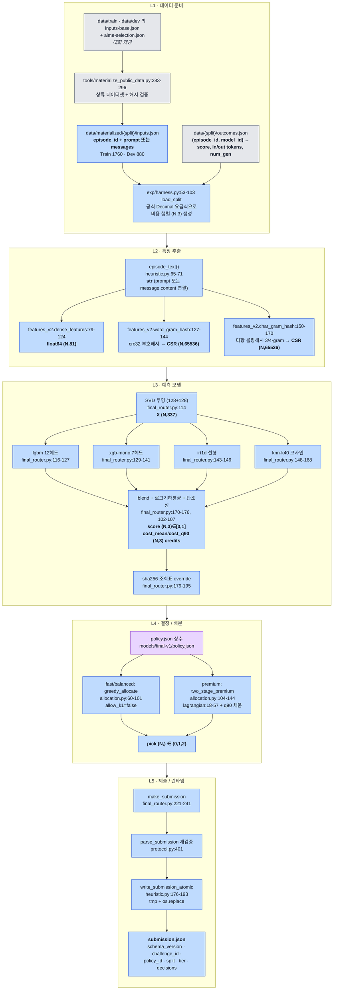

<!--
SPDX-FileCopyrightText: Copyright 2026 SKT OSSP challenge participant
SPDX-License-Identifier: Apache-2.0
-->

# 1. 시스템 조감도

> **한 문단 요약.** 이 저장소는 프롬프트 텍스트만 보고 세 모델
> (`ax31-light` / `ax31` / `axk1-think`) 중 하나를 문항마다 고르는
> 배치 라우터다. 오프라인에서 공개 Train 1,760문항으로 점수·토큰 예측기를
> 학습해 `models/final-v1` 번들로 동결하고, 네트워크가 끊긴 arm64 컨테이너
> 안에서는 그 번들만 읽어 예산 제약 배분 문제를 푼다. **정직한 일반화 점수는
> 공개 Dev 기준 가중 최종 0.684318** (95% CI [0.656175, 0.710795], 오라클
> 천장의 85.1%)이다. 저장소에 남아 있는 0.760284는 공개 Train/Dev를 통째로
> 외운 조회표가 켜졌을 때의 값이며 **일반화 성능이 아니다**(§1.5.3).

---

## 1.1 두 종류의 독자를 위한 진입점

| 당신이 | 먼저 볼 것 |
| --- | --- |
| 대회 심사위원 | §1.2 (무엇이 우리 기여인가) → §1.5 (성능과 그 한계) → §1.4 (규정 준수 경계) |
| 처음 보는 엔지니어 | §1.3 (5계층 데이터 흐름) → §1.4 (학습/추론 분리) → §1.2 (어느 파일을 읽어야 하나) |

이 문서(§1)는 **조감도만** 다룬다. 개별 모델 수식과 배분기 유도는 §2,
실험 이력과 반증 실험은 §6에서 다룬다.

---

## 1.2 저장소: 대회가 준 것 vs 우리가 만든 것

### 1.2.1 판별 방법과 그 한계

**git log는 이 판별에 쓸 수 없다.** 저장소 전체 커밋이 두 개뿐이고, 두 번째
커밋 하나가 나머지 224개 파일을 한꺼번에 담고 있다.

```
5baef67 2026-08-16 21:13:56 +0900  let's go        (224 files)
4de18f9 2026-08-16 21:10:05 +0900  Create README.md  (1 file)
```

따라서 판별은 **파일 헤더의 `SPDX-FileCopyrightText`** 를 1차 근거로 삼는다.

| 헤더 값 | 해석 |
| --- | --- |
| `Copyright 2026 SK TELECOM CO., LTD.` | 대회 제공 |
| `Copyright 2026 SKT OSSP challenge participant` | 참가자 작성 |
| 두 줄 모두 | 대회 제공 파일을 참가자가 확장 |
| 헤더 없음 (바이너리·JSON) | `REUSE.toml`의 `[[annotations]]` 오버라이드로 귀속 판정 |

`REUSE.toml:12-29`가 `schemas/*.json`, `configs/*.json`, `data/*.json`,
`src/ossp_router/resources/*.json` 등 주석을 넣을 수 없는 파일을 SK TELECOM에
명시 귀속시킨다. `REUSE.toml:31-38`은 `data/{train,dev}/inputs-base.json`을
업스트림 데이터셋 저자에게 귀속시킨다. 헤더도 REUSE 항목도 없는 나머지
바이너리(`models/final-v1/**`, `exp/**/*.npz`, `exp/figs/*.png`)는 참가자
코드가 생성한 산출물이다 — 생성 스크립트를 §1.4에서 명시한다.

**SPDX만으로는 잡히지 않는 경계가 있으므로**, 세 가지 교차 검증을 추가로 했다.

1. **`setup.cfg` 진입점 교체 (현재 워킹트리 diff로 확인 가능).**

   ```diff
   -    router-run = ossp_router.heuristic:main
   +    router-run = ossp_router.final_router:main
   ```

   즉 `src/ossp_router/heuristic.py`가 **대회가 제공한 참조 라우터**이고,
   `src/ossp_router/final_router.py`가 그 자리를 대체한 **우리 라우터**다.
   이 한 줄이 "무엇이 대체되었는가"를 가장 짧게 증명한다.

2. **`.dockerignore` 허용목록.** 이 파일은 SK TELECOM 헤더를 달고 있지만
   (`.dockerignore:1`), 내용에는 참가자 모듈이 명시적으로 열려 있다
   (`.dockerignore:22-24`: `!src/ossp_router/allocation.py`,
   `!src/ossp_router/features_v2.py`, `!src/ossp_router/final_router.py`).
   대회 제공 파일을 참가자가 제자리 수정한 사례다.

3. **`container/Dockerfile:1-3`, `container/entrypoint.py:1-3`** 은 SPDX 두
   줄을 모두 달아 공동 저작을 스스로 표시한다.

> **UNVERIFIED.** SPDX 헤더는 자기 신고다. 대회 제공 파일을 참가자가
> 제자리 수정하면서 헤더를 갱신하지 않은 경우, 그 커밋이 `5baef67` 이전에
> 이뤄졌다면 git으로 탐지할 수단이 없다. 위 (1)은 워킹트리 diff라서 잡혔고
> (2)는 내용 검사로 잡았지만, **동종의 다른 수정이 남아 있지 않다는 보장은
> 하지 못한다.** 상류 배포본과의 바이트 대조는 이 트랙에서 수행하지 않았다.

### 1.2.2 최상위 디렉터리 요약 (git 추적 225개 파일 전수 분류)

| 경로 | 파일 | 대회 제공 | 참가자 작성 | 참가자 산출물(바이너리) | 이 디렉터리의 역할 |
| --- | ---: | ---: | ---: | ---: | --- |
| `(root)` | 14 | 14 | 0 | 0 | 라이선스·기여지침·패키징. 단 `setup.cfg`는 참가자가 진입점 1줄 수정 |
| `LICENSES/` | 4 | 4 | 0 | 0 | 라이선스 원문 |
| `analysis/` | 1 | 0 | 1 | 0 | `eda.md` — 데이터 탐색 기록 |
| `baselines/` | 9 | 9 | 0 | 0 | 대회 제공 기준선 4종(all-light / prompt-heuristic / feature-budget / hash-regex) |
| `configs/` | 1 | 1 | 0 | 0 | `routing-policy.v1.json` — 요금·예산배수·등급가중치의 단일 진실 |
| `container/` | 5 | 3 | 2(공동) | 0 | 제출 이미지 정의 |
| `data/` | 18 | 18 | 0 | 0 | 공개 Train/Dev 선택 목록과 `outcomes.json` |
| `docs/` | 13 | 13 | 0 | 0 | 규정·채점·런타임 명세 (참가자 문서는 §1.2.4의 미추적 목록) |
| `exp/` | 85 | 0 | 47 | 38 | **오프라인 실험·학습 파이프라인 전부** |
| `models/` | 28 | 0 | 0 | 28 | **동결 추론 번들 `final-v1`** |
| `schemas/` | 6 | 6 | 0 | 0 | 입력/결과/제출 JSON 스키마 |
| `src/` | 16 | 13 | 3 | 0 | 프로토콜·채점기(제공) + 라우터 3모듈(참가자) |
| `tests/` | 19 | 18 | 1 | 0 | 제공 테스트 18 + `test_final_router.py`(참가자) |
| `tools/` | 6 | 6 | 0 | 0 | 데이터 materialize, 런타임 검사 도구 |
| **합계** | **225** | **105** | **54** | **66** | |

`(root)`와 `LICENSES/`의 헤더 없는 7개 파일(`LICENSE`, `NOTICE`,
`submission-ossp-skt.template.json`, `LICENSES/*.txt`)은 `REUSE.toml:6-10`
또는 파일 내용 자체로 대회 측 귀속이 확정된다.

### 1.2.3 참가자 기여의 실체 — 파일 단위

**추론 경로에 실제로 들어가는 우리 코드는 단 3개 모듈, 624줄이다.**

| 파일 | 줄 | 역할 |
| --- | ---: | --- |
| `src/ossp_router/final_router.py` | 268 | 번들 로드 → 특징 → 4멤버 예측 → 조회표 → 배분 → 제출 |
| `src/ossp_router/features_v2.py` | 212 | 결정적 내용 기반 특징 추출기 (학습기와 바이트 단위 동일) |
| `src/ossp_router/allocation.py` | 144 | 순서 불변 예산 배분기 3종 |

나머지 기여는 전부 **오프라인**이다.

| 그룹 | 대표 파일 | 요지 |
| --- | --- | --- |
| 실험 하네스 | `exp/harness.py`(232줄), `exp/registry_lib.py`, `exp/registry.jsonl` | 모든 실험을 **공식 Decimal 채점기**로만 평가하고 결과를 append-only 레지스트리에 기록 |
| 특징·모델 | `exp/feat_lib.py`, `exp/models/` 12개 파일 (`lgbm` `xgb` `irt` `knn` `ridge` `mlp` `ordinal` `stack` `blend` `delta` `naive` `compose_cost`) | 후보 모델 구현. 최종 정책이 채택한 점수 멤버는 4종 — `models/final-v1/policy.json`의 `blend_members`: `xgb-mono` `irt1d` `knn-k40` `lgbm` |
| 배분·정책 | `exp/alloc_lib.py`, `exp/final_policy.py`, `exp/freeze_final.py` | 배분기 설계와 정책 동결 |
| 번들 빌드 | `exp/precompute.py`, `exp/build_final.py` | `models/final-v1` 생성 + 스냅샷 재현 검증 |
| 위험·검증 | `exp/stress_lib.py`, `exp/conformal_lib.py`, `exp/verify_runtime.py`, `exp/selftest.py` | 예산 초과확률·분포이동 스트레스·런타임 실측 |
| 감사 | `exp/audit/A{1,2,3,4,6,7,8,9,10}-*.md`, `exp/audit/a7_*.py` (미추적) | 자기 반증 트랙 (§1.5.5) |

### 1.2.4 git이 추적하지 않는 참가자 산출물

| 경로 | 상태 | 비고 |
| --- | --- | --- |
| `docs/TECHNICAL_REPORT.md`, `docs/REPRODUCE.md`, `.gitattributes` | untracked | 참가자 SPDX 확인됨 |
| `exp/audit/` (md 9 + py 7 = 16개), `exp/ceiling-check.md` | untracked | 감사 보고서 |
| `build/` | `.gitignore:21`로 제외 | 모든 중간 산출물. 재현 시 재생성 |
| `data/materialized/` | `.gitignore:23`로 제외 | `tools/materialize_public_data.py`가 상류 데이터셋에서 생성 (Train 1,760 / Dev 880) |

---

## 1.3 5개 계층



### 계층별 계약과 설계 결정

| 계층 | 입력 타입 | 출력 타입 | 담당 모듈 (파일:라인) | 핵심 설계 결정 | 이유 |
| --- | --- | --- | --- | --- | --- |
| **L1 데이터 준비** | 상류 데이터셋 + 선택 목록 JSON | `InputBatch` (Train 1760 / Dev 880) + 정렬된 `(N,3)` 점수·비용·토큰 배열 | `tools/materialize_public_data.py:283-296`, `exp/harness.py:53-103` | 학습 라벨의 **비용을 float로 새로 만들지 않고, 채점기와 같은 `Decimal` 요금식**(`configs/routing-policy.v1.json` → `protocol.RoutingPolicy`)으로 계산한다 | 최적화 루프가 쓰는 비용과 채점기가 쓰는 비용이 어긋나면 예산 초과가 실험에서 보이지 않는다. 초과는 등급 점수를 0으로 만든다(`scoring.py:156-158`) |
| **L2 특징 추출** | `str` 프롬프트, `int` 메시지 수 | `dense (N,81) float64`, `word CSR (N,65536)`, `char CSR (N,65536)` | `features_v2.py:79-124 / 127-144 / 150-170 / 188-212` (학습 쌍둥이: `exp/feat_lib.py`) | **어휘 사전 없이 해시 특징만** 사용하고, 학습기와 추론기를 바이트 단위 동일하게 이중 구현 | 사전을 이미지에 넣지 않아도 되고, `sklearn` 없이 추론 가능. 난수·`episode_id`·입력 순서가 특징에 들어갈 경로 자체가 없어 규정 위반이 구조적으로 불가능 |
| **L3 예측 모델** | `X (N,337)` 밀집+SVD, 희소 `(N, keep-cols)` | `score (N,3) ∈ [0,1]`, `cost_mean (N,3)`, `cost_q90 (N,3)` (credits) | `final_router.py:109-196`, 아티팩트 `models/final-v1/**` | 점수는 4멤버 **산술평균**, 비용은 lgbm·xgb의 **로그공간 기하평균** + 등급 간 **단조성 하드 강제**(`final_router.py:102-107`) | 비용 오차는 곱셈적이라 로그평균이 맞다. 등급 간 비용 역전이 생기면 배분기가 "더 싸고 더 좋은 모델"이라는 착시를 보고 무한 이득을 계산한다 |
| **L4 결정 / 배분** | `score/cost (N,3)` + `tier` | `pick (N,) ∈ {0,1,2}` | `allocation.py:60-101`, `:104-144`, `:18-57`; 상수 `models/final-v1/policy.json` | ① 동일 예측 서명을 가진 행은 **그룹 단위로 함께 승급**(`allocation.py:88-99`, `:136-143`) ② Fast/Balanced는 `allow_k1=false`, `utilization` 0.93 / 0.88 | ① 규정이 `episode_id`·입력 순서 의존을 금지한다. 타이브레이크가 순서에 의존하면 그 자체로 위반이므로 순서 불변 배분이 필수 ② 예산 초과 시 등급 점수 0. 평균 점수 몇 pp보다 꼬리 위험 제거가 우선 |
| **L5 제출 / 런타임** | `pick` + `InputBatch` | `submission.json` (허용 6필드) | `final_router.py:221-241`, `protocol.py:401`, `heuristic.py:176-193` | 쓰기 직전 **스키마 재파싱** 후 tmp 파일 + `os.replace` 원자적 교체 | 90초 초과 시 운영자가 `SIGKILL`을 보낸다(`docs/RUNTIME.md:135-137`). 부분 JSON이 남으면 형식 실격 |

**핵심 상수 (`configs/routing-policy.v1.json`).** 요금 `[in, out]` per 1e6 토큰 —
`ax31-light` `[1, 4]`, `ax31` `[2.127, 8.509]`, `axk1-think` `[6.565, 26.260]`.
예산 배수 / 가중치 — Fast `1.25 / 0.4`, Balanced `2.0 / 0.3`, Premium `4.0 / 0.3`.
예산 한도는 **그 등급의 all-light 총비용 × 배수**로 등급마다 동적으로 정해진다
(`scoring.py:154`).

---

## 1.4 학습 시점(오프라인)과 추론 시점(컨테이너)의 분리

심사에서 가장 먼저 확인해야 할 경계다. **주황 = 오프라인(호스트, `exp/`,
GPU·sklearn 사용) / 보라 = 동결 산출물 / 파랑 = 컨테이너 내부 실행(`src/`) /
회색 = 대회 제공 / 초록 = 오프라인 채점(컨테이너 밖).**

```mermaid
flowchart LR
    subgraph OFF["🔶 학습 시점 — 오프라인 호스트 (컨테이너 밖)"]
        direction TB
        O0["data/materialized/*/inputs.json<br/>+ data/*/outcomes.json<br/>(정답 라벨 접근 O)"]
        O1["exp/precompute.py:23-49<br/>feat_lib.featurize_batch<br/>→ build/feats (npy · npz)"]
        O2["exp/build_final.py:87-93<br/>TruncatedSVD ×2 (sklearn)"]
        O3["exp/build_final.py:96-137<br/>LGBM 12헤드<br/>score×3 · log_in×3 · log_out×3 · q90×3"]
        O4["exp/build_final.py:140-190<br/>XGBoost multi_output + 토큰헤드<br/>(device=cuda)"]
        O5["exp/build_final.py:193-211<br/>IRT 1d 선형 (StandardScaler)"]
        O6["exp/build_final.py:214-245<br/>kNN k=40 인덱스"]
        O7["exp/build_final.py:274-294<br/>sha256(text) → 실측 점수·비용<br/><b>공개 Train+Dev 2,640행</b>"]
        O8["exp/build_final.py:248-271<br/>스냅샷 재현 검증<br/>+ E049 배정 완전일치 확인"]
        O9["exp/freeze_final.py:22-51<br/>정책 상수 동결 · 레지스트리 등록"]
        O10["exp/build_final.py:314-320<br/>manifest.json (파일별 sha256)"]
        O0 --> O1 --> O2
        O2 --> O3 & O4 & O5 & O6
        O0 --> O7
        O3 & O4 & O5 & O6 --> O8
        O8 --> O9 --> O10
    end

    subgraph BUNDLE["🟣 동결 산출물 — models/final-v1 (142.5 MB, 28 파일)"]
        direction TB
        B1["svd-word.npz · svd-char.npz<br/>각 (128, 65536)"]
        B2["lgbm/*.txt ×12 · xgb/*.json ×7<br/>+ xgb/keep-cols.npy"]
        B3["irt.npz  W(1,337) a(3,1) b(3)<br/>+ scaler mean/scale (81)"]
        B4["knn/index.npz (1760 × 131072, nnz 2,249,927)<br/>knn/outcomes.npz"]
        B5["lookup.npz  key(2640,32) scores(2640,3) costs(2640,3)<br/>⚠️ 공개 정답 실측값 포함"]
        B6["policy.json · manifest.json"]
    end

    subgraph RUN["🔷 추론 시점 — arm64 컨테이너 내부 (--network none, --read-only)"]
        direction TB
        R0["container/entrypoint.py:9-13<br/>→ final_router.main:244-264"]
        R1["protocol.load_input:605<br/>parse_input:257-323 스키마 강검증"]
        R2["FinalRouter.__init__:59-98<br/>번들 로드 (디스크→메모리)"]
        R3["episode_text:65-71 → featurize_batch:188-212<br/>순수 numpy/re/zlib"]
        R4["predict_batch:109-196<br/>lgbm·xgb·irt·knn → blend → 조회표"]
        R5["allocate:200-218<br/>greedy / two-stage"]
        R6["write_submission_atomic:176-193<br/>→ /challenge/output/submission.json"]
        R0 --> R1 --> R2 --> R3 --> R4 --> R5 --> R6
    end

    subgraph SCORE["🟢 채점 — 오프라인 검증에서만 (컨테이너 밖)"]
        direction TB
        C1["src/ossp_router/scoring.py:119-197<br/>Decimal · ROUND_HALF_EVEN"]
        C2["build/dev-*-report.json"]
        C1 --> C2
    end

    O10 --> BUNDLE
    BUNDLE -->|"COPY models/final-v1 → /opt/router/model-bundle<br/>container/Dockerfile:32"| R2
    R6 -.->|"공식 평가에서는 이 화살표가 없다.<br/>outcomes는 라우터에 전달되지 않는다"| C1

    classDef off fill:#fde68a,stroke:#b45309,color:#111827
    classDef bun fill:#e9d5ff,stroke:#7e22ce,color:#111827
    classDef run fill:#bfdbfe,stroke:#1d4ed8,color:#111827
    classDef giv fill:#e5e7eb,stroke:#4b5563,color:#111827
    classDef sc  fill:#bbf7d0,stroke:#15803d,color:#111827
    class O1,O2,O3,O4,O5,O6,O7,O8,O9,O10 off
    class O0 giv
    class B1,B2,B3,B4,B5,B6 bun
    class R0,R1,R2,R3,R4,R5,R6 run
    class C1,C2 sc
```



### 1.4.1 컨테이너 안에 **없는** 것

`container/Dockerfile:31-32`는 `src/`(허용목록 통과분)와
`models/final-v1`만 복사한다. `.dockerignore:4`의 `**` 전면 차단 뒤
개별 허용(`:5-37`)이므로, 아래는 이미지에 존재하지 않는다.

- `exp/` 전체 — 학습 코드, 실험 레지스트리, 스냅샷
- `data/` 전체 — **`outcomes.json`(정답 라벨) 포함**
- `scikit-learn` — 학습에만 쓰고 추론은 SVD 성분행렬 곱으로 대체
- `pip` / `setuptools` / `wheel` — 설치 직후 제거(`Dockerfile:18`), 실행 중 다운로드 불가
- 네트워크 — 실행은 `--network none --read-only`

런타임 의존성은 `numpy 2.0.2 / scipy 1.17.1 / lightgbm 4.7.0 / xgboost 3.2.0`
4개로 고정하고 베이스 이미지는 다이제스트 핀(`Dockerfile:7`), 실행 사용자는
`65532:65532` 비특권(`Dockerfile:36`)이다.

`src/ossp_router/scoring.py`는 이미지에 **포함되지만 라우터 진입 경로에서
import되지 않는다** — `final_router.py:32-46`의 import는
`allocation`, `features_v2`, `heuristic`, `protocol` 뿐이다. 이 사실은 감사
트랙 A2(추론 경로 누수)에서 PASS로 확인되었다.

### 1.4.2 정직한 고지 — 이미지 안에 정답이 들어간다

`models/final-v1/lookup.npz`는 **공개 Train 1,760 + Dev 880 = 2,640문항의
sha256(프롬프트) → 실측 점수·비용**을 담고 있다(`build_final.py:274-294`).
`final_router.py:179-195`가 프롬프트 해시가 일치하면 예측을 실측값으로
덮어쓴다.

- **규정상 허용된다.** `docs/CHALLENGE_RULES.md:113-115` —
  "공개 자료에서 만든 분류기, 회귀 계수, 어휘·IDF, 토크나이저, 조회표, 검색
  색인과 캐시를 제출 이미지에 포함할 수 있습니다. 정확한 프롬프트나 프롬프트
  해시를 사용하는 공개 자료 조회도 허용합니다."
- **그러나 일반화가 아니다.** 실측 적중률은 train 1,760/1,760 = 100%,
  dev 880/880 = 100%. 즉 공개 스플릿에서는 전부 암기로 답한다.
  비공개 평가셋에서는 적중률 0%를 가정하는 것이 안전하며, 그때 남는 것은
  §1.5.1의 0.684318이다.

### 1.4.3 런타임 실측

| 환경 (Dev 880문항, 등급당 1회 실행) | Fast | Balanced | Premium | 한도 |
| --- | ---: | ---: | ---: | ---: |
| 호스트 x64 | 7.3–11.1초 (세 등급 공통 범위) | ← | ← | — |
| arm64 컨테이너 (QEMU 에뮬레이션) | 59.9초 | 67.0초 | 68.2초 | **90초** |

가장 느린 등급(Premium 68.2초)이 한도의 75.8 %다. 여유는 21.8초.

이미지: `linux/arm64`, `USER 65532:65532`, `VOLUME` 없음, 겉보기 크기
721,803,819 B. 출력 볼륨에는 `submission.json` 하나만 생성되고 필드는 스키마
허용 6개(`schemas/submission.v1.schema.json`)뿐이다.

**블랙박스 재현.** `--network none --read-only`로 `inputs.json`만 마운트하고
`outcomes`를 전달하지 않은 arm64 컨테이너의 출력이 호스트 실행과 12자리까지
완전 일치했다(`0.760284090909`). 런타임 누수 없음.

---

## 1.5 성능 요약

### 1.5.1 정직한 일반화 점수 — 조회표 OFF가 기준선이다

`models/final-v1`의 `lookup.npz`를 빈 배열로 교체한 번들
(`build/bundle-nolookup`)로 공개 Dev 880문항을 공식 Decimal 채점기로 채점한
값이다. 원본: `build/dev-nolookup-report.json`.

| 등급 | 가중치 | 품질 점수 | 비용 비율 | 예산 한도 | 오라클 천장 | 천장 대비 | 모델 배정 (light / ax31 / k1) |
| --- | ---: | ---: | ---: | ---: | ---: | ---: | --- |
| Fast | 0.4 | **0.659091** | 1.180437 | 1.25 | 0.759469 | 86.8 % | 466 / 414 / 0 |
| Balanced | 0.3 | **0.691761** | 1.677356 | 2.0 | 0.807915 | 85.6 % | 111 / 769 / 0 |
| Premium | 0.3 | **0.710511** | 2.823888 | 4.0 | 0.859256 | 82.7 % | 82 / 740 / 58 |
| **가중 최종** | | **0.684318** | | | 0.803939 | **85.1 %** | |

- 가중 합산 검산: `0.4×0.659091 + 0.3×0.691761 + 0.3×0.710511 = 0.684318`
  — 리포트의 `final_score: "0.684318181818"`와 일치.
- **95% 부트스트랩 신뢰구간 [0.656175, 0.710795]** (A10 독립 재현 [0.654, 0.712]).
- 세 등급 모두 예산 한도 미달로 통과(`budget_passed: true`), 초과 0점 미적용.

### 1.5.2 기준선 대비 — 그리고 "기대 최종점수"

| 라우터 | Dev 가중 최종 | Fast/Bal/Prem 예산 초과확률 | 초과 위험 반영 기대 최종점수 |
| --- | ---: | --- | ---: |
| all-light (제공 기준선) | 0.619318 | 0 / 0 / 0 (정의상) | 0.619318 |
| prompt-heuristic (제공) | 0.655300 | — | — |
| **랜덤 특징 null** | 0.656297 | — | — |
| **라벨 셔플 null** | 0.666515 | — | — |
| hash-regex (제공 최강) | **0.695369** | 39.4 % / 38.9 % / 49.3 % | **≈ 0.40** |
| **본 제출 (조회표 OFF)** | **0.684318** | **0.221 % / 0.000 % / 0.631 %** | **≈ 0.68** |

**hash-regex의 원점수는 우리보다 0.011 높다.** 그러나 hash-regex는 세 등급
모두 40~50% 확률로 예산을 초과하고, 초과하면 그 등급 점수가 0이 된다
(`scoring.py:156-158`). 초과 위험을 반영한 기대 최종점수는 약 0.40으로
떨어진다. 우리 정책이 `utilization`을 1.0 미만으로 잡고 Fast/Balanced에서
`axk1-think`를 금지한 것은 이 0.011을 포기하고 0.28을 사는 거래다.

> 저장소가 이전에 주장한 초과확률 0.1 % / 0.0 % / 0.5 %는 과소평가였다.
> 위 표의 0.221 % / 0.000 % / 0.631 %는 A10 재측정값이며, 이쪽을 정본으로 쓴다.

### 1.5.3 조회표 ON 수치의 취급

| 등급 | 점수 | 비용 비율 | 천장 대비 | 배정 (light / ax31 / k1) |
| --- | ---: | ---: | ---: | --- |
| Fast | 0.738636 | 1.157056 | 97.3 % | 728 / 152 / 0 |
| Balanced | 0.742045 | 1.204907 | 91.8 % | 722 / 158 / 0 |
| Premium | 0.807386 | 2.086733 | 94.0 % | 668 / 140 / 72 |
| **가중 최종** | **0.760284** | | **94.6 %** | |

**이 수치를 성능으로 인용해서는 안 된다.**[^lookup] 원본
`build/dev-final-report.json`. 조회표 적중률이 Dev 880/880 = 100%이므로 이
표는 "정답을 다 아는 상태에서 예산 배분만 푼 결과"다. 오라클 천장의 94.6%에
도달한 것도 그 때문이며, 예측 품질의 증거가 아니다.

[^lookup]: 조회표는 `docs/CHALLENGE_RULES.md:113-115`가 명시적으로 허용하는
장치이므로 규정 위반은 아니다. 그러나 공개 Train/Dev 2,640문항을 전부 담고
있고 실측 적중률이 100%이므로, 이 값은 **암기이며 일반화 성능이 아니다**.
비공개 평가셋에서는 적중률 0%를 가정해야 하고 그때 남는 것은 0.684318이다.
두 값의 차이 0.0760이 곧 "암기가 벌어준 몫"의 크기다.

### 1.5.4 불리한 사실 — 먼저 밝힌다

> 출처: (a)(b)(c)(e)는 감사 트랙 A7, 신뢰구간은 A10, (f)는 리드의 직접 측정.
> (d)의 SVD·IRT·kNN·조회표 계수는 이 트랙에서 번들 shape로 직접 재확인했고,
> LightGBM·XGBoost 계수는 A7 값을 그대로 인용한다.

**(a) 이득의 대부분은 점수 예측이 아니라 비용모델 + 배분기에서 나온다.**
무정보 null은 all-light(0.619318)가 아니다. 특징을 난수로 바꿔도 0.656297,
라벨을 셔플해도 0.666515가 나온다. 점수 모델의 실제 기여는
`0.684318 − 0.656297 ≈ +0.028`뿐이다.

**(b) 4멤버 점수 블렌드는 통계적으로 0과 구별되지 않는다.**
블렌드 전체의 기여 `+0.00159`, 95% CI `[−0.00483, +0.00830]`, `p(≤0) = 0.31`.
따라서 §1.3에서 블렌드를 "핵심 설계"로 서술하지 않았다. 핵심은 L4다.

**(c) 데이터가 부족한 게 아니라 신호가 부족하다.**
학습곡선이 440행(Train의 25%)에서 포화한다. 1,760행이 440행보다 오히려
미세하게 낮다. Dev를 학습에 추가해도 이득의 근거가 없다.

**(d) 모델은 심하게 과파라미터화되어 있다.** 총 21,997,444개이고, 라벨
셀은 `1760 × 3 × 3 = 15,840`개뿐이다. 파라미터 / 라벨 셀 ≈ **1,389 : 1**.

| 구성요소 | 파라미터 | 종류 | 산정 근거 |
| --- | ---: | --- | --- |
| SVD 성분 (word+char) | 16,777,216 | 비지도 | `2 × 128 × 65536` — 번들 shape 실측 |
| kNN 인덱스 + 조회표 | 4,610,740 | 암기 | `nnz 2,249,927 ×2(data+idx) + 10,560 + 6 + 84,480 + 15,840` |
| LightGBM | 325,926 | 지도학습 | A7 계수 |
| XGBoost | 283,219 | 지도학습 | A7 계수 |
| IRT | 343 | 지도학습 | `W(1,337) + a(3) + b(3)` — 번들 shape 실측 |
| **합계** | **21,997,444** | | 순수 지도학습분은 **609,488**(2.8 %) |

**(e) 과적합은 아니다 — 그것과는 별개로.** Train OOF 대비 Dev 정규화 갭
`+0.55 pp`, 역방향 검증도 대칭이다(headroom 29.2 % vs 30.7 %). 정책 노브
(`utilization`)는 Dev argmax가 아니라 보수적으로 잡혀 있어 Fast에서 0.0134,
Premium에서 0.0196 점수를 일부러 남긴다. 즉 **정책 상수는 Dev에 적합되지
않았다.**

**(f) 근접중복 누수는 없다.** MinHash Jaccard ≥ 0.8 기준으로 Train의
167/1,760(9.5 %)이 크기 ≥ 2 군집을 이루고 최대 군집은 24개(한국 나이계산
템플릿)다. 그러나 Dev에서 Train과 J ≥ 0.8인 문항은 20개뿐이고, Dev를 Train
유사도로 계층화한 lift(balanced − all-light)는 유사도와 함께 커지지 않는다.

| 유사도 구간 | n | lift |
| --- | ---: | ---: |
| novel (J < 0.3) | 546 | +0.0755 |
| weak (0.3–0.5) | 208 | +0.0817 |
| moderate (0.5–0.8) | 106 | +0.0330 |
| near-dup (J ≥ 0.8) | 20 | +0.1000 (표본 과소, 노이즈) |

### 1.5.5 감사 트랙 상태 — 검증된 것과 안 된 것

| 트랙 | 대상 | 상태 | 산출물 |
| --- | --- | --- | --- |
| A1 | 채점 정합성 (독립 재구현 대조) | **PASS** | `exp/audit/A1-scoring-integrity.md` |
| A2 | 추론 경로 누수 | **PASS** | `exp/audit/A2-inference-leakage.md` |
| A3 | 데이터셋 신원 | **PASS** | `exp/audit/A3-dataset-identity.md` |
| A6 | 비용 모델 독립 재구현 | **PASS** | `exp/audit/A6-cost-reimplementation.md` |
| A7 | 과적합 반증 | **PARTIAL** | `exp/audit/A7-overfit-falsification.md` |
| A10 | 통계적 유의성·안정성 | **PARTIAL** | `exp/audit/A10-significance-stability.md` |
| A4 | 근접중복 누수 | 트랙 중단. **리드가 직접 측정해 결론** | 부분 산출물 `exp/audit/A4-group-leakage.md`; 채택 결론은 §1.5.4(f) |
| A5 | 규정 준수 | 트랙 중단. 리드가 부분 확인 | 전용 보고서 없음 |
| A8 | 컨테이너 실증 | 트랙 중단. 리드가 부분 확인 | 부분 산출물 `exp/audit/A8-container-reality.md`; 채택 결론은 §1.4.3 |
| A9 | Dev 선택 편향 정량화 | **UNVERIFIED** | 부분 산출물 `exp/audit/A9-selection-leakage.md` — **결론 미채택** |

A4·A8·A9는 디스크에 보고서 파일이 남아 있으나 **트랙이 완료되지 않았다.**
A4와 A8은 리드가 독립적으로 재측정한 부분만 본문에 채택했고, A9의 결론은
채택하지 않았다.

> **UNVERIFIED — 비공개셋 기대값.** 저장소가 주장한 Train 내부 홀드아웃
> 0.6625–0.6629는 Dev 0.684318보다 0.02 낮다. 이 격차가 Dev 선택 편향
> 때문인지 홀드아웃 구성 방식 때문인지는 A9 미완료로 판정하지 못했다.
> 따라서 **비공개 평가셋 기대값은 0.66–0.68로 폭넓게 잡는다.** 단일 점추정을
> 제시하지 않는다.

### 1.5.6 한 줄 결론

프롬프트만으로 문항 난이도를 맞히는 신호는 이 데이터에 얼마 없다(+0.028).
이 제출의 실질은 **비용을 로그공간에서 예측하고, 순서 불변으로 배분하며,
예산 초과 확률을 1 % 미만으로 눌러 등급 0점을 피하는 것**이다. 원점수만 보면
hash-regex가 0.011 앞서지만, 초과 위험을 반영하면 0.68 대 0.40이다.
