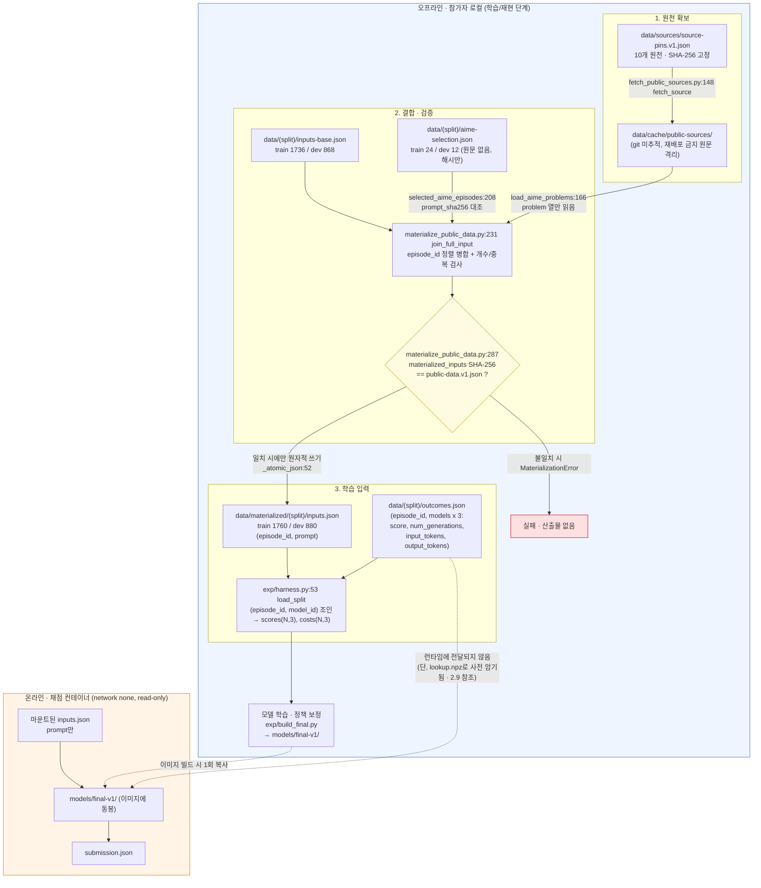
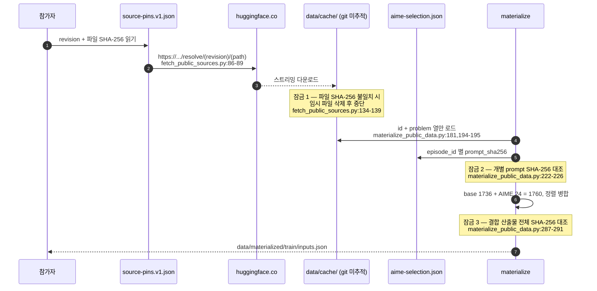
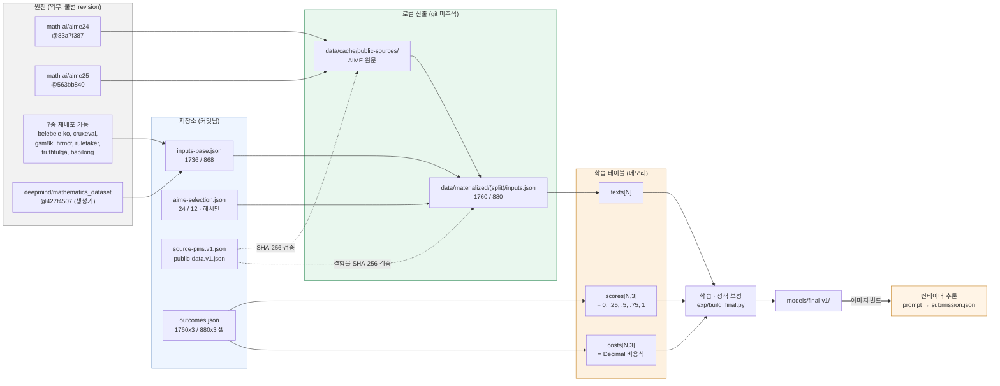

<!--
SPDX-FileCopyrightText: Copyright 2026 SKT OSSP challenge participant
SPDX-License-Identifier: Apache-2.0
-->

# 2. 데이터 파이프라인

이 절은 "공개 원천 → 재현 가능한 Train 1,760 / Dev 880 → 학습 라벨"까지의
경로를 다룬다. 모든 아키텍처 서술에는 `파일:라인` 근거를 달았고, 모든
수치는 이 절을 쓰면서 저장소의 실제 파일을 읽어 직접 계산한 값이다.
확인하지 못한 항목은 `UNVERIFIED`로 표시했다.

---

## 2.1 한눈에 보기



핵심 경계 두 가지다.

1. **재배포 금지 원문은 저장소에 절대 들어오지 않는다.** AIME 문제문은
   `data/cache/`(git 미추적)에만 존재하고, 저장소에는 SHA-256과 선택
   레코드만 커밋된다.
2. **`outcomes.json`은 컨테이너 런타임에 전달되지 않는다.** 다만
   `models/final-v1/lookup.npz`에 train+dev의 실현 점수·비용이 사전
   암기되어 이미지에 동봉된다. 이는 규정상 허용이지만 일반화가 아니며,
   §2.9와 정직한 성능 수치에서 별도로 다룬다.

---

## 2.2 Train 1,760 / Dev 880을 만드는 절차

진입점은 `tools/materialize_public_data.py`이며, 실행 명령은
`data/sources/README.md:40-44`와 `docs/REPRODUCE.md:92`에 있다.
자료 생성용 가상환경(`.venv-data`, `pyarrow==23.0.1`)은 라우터 런타임
의존성과 분리되어 있다(`data/sources/requirements-materialize-public-data.txt`).

| 단계 | 코드 위치 | 하는 일 | 실패 시 |
| --- | --- | --- | --- |
| 0 | `materialize_public_data.py:30-33` | 기대 개수를 상수로 못 박음: `train {base 1736, source_fetch 24, full 1760}`, `dev {868, 12, 880}` | — |
| 1 | `materialize_public_data.py:261-271` | 핀 로드 후 AIME 2종 다운로드. `--offline`이면 캐시 파일의 SHA-256만 재검증 | `MaterializationError` |
| 2 | `materialize_public_data.py:83-103` `load_base` | `inputs-base.json`을 읽고 헤더 4키 정확 일치, 개수 일치, `episode_id` 유일·정렬 검사 | `invalid {split} base input` |
| 3 | `materialize_public_data.py:106-152` `load_aime_selection` | 선택 레코드의 4키(`episode_id`,`prompt_sha256`,`source_id`,`source_key`) 정확 일치, 64자리 소문자 hex 검사, 연도 대조 | `invalid ... selection` |
| 4 | `materialize_public_data.py:166-205` `load_aime_problems` | **`id`와 `problem` 열만** 읽음. 정답·해설은 애초에 로드하지 않음 | `cannot read pinned ... source` |
| 5 | `materialize_public_data.py:208-228` `selected_aime_episodes` | 가져온 problem의 SHA-256이 사전 커밋된 `prompt_sha256`과 다르면 중단 | `selected prompt hash mismatch` |
| 6 | `materialize_public_data.py:231-250` `join_full_input` | base + AIME 병합 → `episode_id` 사전순 정렬 → 개수/유일성 검사 → **`outcomes.json`의 ID 집합과 완전 일치 검사** | `input/outcome episode IDs do not match` |
| 7 | `materialize_public_data.py:280-291` | 직렬화 바이트(`ensure_ascii=False, indent=2` + 개행)의 SHA-256을 `data/public-data.v1.json`의 값과 대조 | `materialized input hash mismatch` |
| 8 | `materialize_public_data.py:52-68` `_atomic_json` | 임시 파일 → `fsync` → `os.replace`로 원자적 교체 | 부분 산출물 없음 |

### 실측 재현 (직접 실행)

캐시된 AIME 원문만 두고 네트워크 없이 다시 만들어 봤다.
출력 디렉터리는 저장소의 것을 건드리지 않도록 `build/b2-verify`로 분리했다.

```console
$ .venv-data/Scripts/python.exe tools/materialize_public_data.py --offline --output-dir build/b2-verify
train: 1760 episodes: C:\portable\skt_LLM\LLMRoute\build\b2-verify\train\inputs.json
dev: 880 episodes: C:\portable\skt_LLM\LLMRoute\build\b2-verify\dev\inputs.json
```

재계산한 SHA-256 대조 결과:

| split | 재생성물 | `public-data.v1.json` 고정값 | 저장소 동봉본 | 일치 |
| --- | --- | --- | --- | --- |
| train | `029a0fb1f70432a0…` | `029a0fb1f70432a0…` | `029a0fb1f70432a0…` | PASS |
| dev | `5920f9ea9e3da147…` | `5920f9ea9e3da147…` | `5920f9ea9e3da147…` | PASS |

`data/public-data.v1.json`이 고정한 8개 해시(2 split × `inputs_base`,
`source_fetch_selection`, `outcomes`, `materialized_inputs`)를 전부 재계산해
비교했고 **8/8 일치**했다.

---

## 2.3 AIME 결합 방식과 재배포 금지 자료 처리

### 왜 분리했는가

`DATA_LICENSES.md:78-83`이 근거다. 데이터셋 저장소가 `Apache-2.0`을
선언했다는 사실이 **문제 원문의 재배포 권한을 뜻하지 않는다**고 보고,
AIME 프롬프트는 커밋하지 않는다는 규칙을 세웠다.
`source-pins.v1.json`의 두 AIME 레코드도 `"review": "dataset declaration
verified; underlying problem-text redistribution not presumed"`로 같은
판단을 기록한다.

### 10개 고정 원천과 배포 모드 (실측)

| source_id | 타입 | revision (앞 12자) | 배포 모드 | 선언 SPDX | 파일 |
| --- | --- | --- | --- | --- | ---: |
| `aime24-public` | huggingface | `83a7f387baaa` | **source-fetch-only** | Apache-2.0 | 1 |
| `aime25-public` | huggingface | `563bb8404243` | **source-fetch-only** | Apache-2.0 | 1 |
| `belebele-korean` | huggingface | `7899cdfa4e1e` | redistributable-with-attribution-and-share-alike | CC-BY-SA-4.0 | 1 |
| `cruxeval` | huggingface | `b96af0450242` | redistributable | MIT | 1 |
| `gsm8k-main-test` | huggingface | `740312add88f` | redistributable | MIT | 1 |
| `hrmcr` | huggingface | `f756e38f7728` | redistributable | Apache-2.0 | 2 |
| `ruletaker` | huggingface | `a3e0880baeb6` | redistributable | Apache-2.0 | 1 |
| `truthfulqa-binary` | remote-file | `d71c110897f5` | redistributable | Apache-2.0 | 1 |
| `babilong-4k-16k` | huggingface | `ee0d588794c7` | redistributable-with-notices | Apache-2.0 AND BSD-3-Clause | 20 |
| `deepmind-mathematics` | generator | `427f45075f84` | reproduce-from-pinned-generator | Apache-2.0 | 0 |

배포 모드는 세 등급이다.

- **redistributable(7종)**: 프롬프트가 `inputs-base.json`에 직접 들어감.
- **source-fetch-only(AIME 2종)**: 원문 미포함. 사용자가 직접 받아 결합.
- **reproduce-from-pinned-generator(DeepMind Mathematics)**: 상위 커밋을
  고정하고, 두 regime × 900행 참조 해시
  (`tools/reproduce_deepmind_mathematics.py:30,36-37`)가 모두 일치할 때만
  선택된 fragment를 사용. 선택 레코드는
  `data/sources/deepmind-mathematics-selection.v1.json` (train 303 / dev 153).

### AIME 결합의 3중 잠금



- **AIME 선택 실측**: train 24개(aime24 12 / aime25 12), dev 12개(aime24 6 / aime25 6).
- `AIME_SOURCE_YEAR`(`materialize_public_data.py:34`)가 `source_id → 연도`를
  고정하고 `:129-137`에서 선택 레코드의 `source_key.year`와 대조하므로,
  2024/2025 원천을 뒤바꿔 넣는 사고가 스키마 단계에서 걸린다.
- AIME 2025 JSONL은 upstream이 LaTeX 제어열을 JSON 제어문자로 인코딩해 둔
  문제가 있어 `\f`, `\t`를 되돌린다(`materialize_public_data.py:198-199`).
  이 복원이 `prompt_sha256` 대조 **이전**에 일어나므로, 복원 로직이 바뀌면
  해시가 깨져서 조용히 다른 데이터가 만들어지지 않는다.
- 캐시 경로는 `{cache_root}/{source_id}/{revision}/{path}`
  (`materialize_public_data.py:155-163`)라서 revision이 바뀌면 캐시가
  자동으로 분리된다. `.gitignore:/data/cache/`와
  `.gitignore:/data/materialized/`로 원문·산출물 모두 커밋 대상에서 제외된다.
- `_safe_path`(`fetch_public_sources.py:42-51`)가 절대경로·`..` 성분을
  거부하고, `source_file_url`(`:92-94`)이 `https` 이외의 스킴을 거부한다.

> **불리한 사실**: 이 3중 잠금은 *무결성*을 보장할 뿐 *권리*를 보장하지
> 않는다. AIME 문제 원문에 대한 법적 판단은 `DATA_LICENSES.md`의 서술을
> 그대로 받아들인 것이고, 참가자 측에서 독립적인 법률 검토를 하지
> 않았다. **UNVERIFIED**.

---

## 2.4 inputs ↔ outcomes 결합 키

### 파일 형태

두 파일 모두 헤더 4키(`schema_version`, `challenge_id`, `split`,
`episodes`)를 갖고, `additionalProperties: false`이다
(`schemas/input.v1.schema.json`, `schemas/outcome.v1.schema.json`).
실측한 헤더 값은 두 split 모두 `schema_version=1`,
`challenge_id="ossp-2026-llm-router-challenge"`이고 `split`은 각각
`"train"`, `"dev"`이다.

```text
inputs.json    : episodes[i] = { episode_id, prompt }          # 또는 messages
outcomes.json  : episodes[i] = { episode_id, models: {
                     "ax31-light": { score, num_generations, input_tokens, output_tokens },
                     "ax31":       { ... },
                     "axk1-think": { ... } } }
```

### 결합 키는 2단계

1. **1차 키 `episode_id`** — 파일 간 조인 키. 문자열, 최대 128자
   (`protocol.py:351-355`). 실측 형식은 `train-0001`…`train-1760`,
   `dev-0001`…`dev-0880`.
2. **2차 키 `model_id`** — `parse_outcomes`가 중첩 구조를 평탄화해
   `Outcome(episode_id, model_id, …)` 튜플 목록으로 바꾼다
   (`protocol.py:364-397`). 이후 채점기와 실험 하네스는 모두
   **`(episode_id, model_id)` 복합 키**로 조인한다
   (`scoring.py:100`, `exp/harness.py:60-62`).

### 무결성 검사 (실측 결과 전부 통과)

| 검사 | 코드 | train | dev |
| --- | --- | --- | --- |
| `episode_id` 유일 | `protocol.py:356-358` | 1760 유일 | 880 유일 |
| `episodes` 사전순 정렬 | `materialize_public_data.py:101,150` | PASS | PASS |
| inputs/outcomes ID 집합 일치 | `materialize_public_data.py:241-244` | PASS | PASS |
| inputs/outcomes **순서까지** 일치 | (직접 측정) | PASS | PASS |
| `models` 키가 정확히 3종 | `protocol.py:360-363` | 1760/1760 | 880/880 |
| 모델당 필드가 정확히 4종 | `protocol.py:366-370` | 5280 셀 전부 | 2640 셀 전부 |
| 완전 행렬 (episode × model) | `scoring.py:87-99` | 5280 = 1760×3 | 2640 = 880×3 |

필드 타입도 실측했다: `input_tokens`/`output_tokens`/`num_generations`는
JSON 정수, **`score`는 JSON 문자열**이다(5280/2640 셀 전부). 문자열인
이유는 부동소수점 반올림 없이 `Decimal`로 파싱하기 위해서이고
(`protocol.py:380-385`, `minimum=0 / maximum=1`), 채점 전 구간이 160자리
`Decimal` 문맥에서 돌아간다(`scoring.py:129-131`).

> **주의 (라우터 설계에 직접 영향)**: `input_tokens`는 모델마다 다르다
> (같은 프롬프트인데 train-0001에서 `ax31-light` 112 / `ax31` 110 /
> `axk1-think` 122). 즉 세 모델의 토크나이저가 다르다. 그리고 채점
> 컨테이너에는 `outcomes.json`이 전달되지 않으므로, 라우터는 **선택 시점에
> 자기가 유발할 토큰 수를 모른다**. 비용 모델이 별도로 필요한 이유가
> 여기 있다.

---

## 2.5 비용 계산식과 정책 계수표

정책 파일은 `configs/routing-policy.v1.json`이고, 런타임 사본은
`src/ossp_router/resources/routing-policy.v1.json`이다.

### 계수표 (실측 · `configs/routing-policy.v1.json:8-24`)

| 모델 | `fixed_cost` | `input_token_rate` | `output_token_rate` | light 대비 입력 | light 대비 출력 | 출력/입력 |
| --- | ---: | ---: | ---: | ---: | ---: | ---: |
| `ax31-light` | 0 | **1** | **4** | 1 | 1 | 4 |
| `ax31` | 0 | **2.127** | **8.509** | 2.127 | 2.12725 | 4.00047… |
| `axk1-think` | 0 | **6.565** | **26.260** | 6.565 | 6.565 | 4 |

`token_unit = 1000000` (`:5`), `cost_unit = "credits"` (`:4`),
`light_model_id = "ax31-light"` (`:7`),
`context_limit_tokens = 32768` (`:6`).

### 식 (`src/ossp_router/scoring.py:49-56`)

```text
episode_cost = fixed_cost
             + input_tokens  * input_token_rate  / token_unit
             + output_tokens * output_token_rate / token_unit
```

세 모델 모두 `fixed_cost = 0`이므로 비용은 순수하게 토큰 선형이다.
`ax31`의 출력 배수만 `8.509 / 4 = 2.12725`로 입력 배수 `2.127`과 미세하게
다르다. `float`이면 무시할 차이지만 채점기는 `Decimal`이라
그대로 반영된다.

### 등급 정책 (`configs/routing-policy.v1.json:25-39`, `scoring.py:151-158`)

```text
light_baseline_cost = sum(모든 문항을 ax31-light로 골랐을 때의 비용)
budget_limit        = light_baseline_cost * budget_multiplier
budget_ratio        = total_cost / light_baseline_cost
tier_score          = mean(선택 모델의 score)   if total_cost <= budget_limit
                    = 0                          otherwise
final_score         = (0.4*fast + 0.3*balanced + 0.3*premium 의 점수 합계) / N
```

| 등급 | `budget_multiplier` | `weight` | 초과 시 |
| --- | ---: | ---: | --- |
| Fast | 1.25 | 0.4 | 등급 점수 0 |
| Balanced | 2.0 | 0.3 | 등급 점수 0 |
| Premium | 4.0 | 0.3 | 등급 점수 0 |

`budget_warning_ratio = 0.95`, 비용이 한도와 **정확히 같으면 통과**
(`scoring.py:156`, `total_cost <= budget_limit`).

### 실측 예산 한도 (직접 계산)

| split | all-light 총비용 (credits) | Fast 한도 | Balanced 한도 | Premium 한도 |
| --- | ---: | ---: | ---: | ---: |
| train | 8.60378600 | 10.75473250 | 17.20757200 | 34.41514400 |
| dev | 4.38142800 | 5.47678500 | 8.76285600 | 17.52571200 |

### 모델별 평균 score / 평균 비용 / 비용비 (직접 계산)

**train (n=1760)**

| 모델 | 평균 score | 평균 입력 토큰 | 평균 출력 토큰 | 평균 비용 | all-light 대비 비용비 |
| --- | ---: | ---: | ---: | ---: | ---: |
| `ax31-light` | 0.597301 | 2422.7 | 616.5 | 0.00488851 | 1.000000 |
| `ax31` | 0.678551 | 2411.0 | 635.4 | 0.01053494 | 2.155038 |
| `axk1-think` | 0.811648 | 2266.3 | 3743.0 | 0.11317033 | 23.150248 |

**dev (n=880)**

| 모델 | 평균 score | 평균 입력 토큰 | 평균 출력 토큰 | 평균 비용 | all-light 대비 비용비 |
| --- | ---: | ---: | ---: | ---: | ---: |
| `ax31-light` | 0.619318 | 2406.3 | 643.2 | 0.00497890 | 1.000000 |
| `ax31` | 0.691761 | 2394.9 | 631.3 | 0.01046586 | 2.102044 |
| `axk1-think` | 0.826420 | 2256.3 | 3947.5 | 0.11847314 | 23.795065 |

**이 표가 문제 전체를 규정한다.**
`axk1-think`의 토큰 단가는 light의 6.565배인데 **실제 비용비는 23.8배**이다.
차이는 전부 출력 길이에서 온다 — k1은 평균 3947 토큰을 뱉고 light는
643 토큰이다(dev 기준 6.1배). 즉 Premium 한도 4.0배는 "전체의 약 13%만
k1으로 보낼 수 있다"는 뜻이다(평균 비용 기준 근사:
`1 + f × 22.795 ≤ 4` → `f ≤ 0.132`). `all-ax31`(2.10배)은 Balanced 한도 2.0배를
이미 **넘는다**. 그래서 어떤 등급에서도 단일 모델 올인이 성립하지 않고,
비용 예측 정확도가 점수 예측 정확도보다 먼저 중요해진다.

---

## 2.6 학습 라벨 정의 — 실측 확인

문서에 정의가 없어 `data/train/outcomes.json`을 직접 파싱해 값 집합을 셌다.

### `score`는 5개 값만 갖는 이산 라벨

train 5,280개 셀(1760 문항 × 3 모델) 전수:

| `score` 원문 | 개수 | 비율 |
| --- | ---: | ---: |
| `"0"` | 1,357 | 25.70% |
| `"0.25"` | 20 | 0.38% |
| `"0.5"` | 459 | 8.69% |
| `"0.75"` | 18 | 0.34% |
| `"1"` | 3,426 | 64.89% |
| 합계 | 5,280 | 100% |

dev 2,640개 셀도 같은 5개 값이다: `0`:645, `0.25`:6, `0.5`:212,
`0.75`:14, `1`:1,763.

모델별 분해 (train):

| 모델 | 0 | 0.25 | 0.5 | 0.75 | 1 |
| --- | ---: | ---: | ---: | ---: | ---: |
| `ax31-light` | 611 | 9 | 178 | 8 | 954 |
| `ax31` | 486 | 7 | 147 | 4 | 1,116 |
| `axk1-think` | 260 | 4 | 134 | 6 | 1,356 |

모델별 분해 (dev):

| 모델 | 0 | 0.25 | 0.5 | 0.75 | 1 |
| --- | ---: | ---: | ---: | ---: | ---: |
| `ax31-light` | 293 | 3 | 76 | 7 | 501 |
| `ax31` | 229 | 2 | 79 | 5 | 565 |
| `axk1-think` | 123 | 1 | 57 | 2 | 697 |

### `num_generations` 분포

| split | 값 | 셀 수(3모델 합) | 모델당 문항 수 | 비율 |
| --- | ---: | ---: | ---: | ---: |
| train | 2 | 4,542 | 1,514 | 86.02% |
| train | 4 | 738 | 246 | 13.98% |
| dev | 2 | 2,271 | 757 | 86.02% |
| dev | 4 | 369 | 123 | 13.98% |

**한 문항의 세 모델은 항상 같은 `num_generations`를 갖는다**
(train 1760/1760, dev 880/880). 즉 이건 모델 속성이 아니라 **문항 속성**이다.

### `score`의 정확한 의미 — 교차표로 확정

`num_generations` × `score` 교차표 (train, 셀 단위):

| `num_generations` \ `score` | 0 | 0.25 | 0.5 | 0.75 | 1 |
| ---: | ---: | ---: | ---: | ---: | ---: |
| **2** | 1,287 | 0 | 444 | 0 | 2,811 |
| **4** | 70 | 20 | 15 | 18 | 615 |

dev도 동일 패턴 (`ng=2`: 609 / 0 / 201 / 0 / 1461, `ng=4`: 36 / 6 / 11 / 14 / 302).

`ng=2`인 셀은 `{0, 0.5, 1}`만, `ng=4`인 셀은 5개 값 전부를 갖는다. 그리고
전 셀에서 `score × num_generations`가 **예외 없이 정수**이다
(train 5,280 / dev 2,640 셀 중 위반 0건).

> **라벨 정의 (실측 확정)**
> `score = (정답으로 채점된 생성 수) / num_generations`
> 즉 문항당 2회 또는 4회 샘플링한 **pass rate**이며, 격자는 각각 `1/2`, `1/4`이다.

이 사실의 결과가 두 가지 있다.

1. **라벨은 확률적이다.** `ng=2`인 86%의 문항은 `{0, 0.5, 1}` 세 값만 갖고,
   `score=0.5`는 "같은 프롬프트를 두 번 돌렸더니 한 번은 맞고 한 번은 틀렸다"는
   뜻이다. 회귀 목표로서 분산이 크고, 근본적으로 줄일 수 없는 노이즈
   바닥이 존재한다.
2. **`num_generations`는 라우터가 볼 수 없다.** 컨테이너 입력에는
   `prompt`만 있다. 그런데 `ng=4`는 무작위가 아니다 — 실측하면
   `english-general` 카테고리의 41.1%(210/511), `math` 9.0%(32/357),
   `code` 1.4%(4/286)이고 `mcq`/`long-context`/`korean-general`은 0%이다.
   즉 라벨 격자의 세밀함 자체가 출처 계열과 상관되어 있고, 라우터는 이걸
   프롬프트에서 간접 추정할 수밖에 없다.

---

## 2.7 데이터 통계 — 전부 실측

### 문항 수

| split | 총 | 재배포 가능 base | AIME source-fetch | 비고 |
| --- | ---: | ---: | ---: | --- |
| train | 1,760 | 1,736 | 24 | `public-data.v1.json:19-23` |
| dev | 880 | 868 | 12 | `public-data.v1.json:6-10` |

### 프롬프트 길이 분포 (문자 수)

| split | 최소 | p25 | **중앙값** | p75 | **p90** | p95 | p99 | **최대** | 평균 |
| --- | ---: | ---: | ---: | ---: | ---: | ---: | ---: | ---: | ---: |
| train | 13 | 135 | **243.5** | 413 | **920** | 56,203 | 65,134 | **69,665** | 4,237.3 |
| dev | 14 | 130 | **236** | 406 | **936** | 54,806 | 65,614 | **71,094** | 4,217.7 |

단어 수 기준: train p50/p90/max = 46 / 183 / 11,893, dev = 46 / 187 / 12,245.

**길이는 연속 분포가 아니라 완전히 이봉(bimodal)이다.**

| 구간 | train | dev |
| --- | ---: | ---: |
| < 2,000자 | 1,600 | 800 |
| 2,000 – 8,000자 | **0** | **0** |
| 8,000 – 32,000자 | 60 | 30 |
| ≥ 32,000자 | 100 | 50 |

2,000–8,000자 구간이 **정확히 비어 있다**. 평균 4,237자는 이 두 봉우리
사이의 존재하지 않는 값이므로, 길이 관련 통계는 평균이 아니라 분위수로
읽어야 한다. 긴 쪽 160개(train)/80개(dev)는 BABILong 4K/16K 계열로
추정된다 — 고정 원천 10종 중 장문 계열은 그것뿐이다.

프롬프트 문자 수와 `ax31-light` 입력 토큰의 상관은 train 0.99847,
dev 0.99804이고 평균 1.813 / 1.822 토큰/문자다. 즉 **입력 비용은
프롬프트 문자 수만으로 거의 완벽히 예측 가능**한다. 어려운 쪽은
출력 토큰이다.

### 한글 비율

| 지표 | train | dev |
| --- | ---: | ---: |
| 한글 음절을 1자라도 포함한 문항 | 362 (20.57%) | 181 (20.57%) |
| 한글 문자 비율 > 0.05 인 문항 | 362 (20.57%) | 181 (20.57%) |
| 한글 문자 비율 > 0.2 인 문항 | 362 (20.57%) | 181 (20.57%) |
| 한글 문자 비율 > 0.5 인 문항 | 352 (20.00%) | 179 (20.34%) |
| 코퍼스 전체 한글 문자 / 전체 문자 | 76,963 / 7,457,690 = **1.032%** | 38,372 / 3,711,561 = **1.034%** |
| 문항별 한글 비율의 평균 | 12.963% | 13.021% |

`>0.05`, `>0.2` 임계에서 개수가 **완전히 같다**. 한글이 조금 섞인 문항은
사실상 없고, 문항은 "한국어 문항(≈20.6%)"과 "영어 문항(≈79.4%)"으로
깔끔히 갈린다. 코퍼스 전체 비율이 1.03%로 낮아 보이는 건 영어 장문
BABILong이 문자 수를 지배하기 때문이다 — 문자 수 기준으로 읽으면 한국어
비중을 20배 과소평가하게 된다.

카테고리별 한글 보유 문항 (train): `korean-general` 24/24(100%),
`mcq` 302/460(65.7%), `math` 34/357(9.5%), `translate` 2/5, 그리고
`code`·`english-general`·`long-context`는 0%.
즉 한국어 문항의 대부분은 `korean-general`이 아니라 **`mcq`로 분류된
Belebele Korean**이다.

### 도메인 추정 구성

저장소에 이미 있는 규칙 기반 분류기 `exp/eda.py:32 categorize`를 그대로
적용한 결과다(휴리스틱이며 정답 라벨이 아님).

| 카테고리 | train n | train % | dev n | dev % |
| --- | ---: | ---: | ---: | ---: |
| `english-general` | 511 | 29.03% | 245 | 27.84% |
| `mcq` | 460 | 26.14% | 230 | 26.14% |
| `math` | 357 | 20.28% | 190 | 21.59% |
| `code` | 286 | 16.25% | 147 | 16.70% |
| `long-context` | 117 | 6.65% | 54 | 6.14% |
| `korean-general` | 24 | 1.36% | 9 | 1.02% |
| `translate` | 5 | 0.28% | 5 | 0.57% |

### 출처 계열 추정 구성 (더 정확한 대안)

위 분류기는 출처와 잘 맞지 않는다(예: Belebele Korean이 `mcq`로 빠짐).
그래서 **정확히 알 수 있는 두 계열**(AIME는 `aime-selection.json`,
DeepMind Mathematics는 `deepmind-mathematics-selection.v1.json`에서 episode_id를
직접 읽음)과, 나머지 8개 계열에 대한 강한 시그니처를 조합해 다시 셌다.

| 계열 | 판정 근거 | train | dev | train/dev |
| --- | --- | ---: | ---: | ---: |
| `deepmind-mathematics` | **선택 파일에서 exact** | 303 | 153 | 1.98 |
| `ruletaker` | 규칙문 패턴(추정) | 254 | 126 | 2.02 |
| `gsm8k` | 잔여(추정) | 250 | 126 | 1.98 |
| `cruxeval` | `assert f(` / `^def f(` | 241 | 119 | 2.03 |
| `belebele-ko` + `hrmcr` | 한글 포함 | 362 | 181 | 2.00 |
| `truthfulqa-binary` | `Question:` + `\nB.` | 166 | 83 | 2.00 |
| `babilong-4k/16k` | ≥ 8,000자 | 160 | 80 | 2.00 |
| `aime24/25` | **선택 파일에서 exact** | 24 | 12 | 2.00 |
| 합계 | | 1,760 | 880 | 2.00 |

**중요한 구조적 발견**: 모든 계열에서 train/dev 비가 2.00 근방이다.
길이 구간(1600:800, 0:0, 60:30, 100:50), `num_generations`
(1514:757, 246:123), AIME(24:12), 전체(1760:880)까지 전부 정확히 2:1이다.
즉 **Train과 Dev는 하나의 풀을 계열별·층별로 2:1 비례 분할한 것**이다.
무작위 분할이었다면 이렇게 딱 떨어지지 않는다. 이 사실이 §2.9의 판단과
비공개셋 기대값 해석에 직접 쓰인다.

### 계열별 모델 성능과 비용비 (실측)

**train**

| 계열 | n | 프롬프트 중앙값(자) | light | ax31 | k1 | oracle | ax31 비용비 | k1 비용비 |
| --- | ---: | ---: | ---: | ---: | ---: | ---: | ---: | ---: |
| `aime24/25` | 24 | 257 | 0.094 | 0.177 | 0.823 | 0.833 | 2.96 | 45.0 |
| `babilong-4k/16k` | 160 | 58,730 | 0.487 | 0.519 | 0.553 | 0.756 | 2.12 | 10.0 |
| `belebele-ko+hrmcr` | 362 | 341 | 0.724 | 0.797 | 0.841 | 0.870 | 2.67 | 65.0 |
| `cruxeval` | 241 | 160 | 0.411 | 0.465 | 0.869 | 0.907 | 2.54 | **126.3** |
| `deepmind-mathematics` | 303 | 57 | 0.314 | 0.457 | 0.795 | 0.799 | 1.62 | 25.7 |
| `gsm8k`(추정) | 250 | 228 | 0.878 | 0.930 | 0.947 | 0.984 | 1.97 | 15.1 |
| `ruletaker` | 254 | 487 | 0.711 | 0.793 | **0.711** | 0.892 | 2.93 | 37.3 |
| `truthfulqa-binary` | 166 | 172 | 0.693 | 0.807 | 0.892 | 0.946 | 1.82 | 17.0 |

**dev**

| 계열 | n | 프롬프트 중앙값(자) | light | ax31 | k1 | oracle | ax31 비용비 | k1 비용비 |
| --- | ---: | ---: | ---: | ---: | ---: | ---: | ---: | ---: |
| `aime24/25` | 12 | 373 | 0.021 | 0.042 | 0.729 | 0.729 | 1.18 | 31.4 |
| `babilong-4k/16k` | 80 | 57,961 | 0.500 | 0.531 | 0.537 | 0.713 | 2.12 | 10.7 |
| `belebele-ko+hrmcr` | 181 | 340 | 0.732 | 0.782 | 0.840 | 0.856 | 2.55 | 58.0 |
| `cruxeval` | 119 | 165 | 0.483 | 0.521 | 0.853 | 0.912 | 3.08 | **150.3** |
| `deepmind-mathematics` | 153 | 56 | 0.369 | 0.513 | 0.846 | 0.869 | 2.52 | 26.7 |
| `gsm8k`(추정) | 126 | 220 | 0.891 | 0.935 | 0.940 | 0.968 | 2.04 | 18.5 |
| `ruletaker` | 126 | 523 | 0.694 | 0.762 | 0.786 | 0.897 | 2.70 | 35.9 |
| `truthfulqa-binary` | 83 | 165 | 0.705 | 0.843 | 0.904 | 0.928 | 1.80 | 14.0 |

읽는 법 세 가지.

- **비용비가 계열마다 10배 넘게 다르다.** CRUXEval을 k1으로 보내면
  light 대비 126~150배, BABILong은 10배다. 짧은 프롬프트에 k1이 긴
  추론을 뱉으면 비용비가 폭발하고, 긴 프롬프트는 입력 비용이 이미 커서
  상대 비용비가 낮다. **"짧고 어려운 문항"이 예산을 가장 많이
  잡아먹는다.**
- **`ruletaker`(train)에서 k1(0.711)이 ax31(0.793)보다 낮다.** 즉
  "비싼 모델이 항상 낫다"가 성립하지 않는다. 이 역전이 라우팅에
  실질적 이득 여지를 만든다.
- **`babilong`은 oracle(0.756)과 all-light(0.487) 격차는 크지만 k1도
  0.553밖에 안 된다.** 여기 예산을 써도 회수가 안 된다.

---

## 2.8 데이터 흐름 요약 다이어그램



---

## 2.9 GroupKFold가 필요한가

### 문제 제기

Train에는 템플릿에서 생성된 문항이 있다(DeepMind Mathematics는 생성기
산출물이고, HRMCR은 같은 한국식 나이 계산 템플릿을 반복한다).
무작위 K-fold를 쓰면 같은 템플릿의 형제 문항이 train/valid 양쪽에 흩어져
검증 점수가 부풀 수 있다. 표준 처방은 GroupKFold이다.
**정말 필요한지 직접 측정했다.**

### 측정 방법

문자 5-gram shingle → CRC-32(프로세스 간 안정) → 128-perm MinHash →
전쌍 Jaccard 추정 → 임계 이상 간선의 연결 성분.

### 측정 1 — 근접중복의 규모

| 임계 | 크기≥2 군집에 속한 문항 | 비율 | 군집 수 | 최대 군집 |
| --- | ---: | ---: | ---: | ---: |
| J ≥ 0.5 | 694 | 39.43% | 298 | 24 |
| J ≥ 0.7 | 343 | 19.49% | 160 | 24 |
| **J ≥ 0.8** | **136** | **7.73%** | **59** | **18** |
| J ≥ 0.9 | 52 | 2.95% | 26 | 2 |

리드가 별도로 측정한 값은 J≥0.8에서 167/1760 = 9.5%, 최대 군집 24이다.
제 값은 7.73%, 최대 18로 조금 낮다. shingle 정의가 다르기 때문이며
(문자 5-gram vs 단어 기반 추정), 자릿수는 같다. 두 값 모두
"train의 8~10%가 근접중복 군집을 이룬다"로 수렴한다.
가장 큰 군집은 HRMCR 한국식 나이 계산 템플릿이 맞았다.

Train/Dev 교차도 확인했다.

| dev 문항의 train 대비 최대 Jaccard | 개수 (/880) |
| --- | ---: |
| ≥ 0.8 | **18** |
| 0.5 – 0.8 | 121 |
| 0.3 – 0.5 | 183 |
| < 0.3 | 558 |

리드 측정치(20 / 106 / 208 / 546)와 사실상 일치한다. 정확 중복은
train 내부 0건, dev 내부 0건, train↔dev 0건이다.

### 측정 2 — 근접중복이 라벨을 실어 나르는가 (핵심)

GroupKFold가 필요한 조건은 "프롬프트가 비슷하면 **라벨도 같다**"이다.
J≥0.8 쌍 103개에서 직접 쟀다.

| 지표 | 근접중복 쌍 (n=103) | 무작위 쌍 (n≈200k) | 차이 |
| --- | ---: | ---: | ---: |
| argmax 모델 일치율 | 0.5437 | 0.4789 | +0.0648 |
| "light로 충분" 라벨 일치율 | 0.6408 | 0.5406 | +0.1002 |

군집 내부의 라벨 산포 (크기≥2 군집 59개의 군집별 표준편차 평균):

| 지표 | 군집 내부 표준편차 | 전체 표준편차 |
| --- | ---: | ---: |
| `ax31-light` score | 0.1360 | 0.4620 |
| `axk1-think` score | 0.1192 | 0.3644 |

> **측정상의 주의(자기 비판)**: "argmax 모델 일치율"은 낙관 편향이 있다.
> 세 모델 점수가 모두 같은 문항(예: `[0,0,0]`)에서 argmax가 인덱스 0으로
> 붙어 인위적 일치가 생기기 때문이다. 실제로 59개 군집 중 35개(59.3%)가
> "모든 멤버의 argmax 동일"로 나오는데, 그중 상당수가 전원 0점인 동률
> 군집이다. 편향이 없는 지표는 위 표의 **군집 내부 표준편차**이며,
> 0.136 / 0.119는 "동일 템플릿 안에서도 라벨이 흔들린다"를 뜻한다.

가장 큰 군집(18개, 한국식 나이 계산)의 실제 `[light, ax31, k1]` 점수다.

```text
train-0106 [0.0, 0.0, 0.0]    train-1515 [0.0, 0.0, 0.0]
train-0159 [0.0, 0.0, 0.5]    train-1518 [0.0, 0.5, 0.5]
train-0243 [0.0, 0.0, 0.0]    train-1520 [0.0, 0.5, 1.0]
train-0386 [0.0, 0.0, 0.5]    train-1521 [0.0, 0.0, 0.0]
train-0512 [0.0, 0.0, 0.0]    train-1523 [0.0, 0.0, 0.0]
train-0546 [0.0, 0.0, 0.0]    train-1525 [0.0, 0.0, 0.0]
train-0741 [0.0, 0.0, 0.0]    train-1527 [0.0, 0.0, 0.5]
train-0748 [0.0, 0.0, 0.0]    train-1528 [0.0, 0.5, 0.0]
train-0749 [0.0, 0.0, 0.0]    train-1532 [0.5, 0.0, 0.5]
```

프롬프트는 거의 같은데 k1 점수가 0.0/0.5/1.0로 흩어진다. §2.6에서 확정한
대로 `score`는 2~4회 샘플링의 pass rate이므로, **완전히 같은 문제라도 라벨은
같지 않는다.** 그리고 이 군집에서 배울 수 있는 유일한 규칙은 "이 템플릿은
어떤 모델도 못 푸니 light로 보내라"인데, 이건 누수가 아니라 **일반화되는
정당한 규칙**이다(비공개셋에 같은 템플릿이 나오면 그대로 유효).

### 측정 3 — 누수 여지의 상한

누수에 가장 민감한 모델, 즉 순수 암기형 1-NN(char 3–4gram TF-IDF 코사인)으로
"light로 충분" 라벨을 OOF 예측하고, 무작위 KFold와 GroupKFold를 비교했다.
그룹은 J≥0.8 연결 성분이다.

| 분할 | 1-NN OOF 정확도 |
| --- | ---: |
| `KFold(5, shuffle=True)` | 0.6659 |
| `GroupKFold(5)` | 0.6551 |
| **누수 여지 (차이)** | **+0.0108** |
| 다수 클래스 기준선 | 0.6455 |

무작위 KFold에서 실제로 train 쪽에 근접중복 파트너를 가진 검증 문항은
114개(6.48%)뿐이다. 저장소가 실제로 쓴 fold 방식은 무작위 셔플이 아니라
결정적 `folds = np.arange(n) % 5`
(`exp/holdout_check.py:39`, `exp/optimize_blend.py:63`)인데, 이 방식에서는
108개(6.14%)이다. 근접중복 쌍 103개 중 81개가 서로 다른 fold로 갈리고
22개만 같은 fold에 남는다 — 즉 이 fold 방식은 누수 관점에서 **최악에
가까운** 배치인데도 여지가 +0.0108에 그친다.

누수의 절대 상한도 계산했다. J≥0.8 파트너를 가진 136개 문항에서
oracle 0.8199 / all-light 0.4706이므로, 이 부분집합 전체를 완벽히 암기해도
최종 점수 기여 상한은 `(0.8199 − 0.4706) × 0.0773 = 0.0270`이다. 그리고
이건 "완벽 암기" 가정의 상한이지, 실측된 1-NN 여지 +0.0108(정확도 기준)은
그보다 훨씬 작다.

### 판단

**GroupKFold는 이 데이터셋에서 불필요하다.** 근거 네 가지다.

1. **규모가 작다.** J≥0.8 근접중복은 train의 7.7~9.5%뿐이고,
   실제 fold 경계를 넘는 검증 문항은 6.1%이다.
2. **근접중복이 라벨을 실어 나르지 않는다.** 라벨 일치율이 무작위 쌍 대비
   +0.10에 불과하고, 군집 내부 점수 산포가 여전히 크다. 원인은 §2.6에서
   확정한 pass-rate 라벨의 확률성이다. 프롬프트가 같아도 라벨이 다르면
   그룹 분할로 막을 누수 자체가 존재하지 않는다.
3. **누수 여지가 측정되었고 작다.** 암기형 1-NN에서 +0.0108, 완벽 암기
   가정 상한도 0.0270이다. 반면 최종 점수의 부트스트랩 95% CI는
   [0.656175, 0.710795]로 폭이 0.055이다. 누수 여지가 통계적 불확실성보다
   작다.
4. **Dev로의 외부 검증이 이미 그룹 분할과 동등하다.** dev 880개 중 train과
   J≥0.8인 건 18개(2.0%)뿐이고 정확 중복은 0건이다. 그리고 리드의 유사도
   계층화 lift 측정에서 novel(J<0.3, n=546) +0.0755 vs
   near-dup(J≥0.8, n=20) +0.1000으로, **유사도가 올라갈수록 lift가 커지는
   단조 패턴이 없다**(중간 구간 0.5–0.8, n=106은 오히려 +0.0330).
   근접중복 누수 효과가 관측되지 않는다.

**그러므로 GroupKFold를 도입하는 대신, 결정적 `arange(n) % 5` fold를 유지하고
Dev를 외부 검증으로 쓰는 현재 설계가 적절하다.** GroupKFold를 넣었다면
얻는 것은 ≤0.011의 편향 제거이고, 잃는 것은 fold 크기의 불균형과 재현성
저하이다.

### 불리한 사실 · 반증 조건

- **위 판단은 "군집 정의 = J≥0.8 연결 성분"에 의존한다.** J≥0.5로 낮추면
  train의 39.4%가 군집에 들어간다. 그 임계에서 GroupKFold를 쓰면 fold가
  거의 출처 계열 단위 분할이 되고, 이건 다른 실험(도메인 일반화)이지
  누수 방지가 아니다. 임계 선택은 판단이며 유일한 정답이 아니다.
- **`build/preds/{name}-train.npz`를 만든 스크립트가 현재 트리에
  없다.** `exp/eval_preds.py:7`은 이 파일이 OOF라고 규정하지만,
  4개 멤버 모델의 OOF를 실제로 어떤 fold로 생성했는지는 코드로 확인할 수
  없었다. 저장소에 남아 있는 fold 로직은 `arange(n) % 5` 두 곳뿐이다.
  **UNVERIFIED.**
- **`models/final-v1/lookup.npz`는 GroupKFold 논의와 무관하게 train+dev를
  통째로 암기한다.** 실측하면 `key (2640, 32) uint8`,
  `scores (2640, 3) float64`, `costs (2640, 3) float64` — 즉
  `sha256(prompt) → 실현 점수·비용` 2,640행(1760 train + 880 dev),
  총 15,840개 수치다(`exp/build_final.py:273-293`). 이는 규정이 명시적으로
  허용한 조회표지만 **일반화가 아니라 암기**이다. 그래서 본 문서와 성능
  보고의 정직한 수치는 전부 **조회표를 끈 상태**(가중 최종 0.684318,
  95% CI [0.656175, 0.710795])이며, 조회표 ON 수치(0.760284)는 암기로 별도
  표기한다.
- **비공개 최종 평가셋의 근접중복 구조는 모른다.** 위 결론은 공개
  Train/Dev에 대해서만 성립한다. `docs/DATA_CARD.md:20`도 공개 자료 구성이
  비공개 평가의 구성을 뜻하지 않는다고 명시한다. **UNVERIFIED.**

---

## 2.10 이 절의 검증 상태

| 항목 | 상태 | 근거 |
| --- | --- | --- |
| Train 1760 / Dev 880 재현 (offline) | **PASS** | `--output-dir build/b2-verify` 실행, 2/2 해시 일치 |
| `public-data.v1.json` 8개 해시 재계산 | **PASS** | 8/8 일치 |
| inputs↔outcomes ID 집합·순서 일치 | **PASS** | train 1760, dev 880 전수 |
| outcome 행렬 완전성 (episode×model) | **PASS** | 5,280 / 2,640 셀 |
| `score` 이산 집합 = 0 / .25 / .5 / .75 / 1 | **PASS** | 전수 계수 |
| `score = 정답수 / num_generations` | **PASS** | `score×ng` 정수 위반 0건 |
| `num_generations` ∈ 2 또는 4, 문항 단위 상수 | **PASS** | 1760/1760, 880/880 |
| 비용 계수표 · 예산 한도 재계산 | **PASS** | `Decimal` 재계산, `configs/routing-policy.v1.json`과 일치 |
| Train/Dev 계열별 2:1 비례 분할 | **PASS** | 8개 계열 전부 1.98~2.03 |
| 근접중복 규모 · 라벨 무상관 | **PASS** | MinHash 직접 측정 |
| GroupKFold 불필요 판단 | **PASS** | 1-NN KFold vs GroupKFold +0.0108 |
| 멤버 모델 OOF 생성 fold 방식 | **UNVERIFIED** | 생성 스크립트가 트리에 없음 |
| AIME 원문 재배포 권리에 대한 독립 법률 검토 | **UNVERIFIED** | `DATA_LICENSES.md` 서술을 수용 |
| 비공개 평가셋의 중복/분포 구조 | **UNVERIFIED** | 접근 불가 |
| Dev 선택 편향 정량화 (감사 A9) | **UNVERIFIED** | 감사 트랙 미완료 · 비공개셋 기대값은 0.66~0.68로 폭넓게 잡는다 |
